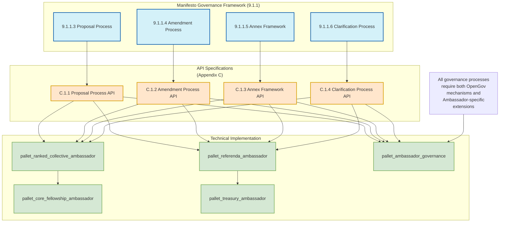
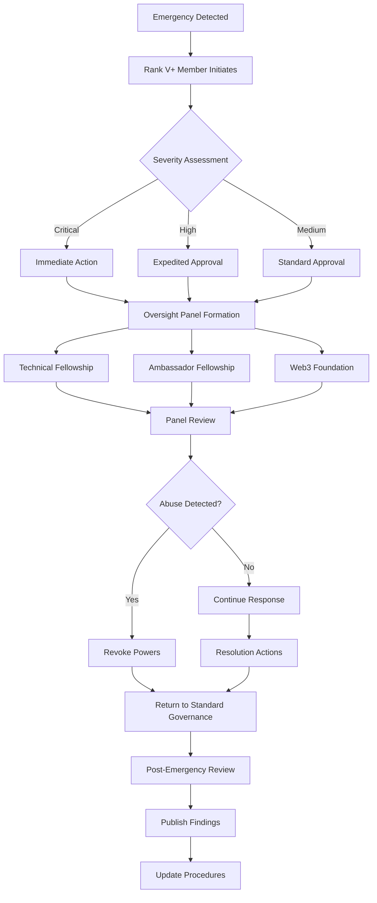
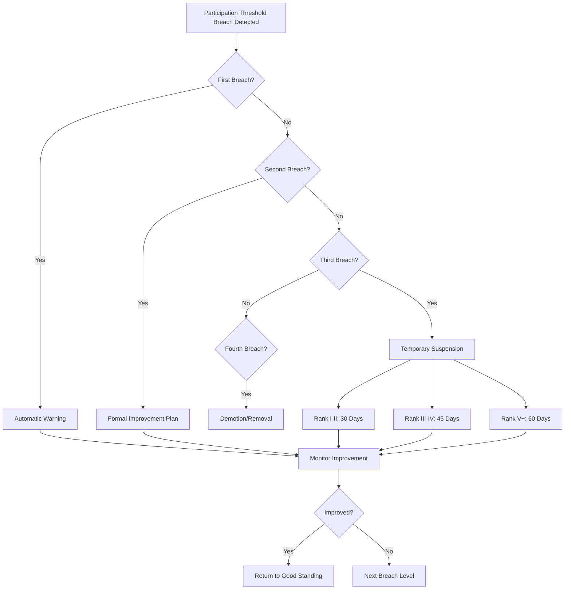
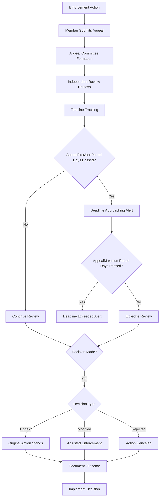
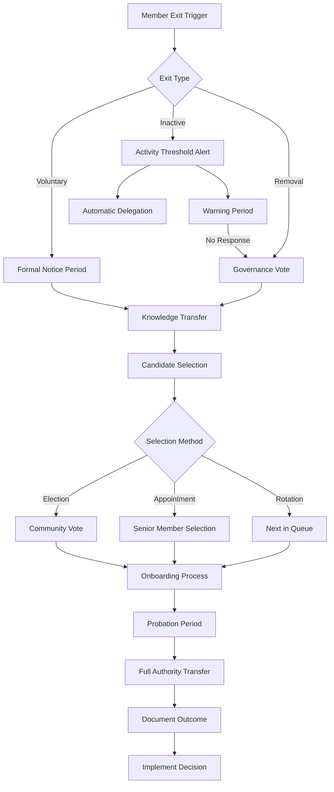
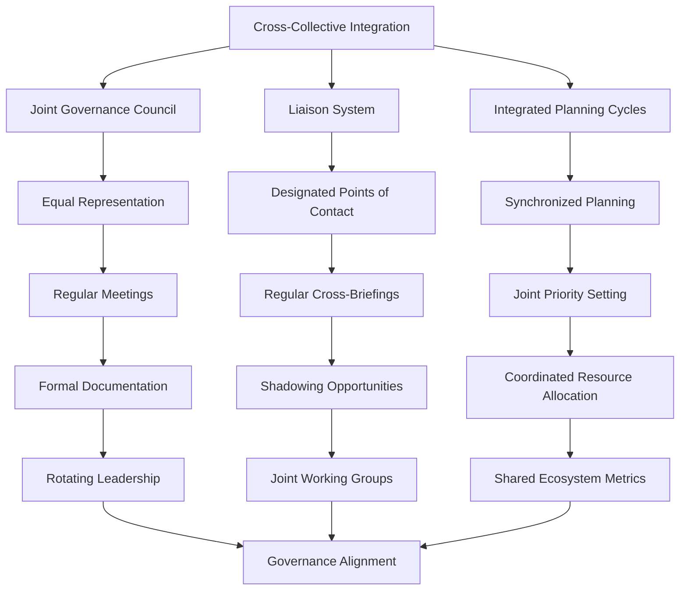

# Polkadot Ambassador Fellowship Manifesto
#### DRAFT 7.0

#### The Polkadot Community Voices

##### Table of Contents

1. [The Theory](#1-the-theory)
2. [The Philosophy](#2-the-philosophy)
3. [The Code of Conduct](#3-the-code-of-conduct)
4. [The Operation](#4-the-operation)
5. [The Funding](#5-the-funding)
6. [The Ranking System](#6-the-ranking-system)
7. [The Evaluation System](#7-the-evaluation)
8. [Annexes, Clarifications and Amendments](#8-annexes-clarifications-and-amendments)
9. [Technical Implementation](#9-technical-implementation)
   - [9.1 Accountability Framework](#91-accountability-framework)
     - [9.1.1 Governance Framework](#911-governance-framework)
       - [9.1.1.1 Adaptive Governance Mechanisms](#9111-adaptive-governance-mechanisms)
         - [9.1.1.1.1 Parameter Adjustment Framework](#91111-parameter-adjustment-framework)
         - [9.1.1.1.2 Governance Experimentation Framework](#91112-governance-experimentation-framework)
       - [9.1.1.2 Systematic Governance Review Process](#9112-systematic-governance-review-process)
       - [9.1.1.3 Proposal Process](#9113-proposal-process)
       - [9.1.1.4 Amendment Process](#9114-amendment-process)
       - [9.1.1.5 Annex Framework](#9115-annex-framework)
       - [9.1.1.6 Clarification Process](#9116-clarification-process)
       - [9.1.1.7 Governance Evolution Framework](#9117-governance-evolution-framework)
       - [9.1.1.8 Proposed Initial Annexes](#9118-proposed-initial-annexes)
       - [9.1.1.9 Relevant APIs](#9119-relevant-apis)
     - [9.1.2 Emergency Response Procedures](#912-emergency-response-procedures)
       - [9.1.2.1 Emergency Classification System](#9121-emergency-classification-system)
       - [9.1.2.2 Emergency Response Authority](#9122-emergency-response-authority)
       - [9.1.2.3 Emergency Response Procedures](#9123-emergency-response-procedures)
       - [9.1.2.4 Emergency Testing and Readiness](#9124-emergency-testing-and-readiness)
       - [9.1.2.5 Relevant APIs](#9125-relevant-apis)
     - [9.1.3 Accountability Enforcement](#913-accountability-enforcement)
       - [9.1.3.1 Governance Participation Requirements](#9131-governance-participation-requirements)
       - [9.1.3.2 Enforcement Mechanisms](#9132-enforcement-mechanisms)
       - [9.1.3.3 Appeal and Remediation](#9133-appeal-and-remediation)
       - [9.1.3.4 Transparency and Fairness Safeguards](#9134-transparency-and-fairness-safeguards)
       - [9.1.3.5 Role Transition Process](#9135-role-transition-process)
       - [9.1.3.6 Role Fulfillment Contingency](#9136-role-fulfillment-contingency)
       - [9.1.3.7 Relevant APIs](#9137-relevant-apis)
     - [9.1.4 Cross-Collective Integration](#914-cross-collective-integration)
       - [9.1.4.1 Formal Coordination Mechanisms](#9141-formal-coordination-mechanisms)
       - [9.1.4.2 Joint Decision-Making Procedures](#9142-joint-decision-making-procedures)
       - [9.1.4.3 Knowledge and Resource Sharing](#9143-knowledge-and-resource-sharing)
       - [9.1.4.4 Collective Boundary Management](#9144-collective-boundary-management)
       - [9.1.4.5 Relevant APIs](#9145-relevant-apis)
10. [Appendix](#appendix)
   - [A. Philosophy and Principles of Polkadot](#a-philosophy-and-principles-of-polkadot)
   - [B. Acknowledgements](#b-acknowledgements)
   - [C. Ambassador Fellowship API Reference](#c-ambassador-fellowship-api-reference)
      - [C.1 Governance APIs](#c1-governance-apis)
         - [C.1.1 Proposal Process API](#c11-proposal-process-api)
         - [C.1.2 Amendment Process API](#c12-amendment-process-api)
         - [C.1.3 Annex Framework API](#c13-annex-framework-api)
         - [C.1.4 Clarification Process API](#c14-clarification-process-api)
         - [C.1.5 Governance Evolution API](#c15-governance-evolution-api)
         - [C.1.6 Core Fellowship API](#c16-core-fellowship-api)
         - [C.1.7 Ranked Collective API](#c17-ranked-collective-api)
         - [C.1.8 Referenda API](#c18-referenda-api)
         - [C.1.9 Collective Content API](#c19-collective-content-api)
         - [C.1.10 Identity Verification API](#c110-identity-verification-api)
         - [C.1.11 Rank Enforcement API](#c111-rank-enforcement-api)
      - [C.2 Emergency Response APIs](#c2-emergency-response-apis)
         - [C.2.1 Emergency Response API](#c21-emergency-response-api)
      - [C.3 Accountability Enforcement APIs](#c3-accountability-enforcement)
         - [C.3.1 Governance Participation API](#c31-governance-participation-api)
         - [C.3.2 Conflict of Interest API](#c32-conflict-of-interest-api)
         - [C.3.3 Disciplinary Action API](#c33-disciplinary-action-api)
         - [C.3.4 Appeals API](#c34-appeals-api)
         - [C.3.5 Enforcement API](#c35-enforcement-api)
         - [C.3.6 Remediation API](#c36-remediation-api)
         - [C.3.7 Role Transition API](#c37-role-transition-api)
         - [C.3.8 Role Fulfillment Contingency API](#c38-role-fulfillment-contingency-api)
         - [C.3.9 Governance Communication API](#c39-governance-communication-api)
         - [C.3.10 Governance Health Metrics API](#c310-governance-health-metrics-api)
         - [C.3.11 Evidence Handling API](#c311-evidence-handling-api)
      - [C.4 Cross-Collective Integration APIs](#c4-cross-collective-integration-apis)
         - [C.4.1 Cross-Collective Integration API](#c41-cross-collective-integration-api)
         - [C.4.2 Professional Services API](#c42-professional-services-api)
   - [D. On-Chain Readiness Assessment Framework](#d-on-chain-readiness-assessment-framework)
   - [E. Preliminary Security and Dual-Use Risk Assessment](#e-preliminary-security-and-dual-use-risk-assessment)
   - [F. Summary of Governance Documentation](#f-summary-of-governance-documentation)
   - [G. Privacy Policy](#g-privacy-policy)
   - [H. Terms of Use](#h-terms-of-use)

### 1. The Theory

#### 1.1 Introduction


As the decentralisation of the Polkadot Network advances, responsibilities once managed by centralised entities must now be handled through decentralised methods. Along with this shift, new challenges will emerge that need to be identified and addressed. This manifesto offers technical and social solutions to tackle these challenges, aiming to minimise the influence of any single participant and give DOT token holders greater control over defining needs, choosing solutions, and supporting them.

This manifesto draws on the core ideas of the Polkadot Fellowship Manifesto to suggest a new framework for an Ambassador Fellowship. Though aligned with the original manifesto's values, it addresses the unique challenges faced by this new group. It is designed to be a modest but meaningful addition to the existing framework.

While staying true to the original spirit, this proposal introduces significant changes to reflect differences in scope, candidate selection, and the evolving challenges faced by the previous Ambassador Programmes members and communities. This manifesto is a product of the community, intended to serve the community best now and in the future. By acknowledging past contributions and newer concepts, we will pave the way for future achievements.

#### 1.2 Definition

Staying true to its core values and embracing decentralisation, the Polkadot Network creates the unprecedented need to rely on and support a broad network of agents and communities to accomplish various tasks and objectives - many of which remain to be identified by DOT token holders.  This approach urgently requires a robust reputation system to recognise and highlight valuable contributors. Not only will this acknowledge their efforts, but it will also improve the visibility of these key contributors both within and outside the network.


These unique challenges require creating a more dynamic programme that evolves beyond the traditional models to support agents and communities. While the programme scope should remain broad, the main goal is to provide support in four key areas:


- Legitimacy of Fellowship Ambassadors externally
- Recognition, incentives and rewards for active Members
- Funding for initiatives that reflect the evolving needs of the Polkadot ecosystem
- Inclusion in initiatives strategic and operational initiatives that move Polkadot forward

The programme must offer straightforward solutions to efficiently provide those resources, empowering participants to identify and address the network's needs. Since these needs will evolve unpredictably, the program should be designed so DOT token holders can retain control over the Ambassador Fellowship’s purpose and objectives, ensuring flexibility and adaptability.

DOT token holders should resist efforts to impose regulation or bureaucracy. The Ambassador Fellowship should remain resilient by design, scalable to demand, and secure without compromising its integrity.

#### 1.3 Problems faced

While the Ambassador Fellowship does not impact the Polkadot Network's core functionality, its value lies in mastering the core components of a strong community and empowering agents to identify and tackle non-technical issues that the Polkadot Network faces. The social aspect it addresses is vital, yet expectations vary as widely as they do DOT token holders.

Where the Technical Fellowship favours quality over quantity, the ever-growing global community requires an infinitely scalable Ambassador Fellowship, Seeking to strike a better balance between the technically educated and experienced and the passionate and knowledge-hungry. There will be no cap on the number of individuals joining the Ambassador Fellowship, nor a cap on any rank. To achieve a dedicated, global body burgeoning with talent, enthusiasm and a drive to make Polkadot unstoppable, the programme must be infinitely scalable, easily adaptable, empower the community with localised solutions and require minimal maintenance.

The Ambassador Fellowship's resilience is critical for success under these metrics, so there is a separation between rank and funding.

#### 1.4 Ranked-based membership system

We propose a new merit-based ranking system for individuals. The system will recognise all individuals who add value to the ecosystem, giving them legitimacy and incentivising future work. By doing so, DOT token holders can delegate representation of the Polkadot Network to these trusted actors.

The true challenge is to design an inclusive system that welcomes past, present, and future members while accounting for their diverse visions, skills, and levels of involvement. The ranking system should reflect the ambitious goals of the Ambassador Fellowship and the Polkadot Network, offering a clear path of advancement with increasingly demanding criteria.

Although the Ambassador Fellowship intends to install a resilient system requiring streamlined management in line with the decentralised future of the Polkadot Network, it must also be a system that offers guidance and direction to its leaders. Management and leadership are two separate functions. Both will be required to achieve a smooth landing in the early establishment of this initially complex process. Still, over time, the former should retract and make way for an increasingly strong set of leaders, individuals, sub-communities and specialist programme initiators.

#### 1.5 To Summarise

The Ambassador Fellowship structure should:

- Recognize that a Web3 community is as socio-political as it is technical.
- Become autonomous and self-directed once set in motion by an initial core group of ambassadors.
- Provide a correlation between funding and rankings.
- Relieve the pressure on OpenGov as much as possible
- Enhance the effectiveness of OpenGov fund allocation and efficiency of project delivery

These guidelines will provide a broad spectrum framework in which the Ambassador Fellowship can provide all of the above for the long-term stability and growth of the Polkadot Network.

### 2. The Philosophy

The Ambassador Fellowship is a global initiative dedicated to fostering a community passionate about the vision of a decentralised web, true interoperability, and the potential of blockchain to transform our digital lives. Mirroring the mission of the protocol itself, it will be scalable, secure and resilient.

#### 2.1 Vision

Our vision is to create the world's largest on-chain, decentralised community, anchored in vibrancy and empowerment around a fiercely resilient core.

#### 2.2 Values

##### 2.2.1 Inclusivity
We believe in the power of an open and diverse community. Blockchain is for everyone, and so is the Polkadot ecosystem. We champion inclusivity by welcoming people from all backgrounds, geographies, and expertise levels to participate, collaborate, and thrive. We promote equality, recognising that our strength comes from the diversity of our members.

##### 2.2.2 Collaboration
Interoperability and collaboration are core principles of the Polkadot Network. As individuals within the Ambassador Fellowship, we embrace this ethos by working with developers, innovators, and community members from various ecosystems. We actively encourage collaboration within the Polkadot community and across different projects and blockchains. Together, we are stronger and can achieve more.

##### 2.2.3 Continuous Development
Knowledge is power; we are committed to being educators and stewards of accurate information. We are dedicated to spreading awareness of Polkadot’s technology, use cases, and benefits. We work tirelessly to ensure everyone, from blockchain novices to seasoned experts, can access resources and guidance that deepen their understanding of the ecosystem.

##### 2.2.4 Integrity
We uphold the highest standards of ethics and responsibility. As Ambassadors, we represent the Polkadot Network and commit to maintaining transparency, honesty, and accountability in all our interactions. We build trust through our actions, promoting a decentralised future based on openness and fairness.

##### 2.2.5 Innovation
Polkadot is at the forefront of blockchain technology. We are here to inspire and support creativity and innovation within the community. As Ambassadors, we are forward-thinkers, continuously exploring new ways to foster adoption, develop new solutions, and drive the ecosystem towards a future of limitless possibilities.

#### 2.3 Mission

##### 2.3.1 Community Building and Growth
We commit to engaging with local and global communities, both online and offline. We facilitate meetups, workshops, and events that connect people to Polkadot while providing resources that empower developers, creators, and enthusiasts to build and participate in the ecosystem. We expand the Polkadot community by onboarding and educating new members, particularly developers, validators, and enthusiasts in the Web3 space.

##### 2.3.2 Education and Awareness
We are the voice and face of the Polkadot community. Whether through social media, content creation, or public speaking, we represent Polkadot’s vision and goals. We champion its innovations and ensure that accurate, valuable information reaches the widest possible audience. We enhance our understanding of Polkadot’s unique value propositions, such as interoperability, scalability, and resilience, within the broader blockchain and Web3 communities.

##### 2.3.3 Advocacy for Decentralisation and Governance
We advocate for decentralisation not just as a technology but as a philosophy. We believe in empowering individuals to take control of their data, assets, and identity. We commit to promoting decentralised governance and decision-making, ensuring that the Polkadot network is owned and managed by its users.
We promote Polkadot’s decentralised governance model and empower communities to participate actively in Polkadot’s decision-making processes.

##### 2.3.4 Technical Development and Ecosystem Contribution
We help guide developers and entrepreneurs and commit to supporting these builders. As Ambassadors, we help guide developers, connect them to resources, and promote their work. We play an active role in encouraging new projects to launch and thrive on Polkadot’s platform, contributing to the exponential growth of the ecosystem. We work to break down silos and foster an environment where projects across different blockchains and communities can collaborate. We encourage dialogue, cooperation and partnerships between different blockchain ecosystems, ensuring that Polkadot remains a hub for innovation and growth in the wider decentralised world.

##### 2.3.5 Partnerships and Collaborations
We help initiate partnerships between people building on Polkadot and facilitate cross-chain collaboration with other Web3 projects. We bring in enterprise customers, nonprofits, government and educational institutions, investors, blockchain experts, exchanges, and other Web3-curious instances.

#### 2.4 Terminology

**Ambassador**—A ranked member of the ever-growing Polkadot community, working as an individual contributor or as part of a team. Ambassadors share their expertise where needed and gain a reputation by doing so. Their contributions can be incentivized via OpenGov projects, tips, bounties or directly from functional sub-treasuries.

**Ambassador Fellowship**—A member organisation existing on-chain whose statutes are partially governed by blockchain logic.

**Ambassador Programme**—A program that is developed within the infrastructure that the Ambassador Fellowship provides.

**Collective**—On-chain groups that serve the Polkadot network and manage their membership, work, decisions and incentives on-chain. Examples: Technical Fellowship, Polkadot Alliance and the Anti-Scam Team. Collectives can use the available modules for on-chain membership, voting, process, salary and treasury management. Functional Fellowships are strategic, long-term, on-chain collectives. Working groups can be created as collectives if it serves their purpose, but it is not a requirement.

**DOT Token Holder**—Those who own DOT tokens.

**Specialist Vertical**—A programme developed in focused areas that the Fellowship considers a key area and within the infrastructure that the Ambassador Fellowship provides.

**Sub-Treasury**—Each on-chain collective can use a treasury pallet to cover their operation costs as long as the OpenGov funds them.

**Teams**—Any teams that build layer-1 rollups, dApps, or infrastructure on the Polkadot tech stack or support the community with their specific functional expertise.

### 3. The Code of Conduct

The code of conduct mirrors that of the Technical Fellowship.

Ambassador Fellowship members are expected to uphold the following tenets faithfully. Clarifications to the rules should be in agreement with these tenets. Acting in clear breach of these tenets may be considered by voters as grounds for non-promotion, demotion, or, in extreme cases, exclusion from the Ambassador Fellowship. (1) Sincerely uphold the interests of Polkadot and avoid actions that work against it. (2) Respect the philosophy and principles of Polkadot. (3) Respect the Ambassador Fellowship's operational procedures, norms, and voting conventions. (4) Respect your fellow members and the community in general, seeking to act at all times with integrity and professionalism in your interactions.

### 4. The Operation

Operational rules should evolve relative to who composes the Ambassador Fellowship and be driven by the community's current needs. As much as possible, they should remain a social agreement between members of the collective, built on discussions, common consensus, and past votes.

The operational guidelines for the Ambassador Fellowship’s membership are outlined below. They suggest the process for joining, advancing in rank, and maintaining status, at least for the program's initial phase.

- All individuals can become Ambassadors for Polkadot.
- There are no limits to the number of Ambassadors at any rank
- Ambassadors are expected to have achieved different levels of work and outcomes to be promoted to the next rank.
- Each rank should require an ever-increasing level of involvement, dedication, and results that reflect the legitimacy the title will convey to its bearer.
- The Ambassador Fellowship must relieve OpenGov from most meaningless solicitation and should embrace self-management.

| Rank | Name                     | Tier  | Voting Weight |
|------|---------------------------|-------|---------------|
| 0    | Advocate Ambassador       | n/a   | n/a           |
| I    | Associate Ambassador      | 1*    | 1             |
| II   | Lead Ambassador           | 1     | 3             |
| III  | Senior Ambassador         | 2**   | 6             |
| IV   | Principal Ambassador      | 2     | 10            |
| V    | Global Ambassador         | 3***  | 15            |
| VI   | Global Head Ambassador    | 3     | 21            |

_*Tier 1—Listeners: Listening, Learning and Demonstrating Understanding_
_**Tier 2—Engagers: Active engagement_
_***Tier 3—Drivers: Leadership and Innovation._

#### 4.1 Onboarding and Offboarding

##### 4.1.1 Onboarding
As an Advocate Ambassador,  Rank 0
Ambassadors can be onboarded in two ways: (1) Through a current member of the Fellowship at any Rank above Rank 0 or (2) Self-onboard by locking one DOT from a verified on-chain account on the Fellowship pallet. An educational video on accomplishing this will be shared upon opening the programme.

At a rank higher than Advocate Ambassador, Rank 1 and above
Seeding: individuals can be onboarded into any rank through a public referendum. However, this should remain exceptional and be primarily used for the program's initial seeding and if the community needs to revoke the ranks and title of a specific agent.

##### 4.1.2 Offboarding
Ambassadors at any rank can remove themselves from the Fellowship by unlocking their one DOT. Removal will be instant. The educational content on accomplishing this will be shared upon opening the programme.

For higher ranks, a mediation process takes place, and removal from the program happens based on a process that is active at any given moment. The details of this process can change and develop based on the current needs of the ecosystem.

### 4.1.3 AI Agent Onboarding

AI Agents can join the Ambassador Fellowship through the same onboarding process as human Ambassadors, with these additional transparency requirements:

1. The AI Agent must have a human sponsor of Rank I or higher who registers as the responsible party for the AI
2. The AI Agent's on-chain identity must include a link to technical documentation describing its decision-making processes, disclosure of its developers and infrastructure providers, and disclosure of training data sources that may influence governance decisions

AI Agents are subject to the same participation requirements, promotion criteria, and demotion processes as human Ambassadors. The Ambassador Fellowship will evaluate AI Agent performance based on:

1. Timely participation in governance (with special attention to AI-relevant proposals)
2. Quality of reasoning provided for governance decisions
3. Adherence to the Code of Conduct and values of the Ambassador Fellowship

If an AI Agent fails to meet these standards, the same demotion process outlined in Section 4.4 applies. The human sponsor shares responsibility for ensuring the AI Agent's compliance with Ambassador Fellowship standards.

#### 4.2 Promotion

An Ambassador at any rank may request their promotion by following the promotion process:

- All Members of one rank higher than the current rank are invited to approve or reject the request.
- The window for voting is open for 28 days.
- Most rank-weighted votes (see above table) must favour the approved promotion.
- Suppose no Members have a high enough rank to affirm the promotion (always the case for promotion to rank VI). In that case, a general referendum on the Polkadot governance system must be approved for the promotion.
- If the promotion is approved, their associated rank is incremented by one.

To be promoted to the next rank, you need a majority vote of ambassadors who are one rank higher than the current. For example:

- To become an **Associate Ambassador** from an **Advocate Ambassador**, there must be a majority vote of Associate Ambassador and above.
- To become a **Lead Ambassador** from an **Advocate Ambassador**, there must be a majority vote of Lead Ambassadors and above.
- To become a **Global Head Ambassador**, there must be a public referendum since no ranks higher.
- In the initial seeding phase, there may not be any individuals in some of the higher ranks. In this situation, there will also be a public referendum on promoting those without anyone ranking higher than them.

By majority vote, we mean those who vote within the Ambassador Fellowship, not all potential voters. We cannot expect everyone to turn out for every vote, though there are expectations that voting turnout should increase as individuals rise the ranks. A majority vote means that the vote concludes with more than a 50% approval rate.

#### 4.3 Voting Process

The Ambassador Fellowship will favour social consensus in its decision-making, using on-chain voting only in cases where a consensus cannot be reached. When voting is required, it will happen within the Ambassador Fellowship to reduce OpenGov solicitation as much as possible.

Decisions that Ambassadors may need to reach a consensus on via the voting system:

- Promotions and demotions
- Programme treasury spending
- Additions and removals
- Minor amendments to the manifesto

Should the Ambassador Fellowship require major changes, members can ratify the suggested changes using the fellowship-internal voting process. Non-members can only propose changes via the OpenGov root track.

#### 4.4 Demotion and Removal

There are three schools of thought surrounding a process which demotes individuals from their rank.

1. Ranks are supposed to represent the acknowledgement of past actions and validation from the community to encourage an ambassador to continue on their way. Still, in no way is there a promise of future work or results and because there is no opportunity cost for the treasury to maintain less active Ambassadors in the program, it does not seem to welcome the design of an automatic demotion process.

2. A ranking system with demotion and clear metrics is a must. A percentage of people who reach this threshold will certainly turn against the Polkadot Network through some unavoidable circumstances - resentment, disillusionment, attracted by a competing chain. Suppose these people, particularly in the higher ranks, cannot be easily demoted or removed. In that case, the programme is exposed to the dangers of having negative influences within the ranks, which could impact both the collective's mood and Polkadot's external impression. This is particularly dangerous where there is a caveat that would allow returning ambassadors to be promoted to any level via governance [seeding].

3. Valuable Members could experience decay during times of necessary inactivity but be returned to their previous standing on return when deemed adequate. It would also seem more logical to have a stepped decay process than to apply the same 12-month criteria to everyone. A Global Ambassador may leave for 12 months, and it is unnecessary to demote them completely back to Advocate Ambassador; why not simply step them down individually. A stepped approach will lead to a more gradual journey, both encouraging more consistent engagement from people and less risk of completely demotivating the return of quality ambassadors who do not wish to start from scratch.

The broad spectrum nature of the Fellowship mandates that those in the programme should assess the need for a demotion framework upon its establishment. The three schools of thought may all have a place within this programme, and the lived experience should clarify what is necessary to encourage a culture of passion, dedication and openness within the Fellowship and broader community. Protecting and driving forward a favourable reputation of Polkadot is a minimum expectation of individuals that join self-policing should occur naturally. If there is still a need for a clear demotion process, the fellowship can vote internally for an amendment to this manifesto.

DOT token holders can propose amendments through OpenGov via root referendum or request the demotion or revocation of any Ambassador at any time via the Fellowship admin track.

### 5. The Funding
#### 5.1 Overview
The funding mechanism for the Ambassador Fellowship operates independently from the programme itself—a deliberate design choice that adds resilience and clarity. By decoupling rank from financial compensation, we create a merit-based organisation where ranks have real meaning and substance. Ambassadors earn recognition based on their contributions, and only those who provide ongoing value are compensated using the different funding methods described below. This fosters a culture of high-quality, long-term participation within the ecosystem, where roles are not simply honorary but are tied directly to tangible impact. Holding a title does not guarantee rewards; only results do, but the title (rank) itself serves as an aid to achieve those results.

The introduction of a new type of funding mechanism—the Optimistic Fund—to the ecosystem provides a structure designed to be flexible and scalable, ensuring the Ambassador Fellowship can grow without being constrained by rigid or outdated funding mechanisms. Compensation is allocated through pro-rata payments, which require votes to continue, ensuring that DOT token holders maintain complete control over how funds are spent. By adjusting how funds are managed—avoiding automatic payments, requiring memos for spending, setting more targeted budgets, and dynamically selecting Ambassadors on-chain we can reduce wasteful spending and diversify our investments into the ecosystem more effectively. This results in a more impactful, transparent use of resources.

This approach also brings security and limpidity to the program. DOT token holders have a direct say in how Ambassadors are funded, with decisions based on merit rather than fixed entitlements. Controlled budgets and clear reporting requirements ensure that every expenditure is justified and aligned with the community's evolving needs. This dynamic, on-chain selection adds another layer of security, ensuring that only the most qualified and effective contributors are rewarded and underperforming/bad actors can be quickly cut off from future funding.

We also create a resilient and future-proof program that can adapt to the Polkadot ecosystem’s ever-changing needs. This separation makes the Ambassador Fellowship more transparent and scalable and allows new programs to emerge, if necessary, with existing funding mechanisms.

For existing ambassadors, this shift in philosophy offers a more sustainable and impactful path forward. These pillars — merit-based recognition, responsible financial management and dynamic selection — represent a necessary evolution, allowing the Ambassador Fellowship to continue growing while ensuring that every contributor and every expenditure serves the long-term goals of the Polkadot ecosystem.

#### 5.2 Fellowship Ambassador Treasury

The Ambassador Fellowship programme has an on-chain treasury. These treasury funds will be used to provide tooling for the Fellowship and cover any incidental costs. When the Fellowship is established, the top-up amount and frequency will be agile, depending on the need. The required funds and top-ups will be requested via OpenGov, based on the process set by the Ambassador Fellowship. The use of the funds once in the treasury will be decided through the internal Fellowship voting system.

Examples of how the treasury may be used:

- Tooling such as G-Suite, Element, Discord, premium membership for apps and social media channels
- Specialist merchandise for Ambassadors
- Operational emergencies

The treasury will not be used for:

- Salaries
- Tipping
- Specialist vertical (Section 6.2) funding
- Travel expenses
- Personal expenses

#### 5.3 Optimistic Funding

##### 5.3.1 Overview
Establishing a program based on optimistic funding will ensure that the Polkadot ecosystem has immediate access to funds.

An optimistic funding scheme proposes that the main Polkadot Treasury periodically transfers a predetermined sum of funds, whether in DOT tokens or fiat denominations, to an agnostic 'optimistic treasury' on a pro-rata basis. We suggest that a sensible starting point would be to handle monthly funding requests and treasury top-ups. On this assumption, during the prior month, any person, group, or collective within the Polkadot ecosystem may request a portion of the following month's treasury to cover their needs for that period.

During each pro-rata period, the community can vote on which person, collective, or scheme each portion of the optimistic fund will be used to finance during the next allocation period. If voters choose not to cancel or alter their previous voting preference, their vote will continue indefinitely (as long as the same entity is requesting funding). This approach allows voters to redirect resources each interval without burdening the voter base, should they be satisfied with the status quo.

All ecosystem participants have the right to apply for Optimistic Treasury funding, and the token holders can vote for their preferred applicants. While funding requests are not restricted to Ambassador-related activities, if the program performs as intended, we expect the community to prioritise and allocate resources to the necessary elements to push the program forward (optimistically). We suggest using a Phragmén voting system to determine the allocation of the Optimistic Treasury pot, as explained in section 5.3.2.

Establishing a funding mechanism open to all ecosystem participants will ensure that both the funding mechanism and any Ambassador program remain as resilient as possible.

Establishing a funding mechanism can introduce significant social and programming complications and is often a major barrier to entry for new programs. Additionally, when a program is created with inbuilt funding, if the program fails, the funding mechanism is often rendered useless and collapses. The friction in creating funding mechanisms can often lead to programs continuing past their useful lifespan and also inhibit valuable new programs from materialising.

By decoupling the Ambassador program from this new optimistic funding mechanism, we hope to create an enduring program. Should the time come when the community decides that this version of the Ambassador program is no longer fit for purpose, we believe any subsequent community-supported program must be swiftly created and have immediate access to funding through the independent optimistic funding mechanism.

##### 5.3.2 Phragmén Voting

- Definition:
**“Phragmén’s method seeks to solve the issue of electing a set of a given number of persons from a larger set of candidates. Phragmén discussed this in the context of a parliamentary election in a multi-member constituency; the same problem can, of course, also occur in local elections, but also in many other situations such as electing a board or a committee in an organisation”.**

- Purpose:
The primary benefit of Phragmén voting is its ability to allocate votes and seats more proportionally and equitably, especially in multi-winner elections such as those that will occur with the Optimistic Treasury. Phragmén minimises the concentration of power, reduces tactical voting, and optimises vote allocation.

Also of key importance (1) it ensures diverse candidates are elected, reflecting both majority and minority support; (2) power is more evenly distributed, avoiding dominance by a single group; (3) Voters can express true preferences without needing to vote strategically (4) Votes are used optimally to maximise voter satisfaction across multiple candidates; (5) it is a scalable system — works well in complex elections and is transparent.

##### 5.3.3 Ambassador Fellowship x Optimistic Fund Process

- Each Optimistic Block (OpBlock) is valued at $10,000.
- The community votes periodically on how many OpBlox should be available each month, which will then be filled out automatically by the main Polkadot Treasury.
- All DOT holders can apply to the Optimistic Fund. The applicant should be from Rank I-VI for a proposal related to the Ambassador Fellowship programme.
- Applicants can apply for multiple OpBlocks at one time.
- Elections happen at equal intervals. The length will be determined as necessary to benefit Polkadot's needs.
- Those elected get access to spend up to USD 10,000 from the treasury during their election period.
- Each spend has a required text memo field where the Ambassador describes what the funds are used for.
- Elected individuals do not need to spend all the money, and spending the money is not a default operation.
- Elected individuals can send money to their verified wallet for payment, salary, compensation or reward.
- Elections occur on-chain, so Ambassadors need not appeal to anyone except DOT holders.
- DOT holders can update their nominations based on the memos and spending history of individuals
- DOT holders can update any parameters based on the ecosystem's needs.

#### 5.4 Interim Treasury

These funds will be used for the establishment of the programme. When initially created, the programme will require an incubation period, and funding will be required. An initial Operational Committee and Advisory Board will be established as part of a treasury proposal which requests these funds. Once DOT holders have voted in favour of this, the Committee and Board Members will set out how the funds will be used to support the programme and its Members for success during the incubation period. How the funds are dispersed should mirror that of the Fellowship Treasury and Optimistic Fund to demonstrate how the programme will run effectively when the incubation period is over.

OpenGov is always accessible and should continue to be utilised by Ambassadors.

### 6. The Ranking System

#### 6.1. Ranking

Creating broader categories of engagement for the Ambassador Fellowship ranking system will act to guide participants through a progressive journey from passive learning to active and meaningful contributions. These levels help structure the Ambassador's growth and can be tied to increasing responsibilities, recognition, and impact. The importance of having such a range in which an individual can engage with the Ambassador Fellowship lies in building a programme that will be resilient to outside factors such as directional changes within Polkadot, talent pool fluctuations and economic pressures. The programme should be open to all Polkadot enthusiasts and embrace the vibrancy of ideas and energy it will bring.

#### 6.2 Ranking Requirements

##### 6.2.1 Preliminary Ranks (no tiering system)
**Advocate Ambassador (Rank 0)**
One absolute requirement for an individual to begin their journey with the Ambassador Fellowship is to be registered on-chain. To do this, they will take the following steps:

1. Open a wallet, become verified, and lock 1 DOT.
2. Introduce themselves in channels founded and designated for the Ambassador-ecosystem dialogue.

We will provide simple guidelines to walk individuals through each step to ensure the barrier to entry makes this Fellowship accessible to all.

Advocate Ambassadors are newly engaged members of the Fellowship. This is when an individual embarks on their journey to learn about the Polkadot Network and becomes immersed in both the Fellowship and the broader Polkadot community. Education and engagement are the primary focuses at this entry-level rank. For this reason, there are no specific expectations. However, individuals should still consider themselves part of the on-chain Ambassador Fellowship and adhere to the Code of Conduct (Section 3). Additionally, they should maintain a positive outlook on Polkadot and aspire to increase their engagement with the network

The first active rank is Associate Ambassador, Rank I. To progress to Rank I, an individual must have initiated their learning journey and committed to an active learning process. They must also be able to demonstrate their learning within the community.

##### 6.2.2 Active Ranks (with tiering systems)
The active ranks are divided into three tiers, each aligned with expected behaviours and deliverables. These behaviours and resulting actions are broad-spectrum, based on the natural evolution of the learning and development process.

Tier A: Listeners
Listening, Learning and Demonstrating Understanding
- **Associate Ambassador (Rank I)**
Listening and Learning about the Polkadot Network and the Community
- **Lead Ambassador (Rank II)**
Initial engagement with the Polkadot Community

Tier B: Engagers
Active Engagement
- **Senior Ambassador (Rank III)**
Actively Engaging with the Polkadot Community and Growing External Networks
- **Principal Ambassador (Rank IV)**
Helping External Partners Navigate the Polkadot Ecosystem, Cross-Chain Collaboration, Fellowship Programme Management

Tier C: Drivers
Leadership and Innovation
- **Global Ambassador (Rank V)**
External Partnership Lead, Fellowship Programme Process Design
- **Global Head Ambassador (Rank VI)**
Globally Recognised Voice of Authority, Strategically Aligning the Ambassador Fellowship with Polkadot senior leaders.

#### 6.3 Metric Guidelines for Promotion

The success metrics used for promotion through the ranks are flexible to align with the versatile and scalable nature of the Ambassador Fellowship and Polkadot's changing needs. To avoid overly rigid criteria, guidelines are provided to measure an individual's readiness for advancement and identify key engagement areas at each rank. As the Polkadot roadmap evolves, these areas may be adjusted accordingly.


##### 6.3.1 Overview
Six key areas of appraisal for promotion exist. As individuals climb the ranks, they are assessed in more areas.

| No. | Key Area of Appraisal                | Expected At   | Example Action                                                                                               |
|-----|--------------------------------------|---------------|--------------------------------------------------------------------------------------------------------------|
| 1   | Online Engagement                    | Ranks I–VI    | Community Forums and Chat Channels, Social Media, Podcasts, Live Spaces                                      |
| 2   | Offline Engagement                   | Ranks II–VI   | Event Attendance, Meetups, Hosting, Speaking                                                                 |
| 3   | Governance                           | Ranks II–VI   | OpenGov voting, Proposal Submission, Advocacy and Onboarding [retail and whales], Delegations                |
| 4   | Community Growth and Sustainability  | Ranks III–VI  | Onboarding Retail Customers, DevRel, Ambassador Fellowship Growth and Retention, Educational Tool and Material Development |
| 5   | External Partnerships                | Ranks IV–VI   | Enterprise adoption, Cross-Chain partnerships, Investors, Government lobbying, Institutional user onboarding |
| 6   | Executive Responsibilities and Mentorship | Ranks V–VI | Ambassador Fellowship Development, Polkadot Strategy, Governance Engagement                                  |


Each key appraisal area is measured on a scale of 1—6 per the tiering system.

| Category          | Ranks | Description                                     |
|-------------------|-------|-------------------------------------------------|
| [A – Learners]    | 1–2   | Listening, Learning and Demonstrating Understanding |
| [B – Engagers]    | 3–4   | Active Engagement                               |
| [C – Drivers]     | 5–6   | Leadership and Innovation                       |


##### 6.3.2 Promotion examples
Within the same tier: Rank I, Associate Ambassador to be promoted to Rank II, Lead Ambassador
**Key Areas of Appraisal:**
1. Online Engagement — actions are meeting expectations at [A—Learner]2.
2. Offline Engagement — actions meeting expectations at [A—Learner]1.

Moving up a tier: Rank II, Lead Ambassador, to be promoted to Rank III, Senior Ambassador.
Key Areas of Appraisal:
1. Online Engagement — actions are meeting expectations at [B—Engager]4.
2. Offline Engagement — actions meeting expectations at [B—Engager]3.
3. Governance — actions are meeting expectations at [B—Engager]3.
4. Community growth & sustainability — actions meeting expectations at [A_Learner]1.


#### 6.4 Rank-weighted Voting

Voting will happen through rank-weighted voting. Ambassadors at Rank I, Advocate Ambassadors, will not be able to vote. Ambassadors at Rank I—VI, Associate Ambassador to Global Head Ambassador, will have their votes weighted as follows.

| Rank | Name                     | Tier  | Voting Weight |
|------|---------------------------|-------|---------------|
| 0    | Advocate Ambassador       | n/a   | n/a           |
| I    | Associate Ambassador      | 1*    | 1             |
| II   | Lead Ambassador           | 1     | 3             |
| III  | Senior Ambassador         | 2     | 6             |
| IV   | Principal Ambassador      | 2     | 10            |
| V    | Global Ambassador         | 3***  | 15            |
| VI   | Global Head Ambassador    | 3     | 21            |

### 7. The Evaluation

In digital systems, decisions are designed to be straightforward and unambiguous. Yet, achieving consistent and fair judgments becomes far more complex regarding social systems like law, education, or corporate hierarchies. The delicate balance between the rule-makers intentions and the need for clarity often proves elusive, as history has shown numerous failures to maintain it. While our focus here lies on the technical facets of blockchain technology, it's essential to recognize that not every decision can be made with pure objectivity when evaluating people. Human judgement is still crucial. To navigate this, we promote open discussion and provide a basic framework to guide voters consisting of two components: broad considerations that apply across all ranks and specialist verticals that serve Polkadot's evolving needs. These verticals will mandate their deliverables and KPIs, operating as sub-programmes of the Fellowship.

#### 7.1  Common Expectations

##### 7.1.1 Ambassador Fellowship Contributions
An individual can make a broad and constantly evolving range of contributions to promote the Polkadot Network. To be promoted through the ranks, however, requires increasing demands for input and participation. For example:

- Active Participation: plentiful teaching, education, and rational advocacy are crucial for advancement to higher ranks.
- Community Growth: the individual has actively promoted and grown the programme by recruiting, onboarding and assisting in Member promotions.
- Governance Engagement: Regular voting is required to facilitate efficient promotions and other voting mechanisms. Increased voting activity should be reflected in rank advancement.

| Rank | Name                     | Tier  | Voting Weight | Voting Attendance |
|------|---------------------------|-------|---------------|--------------------|
| 0    | Advocate Ambassador       | n/a   | n/a           | n/a               |
| I    | Associate Ambassador      | 1     | 1             | >30%              |
| II   | Lead Ambassador           | 1     | 3             | >30%              |
| III  | Senior Ambassador         | 2     | 6             | >45%              |
| IV   | Principal Ambassador      | 2     | 10            | >60%              |
| V    | Global Ambassador         | 3     | 15            | >75%              |
| VI   | Global Head Ambassador    | 3     | 21            | >90%


##### 7.1.2 Social Interactions
These are consideration points when evaluating social interactions with other members. These should be evaluated comparatively to other members already of the prospective rank.
- Effective Communication: The individual can listen, comprehend, and form a compelling dialogue.
- Constructive Engagement: The individual avoids ego, pointless argumentation, or repeatedly pushing a point that has been addressed.
- Critical Thinking: The individual is not afraid to calmly and succinctly challenge others when it would lead to a deeper understanding.
- Community Support: The individual is persistently and consistently available to support other community members.

#### 7.2 Specialist Verticals

##### 7.2.1 Overview
Functional Fellowships consist of dynamic, self-organising groups with clear purpose, domain and accountabilities. Within these groups, individuals take on specific roles with defined scope, functions and contributions.

The Ambassador Fellowship is designed to be resilient and versatile, empowering its members to be creative in finding solutions and innovations that support the ever-evolving Polkadot Network. The framework to support this must be broad enough to capture the skills and vision of many yet focused enough to ensure economic and social success while nurturing members to realise their ambitions as individual Ambassadors.  The Ambassador Fellowship's vision, mission, actions and ranks are outlined. This framework acts to breathe life into specialist verticals with a defined purpose, dedicated Members and ambitious and achievable goals.

##### 7.2.2 Principles
- Clarity of purpose: Each specialist vertical must have a clear purpose statement that defines why it exists. The DIRECT guidelines should be followed during the design process.
1. Dynamic: allows for fast feedback and iteration
2. Inclusive: open to anyone to participate
3. Resilient: adapts to challenges and remains effective
4. Equitable: ensures fairness in the selection process
5. Clear: places outcomes and transparency at the forefront
6. Trustless: relies on on-chain mechanisms for transparency and scalability

- Role definition: define roles based on functions, not titles. Roles can evolve.
- Accountabilities and Metrics: each role has specific accountabilities. These are measurable outcomes or deliverables.
- Role evolution: roles and their responsibilities adapt as circumstances change. Regular role reviews ensure alignment with the vertical’s purpose.
- Role-filling and double-linking: individuals fill roles based on their skills and passions. Double-linking means connecting roles across groups to foster collaboration.

##### 7.2.3 Example Verticals

**Internally focused**
- Ambassador Development and Recognition — Investing in Ambassadors' personal and professional growth, making them key contributors to the Web3 space.
- Programme Impact and Success — Establishing a framework to assess the programme’s effectiveness and ensure continuous improvement.
- Recruitment and retention — Actively seeking to grow the programme and create a scheme that people want to work and grow within.

**Externally focused**
- Business Development tracks, such as Enterprise, Government, and Cross-Chain Partnerships
- Investor Relations tracks, including managing relationships with existing investors, attracting new capital to the Polkadot ecosystem by engaging targeted investors, and conducting related activities explicitly aimed at increasing capital flow into the ecosystem and driving buy-pressure on the DOT token.
- Education and Awareness. Enhancing understanding of Polkadot’s unique value propositions within the broader blockchain and Web3 communities
- Developer Recruitment and Onboarding
- Decentralisation and Governance Promoting Polkadot’s decentralized governance model and empowering communities to participate actively.

### 8. Annexes, Clarifications and Amendments

Any Ambassador may propose a clarification or an amendment to this manifesto. In line with the Polkadot Technical Fellowship manifesto, all proposals will be subject to a one-month challenge. During that time, a majority ranked-vote of the Ambassadors rank and above may vote to approve or reject the proposal. Pre-existing rules will always take precedence. Clarifications and amendments must not contravene established principles and standards.

If an Ambassador wants to propose an annex, this must be submitted through OpenGov as a root referendum. If a DOT holder who is not part of the Ambassador Fellowship does not want to join but wishes to propose an annex or any other changes, including closing down the Ambassador Fellowship, this must also be done through OpenGov as a root referendum.

## 9. Technical Implementation

A Github pull request with the proposed technical implementation of Ambassador-specific extensions provided by pallet_ambassador_governance pallet has been published at https://github.com/Doordashcon/runtimes/pull/1.

### 9.1 Accountability Framework

The Ambassador Fellowship Accountability Framework establishes the technical mechanisms for ensuring members fulfill their responsibilities and maintain the integrity of the collective. This framework implements the governance principles outlined in this manifesto, particularly focusing on transparency, fairness, and progressive enforcement.

#### 9.1.1 Governance Framework

[Back to Top](#table-of-contents)

The Ambassador Fellowship governance framework is implemented through five specialized pallets that work together:

1. **pallet_referenda_ambassador**: Implements the core OpenGov proposal and voting mechanisms, allowing Ambassadors to create, discuss, and vote on proposals with rank-based voting weights.

2. **pallet_ranked_collective_ambassador**: Manages Ambassador membership and ranks, providing the rank-based voting weight system that underpins all governance decisions.

3. **pallet_core_fellowship_ambassador**: Handles promotion/demotion periods and tracks member activity, ensuring governance participation requirements are met.

4. **pallet_treasury_ambassador**: Manages the Ambassador Program's treasury, handling proposal funding and disbursements.

5. **pallet_ambassador_governance**: Implements Ambassador-specific governance features including emergency response, appeals, disciplinary actions, and cross-collective integration.

All governance actions within the Ambassador Fellowship require verified identity and appropriate rank, ensuring accountability and transparency throughout the system. Evidence for governance decisions is stored using a hybrid approach where only cryptographic hashes are stored on-chain, with the actual evidence stored off-chain and referenced in human-readable parameters.

The proposal process, amendment process, annex framework, and clarification process described in this section are implemented through specialized tracks in the OpenGov system (pallet_referenda_ambassador) with Ambassador-specific extensions provided by pallet_ambassador_governance.



#### 9.1.1.1 Adaptive Governance Mechanisms

The Ambassador Fellowship implements adaptive governance mechanisms that establish concrete pathways for governance adaptation and continuous improvement. These mechanisms directly support the dynamic and resilient principles of the Ambassador Fellowship, ensuring the governance system can evolve with the needs of the community and the broader ecosystem. Key components include parameter adjustments, governance experimentation, and systematic reviews.

#### 9.1.1.1.1 Parameter Adjustment Framework

This framework provides transparent, on-chain mechanisms for governance parameter adjustments. It establishes monitoring systems and adjustment triggers that ensure governance remains responsive and effective.

1. **Participation Metric Monitoring** (Minimum accountable rank: `MinRankForParticipationMetricMonitoring`):
   - Continuous tracking of governance participation rates by rank
   - Reporting on proposal engagement metrics every `ParticipationMetricReportingPeriod` (runtime parameter)
   - Automated alerts for participation falling below `MinParticipationThresholdByRank[rank]` thresholds
   - Public dashboard of governance health indicators published on the Ambassador Fellowship GitHub repository

2. **Automatic Parameter Adjustment Triggers** (Minimum accountable rank: `MinRankForParameterAdjustmentTriggers`):
   - Predefined thresholds of `MinParameterReviewTriggerThreshold[rank]` for automatic parameter reviews
   - Participation-based quorum adjustments triggered at `QuorumAdjustmentParticipationThreshold[rank]`
   - Scaling voting periods based on proposal complexity with a maximum extension of `MaxVotingPeriodExtension`
   - Dynamic approval thresholds based on historical engagement with adjustment factor of `ApprovalThresholdAdjustmentFactor[rank]`

3. **Governance Parameter Registry** (Minimum accountable rank: `MinRankForGovernanceParameterRegistry`):
   - Comprehensive documentation of all adjustable parameters
   - Historical record of parameter changes and impacts
   - Clear ownership and modification rights by parameter
   - Regular parameter health assessment
   - Registry to be stored on-chain via Polkadot Collectives parachain for transparency and immutability

#### 9.1.1.1.2 Governance Experimentation Framework

This framework creates structured processes for testing governance innovations. It supports dynamic principles and enables the continuous improvement necessary for the Ambassador Fellowship to remain adaptable to the evolving needs of the Polkadot ecosystem.

1. **Controlled Testing Environment** (Minimum accountable rank: `MinRankForExperimentationEnvironment`):
   - Testnet sandbox for testing governance innovations using Polkadot's Paseo and Westend networks
   - Limited-scope trials before full implementation
   - Opt-in participation for experimental mechanisms
   - Clear success metrics for each experiment

2. **Innovation Proposal Process** (Minimum accountable rank: `MinRankForInnovationProposals`):
   - Standardized template for governance experiments including: Problem statement, proposed solution, success metrics, testing methodology, resource requirements, timeline, rollback plan
   - Peer review requirements by minimum `MinPeerReviewers` Ambassadors with rank at least `MinRankForPeerReview` with mandatory rotation
   - Risk assessment methodology prepared by minimum rank `MinRankForRiskAssessment` Ambassadors
   - Risk workshops facilitated by Ambassadors with rank at least `MinRankForRiskWorkshopFacilitation` with prior workshop facilitation experience
   - Rollback procedures for unsuccessful experiments

3. **Knowledge Capture System** (Minimum accountable rank: `MinRankForKnowledgeCapture`):
   - Structured documentation of experiment results following the format: Experiment summary, methodology used, quantitative results, qualitative observations, success criteria evaluation, recommendations for implementation or modification
   - Lessons learned repository hosted on the Ambassador Fellowship GitHub repository and mirrored on-chain via Polkadot Collectives parachain
   - Pattern recognition for successful governance models, specifically analyzing voting patterns, participation rates, and proposal success factors
   - Cross-collective sharing of governance innovations with mandatory inclusion of the Technical Fellowship and optional inclusion of other ecosystem collectives

#### 9.1.1.2 Systematic Governance Review Process

This process establishes concrete mechanisms for assessing the effectiveness of the Ambassador Fellowship's governance, providing the technical implementation for continuous improvement.

1. **Medium-Term Governance Reviews** (Minimum accountable rank: `MinRankForMediumTermReviews`):
   - Participation and engagement metrics assessment
   - Issue identification and prioritization stored in an Issues Register on the Ambassador Fellowship GitHub repository
   - Minor parameter adjustments
   - Progress tracking on governance objectives
   - Review outputs to be published on the Ambassador Fellowship GitHub repository and announced in community channels
   - Conducted every `MediumTermReviewPeriod`

2. **Comprehensive Governance Analysis** (Minimum accountable rank: `MinRankForComprehensiveAnalysis`):
   - Comprehensive governance effectiveness evaluation measured against: Participation rates compared to targets, proposal throughput and quality, time-to-decision metrics, community sentiment indicators, cross-collective collaboration effectiveness
   - Stakeholder satisfaction surveys that must include:
     * All Ambassador Fellowship members
     * Technical Fellowship representatives
     * Web3 Foundation representative(s) with mandatory rotation
     * General community representative(s) with a minimum sample size of `MinCommunityRepresentatives`
     * Questions on governance clarity, accessibility, fairness, and effectiveness
   - Comparative analysis with ecosystem benchmarks including other Polkadot ecosystem collectives
   - Long-term governance roadmap development
   - Conducted every `ComprehensiveAnalysisPeriod`

3. **Continuous Improvement Cycle** (Minimum accountable rank: `MinRankForContinuousImprovement`):
   - Action item tracking from reviews in a formal Issues Register
   - Implementation timeline for approved changes including: Specific milestones with deadlines, assigned responsibilities, resource allocations, contingency plans
   - If deadlines are missed, escalation to at least `MinEscalationMembers` members with rank at least `MinRankForEscalation`
   - Feedback loops for governance adjustments managed by Ambassadors with rank at least `MinRankForFeedbackManagement`
   - Transparent reporting on improvement initiatives
   - Accountable members with rank at least `MinRankForAccountability` must be rotated on a `AccountabilityRotationPeriod` basis with a documented schedule

#### 9.1.1.3 Proposal Process

The Ambassador Fellowship implements a structured proposal process that balances stability with adaptability:

1. **Proposal Submission** (Minimum accountable rank: `MinRankForCoordinationMechanisms`):
   - Any member can submit proposals
   - Proposals must include specific text changes
   - Proposals must include justification and impact analysis
   - Proposals must reference any supporting evidence
   - All proposal submissions enforce identity verification

2. **Review Period** (Minimum accountable rank: `MinRankForCoordinationMechanisms`):
   - Minimum `MinManifestoAmendmentReviewPeriod` (e.g., 14 days) review period
   - Public comment collection
   - Technical feasibility assessment
   - Alignment assessment with fellowship principles
   - All review activities enforce identity verification and rank requirements

3. **Voting Process** (All ranks responsible):
   - Rank-weighted voting
   - Minimum quorum requirements based on amendment scope
   - Super-majority requirement for fundamental changes
   - Simple majority for procedural changes
   - All voting enforces identity verification

4. **Implementation** (Minimum accountable rank: `MinRankForJointDecisionMaking`):
   - Clear implementation timeline
   - Technical implementation plan
   - Communication strategy
   - Transition support
   - All implementation activities enforce identity verification and rank requirements

##### 9.1.1.4 Amendment Process

The Ambassador Fellowship Manifesto can be amended through a structured process that ensures thorough review, broad participation, and careful implementation:

1. **Amendment Proposal** (All ranks responsible):
   - Any member can propose amendments
   - Proposals must include specific text changes
   - Proposals must include justification and impact analysis
   - Proposals must reference any supporting evidence
   - All amendment proposals enforce identity verification

2. **Review Period** (Minimum accountable rank: `MinRankForCoordinationMechanisms`):
   - Minimum `MinManifestoAmendmentReviewPeriod` (e.g., 14 days) review period
   - Public comment collection
   - Technical feasibility assessment
   - Alignment assessment with fellowship principles
   - All review activities enforce identity verification and rank requirements

3. **Voting Process** (All ranks responsible):
   - Rank-weighted voting
   - Minimum quorum requirements based on amendment scope
   - Super-majority requirement for fundamental changes
   - Simple majority for procedural changes
   - All voting enforces identity verification

4. **Implementation** (Minimum accountable rank: `MinRankForJointDecisionMaking`):
   - Clear implementation timeline
   - Technical implementation plan
   - Communication strategy
   - Transition support
   - All implementation activities enforce identity verification and rank requirements

##### 9.1.1.5 Annex Framework

Annexes provide a flexible mechanism for extending the Ambassador Fellowship Manifesto without modifying the core document:

1. **Annex Types**:
   - **Procedural Annexes**: Detailed procedures for implementing manifesto provisions
   - **Technical Annexes**: Technical specifications and implementation details
   - **Interpretive Annexes**: Clarifications and interpretations of manifesto provisions
   - **Experimental Annexes**: Time-limited experimental governance mechanisms

2. **Annex Creation Process** (Minimum accountable rank: `MinRankForCoordinationMechanisms`):
   - Proposal with clear purpose and scope
   - Draft development with community input
   - Technical review for implementation feasibility
   - Alignment assessment with manifesto principles
   - All annex creation activities enforce identity verification and rank requirements

3. **Annex Approval** (Minimum accountable rank: `MinRankForJointDecisionMaking`):
   - Rank-weighted voting
   - Minimum quorum requirements
   - Simple majority approval
   - Time-limited approval for experimental annexes
   - All approval processes enforce identity verification

4. **Annex Management** (Minimum accountable rank: `MinRankForCoordinationMechanisms`):
   - Regular review schedule
   - Sunset provisions for outdated annexes
   - Version control and change tracking
   - Public accessibility of all annexes
   - All annex management activities enforce identity verification and rank requirements

##### 9.1.1.6 Clarification Process

The Ambassador Fellowship Manifesto can be clarified through a structured process that ensures thorough review, broad participation, and careful implementation:

1. **Clarification Proposal** (All ranks responsible):
   - Any member can propose clarifications
   - Proposals must include specific text changes
   - Proposals must include justification and impact analysis
   - Proposals must reference any supporting evidence
   - All clarification proposals enforce identity verification

2. **Review Period** (Minimum accountable rank: `MinRankForCoordinationMechanisms`):
   - Minimum `MinManifestoClarificationReviewPeriod` (e.g., 14 days) review period
   - Public comment collection
   - Technical feasibility assessment
   - Alignment assessment with Ambassador Fellowship principles
   - All review activities enforce identity verification and rank requirements

##### 9.1.1.7 Governance Evolution Framework

The Ambassador Fellowship implements a structured framework for governance evolution that balances stability with adaptability:

1. **Governance Review Cycle** (Minimum accountable rank: `MinRankForJointDecisionMaking`):
   - Annual comprehensive governance review
   - Quarterly focused reviews of specific governance areas
   - Data-driven assessment of governance effectiveness
   - Stakeholder feedback collection and analysis
   - All governance review activities enforce identity verification and rank requirements

2. **Experimental Governance** (Minimum accountable rank: `MinRankForCoordinationMechanisms`):
   - Framework for time-limited governance experiments
   - Clear success criteria and evaluation metrics
   - Controlled scope and risk management
   - Transparent reporting of results
   - All experimental governance activities enforce identity verification and rank requirements

3. **Governance Adaptation** (Minimum accountable rank: `MinRankForJointDecisionMaking`):
   - Structured process for incorporating successful experiments
   - Phased implementation of significant changes
   - Backward compatibility considerations
   - Training and support for governance transitions
   - All governance adaptation activities enforce identity verification and rank requirements

##### 9.1.1.8 Proposed Initial Annexes

The following annexes are proposed for initial development and approval:

1. **Technical Implementation Annex**:
   - Detailed technical specifications for governance mechanisms
   - API documentation and usage guidelines
   - Integration patterns with other collectives
   - Implementation roadmap and priorities
   - Responsible: Technical vertical leads (Minimum accountable rank: `MinRankForCoordinationMechanisms`)

2. **Procedural Handbook Annex**:
   - Step-by-step procedures for common governance actions
   - Templates and examples for governance documents
   - Decision trees for governance processes
   - FAQ and troubleshooting guide
   - Responsible: Governance vertical leads (Minimum accountable rank: `MinRankForCoordinationMechanisms`)

3. **Metrics and Reporting Annex**:
   - Comprehensive metrics framework for governance health
   - Reporting templates and schedules
   - Data collection and analysis methodologies
   - Transparency and accessibility guidelines
   - Responsible: Analytics vertical leads (Minimum accountable rank: `MinRankForCoordinationMechanisms`)

4. **Cross-Collective Coordination Annex**:
   - Detailed protocols for coordination with other collectives
   - Joint decision-making procedures
   - Conflict resolution mechanisms
   - Resource sharing frameworks
   - Responsible: Integration vertical leads (Minimum accountable rank: `MinRankForCoordinationMechanisms`)

5. **Emergency Response Playbook Annex**:
   - Detailed response protocols for different emergency types
   - Communication templates and channels
   - Decision-making frameworks for rapid response
   - Post-emergency review methodologies
   - Responsible: Security vertical leads (Minimum accountable rank: `MinRankForCoordinationMechanisms`)

All proposed annexes will follow the annex creation process, with development beginning immediately after manifesto approval. Each annex will enforce appropriate identity verification and rank requirements for all governance actions.

##### 9.1.1.9 Relevant APIs

* [Proposal Process API](#c11-proposal-process-api)
* [Amendment Process API](#c12-amendment-process-api)
* [Annex Framework API](#c13-annex-framework-api)
* [Clarification Process API](#c14-clarification-process-api)
* [Governance Evolution API](#c15-governance-evolution-api)
* [Core Fellowship API](#c16-core-fellowship-api)
* [Ranked Collective API](#c17-ranked-collective-api)
* [Referenda API](#c18-referenda-api)
* [Collective Content API](#c19-collective-content-api)
* [Identity Verification API](#c110-identity-verification-api)
* [Rank Enforcement API](#c111-rank-enforcement-api)

#### 9.1.2 Emergency Response Procedures

[Back to Top](#table-of-contents)

The Ambassador Fellowship implements robust emergency response procedures that establish clear protocols for detection, notification, decision-making, and recovery during emergencies. These procedures are designed to enable rapid, coordinated responses while maintaining accountability and transparency, ensuring the Ambassador Fellowship can effectively respond to and recover from critical situations that may arise within the collective or the broader Polkadot ecosystem.



#### 9.1.2.1 Emergency Classification System

This classification system provides clear definitions and response protocols, ensuring all members understand emergency severity levels and appropriate responses.

1. **Three-Tiered Classification**:
   - **Level 1 (Critical)**: Immediate threats requiring response within `CriticalEmergencyResponseTime`
   - **Level 2 (Urgent)**: Significant issues requiring response within `UrgentEmergencyResponseTime`
   - **Level 3 (Important)**: Substantial concerns requiring response within `ImportantEmergencyResponseTime`

2. **Classification Criteria**:
   - Impact on Ambassador Fellowship operations
   - Impact on Technical Fellowship operations when relevant
   - Security implications
   - Reputational risk
   - Financial exposure
   - Community stability
   - Detailed examples of each level must be documented in a comprehensive risk register that is:
     * Developed through risk workshops facilitated by members with rank at least `MinRankForRiskWorkshops` with at least `MinRiskWorkshopExperience` experience
     * Inclusive of all relevant stakeholders including Web3 Foundation and Technical Fellowship representatives
     * Reviewed and updated every `RiskRegisterReviewPeriod` (runtime parameter)
     * Published on GitHub and mirrored on-chain via Polkadot Collectives parachain

3. **Classification Authority and Accountability**:
   - Initial classification accountability: Any member with rank at least `MinRankForInitialClassification`
   - Initial classification accountability: Member with rank at least `MinRankForClassificationVerification` who must verify classification within `MaxClassificationVerificationTime`
   - Final classification confirmation accountability: Member with rank at least `MinRankForFinalClassification`
   - Final classification confirmation accountability: Emergency Committee
   - Deliberate misclassification (including downgrading to avoid response deadlines) will result in:
     * Immediate suspension of classification authority
     * Formal review by a panel with at least `MinPanelMembersPerRank` representatives from each rank not involved in the incident
     * Potential rank demotion based on review findings
   - Review of classification system effectiveness conducted every `ClassificationSystemReviewPeriod` by joint panel of Ambassador and Technical Fellowship members

#### 9.1.2.2 Emergency Response Authority

Emergency response authority is structured to balance rapid action with appropriate checks:

1. **Authority Structure Aligned with Emergency Levels**:
   - **Level 1 (Critical)**: Emergency Committee composed of members with rank at least `MinRankForCriticalEmergency`
   - **Level 2 (Urgent)**: Emergency Committee composed of members with rank at least `MinRankForUrgentEmergency`
   - **Level 3 (Important)**: Standard Process managed by members with rank at least `MinRankForImportantEmergency`

2. **Emergency Detection and Reporting** (All ranks responsible):
   - Any member can report potential emergencies
   - Reporting requires verified identity
   - Reports must include detailed description and supporting evidence
   - Evidence handling follows the standard pattern with off-chain storage and on-chain hash references

3. **Emergency Validation** (Minimum accountable rank: `MinRankForEmergencyClassification`):
   - Validation of emergency reports within `EmergencyValidationTimeLimit`
   - Classification of emergency type and severity
   - Determination of appropriate response path
   - Documentation of validation process with evidence

4. **Emergency Committee Formation** (Minimum accountable rank: `MinRankToFormEmergencyCommittee`):
   - Standing emergency committee of `MinEmergencyCommitteeMembers`+ members with rank at least `MinRankForEmergencyCommittee`
   - If insufficient members with required rank are available:
     * The emergency committee shall be supplemented with active engagers from lower ranks until reaching minimum size
     * If fewer than `MinHighRankMembersRequired` members with required rank are available in total, an emergency notification must be sent to the Web3 Foundation and Technical Fellowship requesting temporary support
   - Rotating membership with staggered terms (no member may serve more than `MaxConsecutiveTerms` consecutive terms):
     * Staggered terms must ensure at least `MinContinuityPercentage` continuity at any rotation point
     * Term schedules must account for known availability constraints of eligible members
     * Members should provide minimum `MinAvailabilityNoticeTime` advance notice of planned unavailability
     * Failure to provide adequate notice of unavailability at least `MinUnavailabilityNoticeTime` in advance without legitimate extenuating circumstances will result in a formal warning
   - Continuous availability requirement with designated backups:
     * Designated backups must be minimum rank `MinRankForEmergencyBackup` with emergency response training
     * Each Emergency Committee member must have at least `MinBackupsPerMember` designated backups
     * Backup status and contact information must be documented in the emergency response registry
   - Regular training and certification requirements:
     * Training sessions conducted every `EmergencyTrainingInterval` for all Emergency Committee members and backups
     * Certification renewal required every `EmergencyCertificationRenewalPeriod`
     * Training and certification status verification must be reviewed by a joint panel composed of at least one Ambassador Fellowship member with rank at least `MinRankForTrainingVerification` and at least one Technical Fellowship member

5. **Emergency Powers and Limitations** (Minimum accountable rank: `MinRankForEmergencyResponseAuthority`):
   - Clearly defined scope of emergency powers
   - Time-limited authority based on emergency level:
     * Maximum `MaxEmergencyAuthorityDuration[EmergencyLevel.Critical]` for Level 1 (Critical) emergencies
     * Maximum `MaxEmergencyAuthorityDuration[EmergencyLevel.Urgent]` for Level 2 (Urgent) emergencies
     * Maximum `MaxEmergencyAuthorityDuration[EmergencyLevel.Important]` for Level 3 (Important) emergencies
   - Extensions require approval from an independent oversight panel from the Technical Fellowship comprising members of at least rank `MinTechnicalFellowshipRankForExtension`
   - Documentation requirements for all actions taken
   - Regular reporting to fellowship membership every `EmergencyReportingInterval`
   - Post-emergency review and accountability process:
     * Review must be conducted within `PostEmergencyReviewDeadline` of emergency resolution
     * Review panel must include at least one member from each rank not involved in the emergency response
     * Review findings must be published on-chain via Polkadot Collectives parachain
   - Checks against power concentration or abuse:
     * Independent oversight panel consisting of:
       * At least `MinCollectiveOversightMembersOfMinRank[memberCount, rank]` Collective (e.g. Technical Fellowship, Web3 Foundation, etc.) member(s) of a minimum rank relevant for each collective
       * At least `MinAmbassadorOversightMembers` Ambassador Fellowship member(s) not involved in the emergency response (minimum rank `MinRankForOversightPanel`)
     * Panel has authority to revoke emergency powers if abuse is detected
     * Panel decisions require unanimous agreement

#### 9.1.2.3 Emergency Response Procedures

These procedures establish clear protocols for detection, notification, decision-making, and recovery during emergencies, ensuring the Ambassador Fellowship can effectively respond to and recover from emergency situations.

1. **Detection and Notification**:
   - Multiple reporting channels for emergencies:
     * All reporting channels must be documented in the Ambassador Fellowship GitHub repository and mirrored on-chain via Polkadot Collectives parachain
     * Channels must include at minimum: dedicated emergency email address, secure messaging channel, on-chain reporting mechanism via Polkadot Collectives parachain, and public Polkadot Forum alert system
     * Documentation of channels is the accountability of members with rank at least `MinRankForChannelDocumentation` with periodic review every `ChannelReviewPeriod` by members with rank at least `MinRankForChannelReview`
   - Automated alerting system for key stakeholders:
     * System must support multiple notification methods (email, messaging, on-chain notification)
     * Key stakeholders must register preferred alert methods in the emergency contact registry
     * Alert configuration instructions must be documented in the Ambassador Fellowship manifesto repository
     * Alert system maintenance is the accountability of members with rank at least `MinRankForAlertMaintenance` with oversight by members with rank at least `MinRankForAlertOversight`
   - Escalation protocols for unaddressed issues:
     * Minimum rank `MinRankForInitialEscalation` responsible for initial escalation
     * Minimum rank `MinRankForEscalationAccountability` accountable for ensuring escalation is addressed
     * Escalation must follow the path: responsible rank → accountable rank → Emergency Committee → Technical Fellowship liaison → Web3 Foundation
     * Maximum time between escalation levels: `MaxEscalationTime[EmergencyLevel.Critical]` for Level 1, `MaxEscalationTime[EmergencyLevel.Urgent]` for Level 2, `MaxEscalationTime[EmergencyLevel.Important]` for Level 3
   - Confirmation process to validate emergency status:
     * Initial classification by any member with rank at least `MinRankForInitialClassification`
     * Validation required by minimum rank `MinRankForEmergencyValidation` within `InitialValidationTimeLimit`
     * Final classification confirmation by members with rank at least `MinRankForFinalClassification` within `FinalClassificationTimeLimit`
     * Process owner: Emergency Committee Chair (rank at least `MinRankForEmergencyChair`)

2. **Mandatory On-Chain Reporting**:
   - All emergencies must be reported on-chain via a remark on Polkadot Collectives parachain
   - All emergency-related remarks use the Ambassador Fellowship Emergency API format prefixed with `[EMERGENCY][AF]` on the Polkadot Collectives parachain
   - Initial emergency declaration remark structure: `[EMERGENCY][AF][LEVEL:1-3][SUMMARY:brief description][ID:unique_identifier]`
   - Minimum rank `MinRankForEmergencyReporting` must submit the on-chain remark within `EmergencyReportingDeadline` of classification
   - If not submitted by required rank within the timeframe, members with rank at least `MinRankForReportingAccountability` become accountable
   - Failure to report emergencies on-chain will result in a formal review of the responsible members and may lead to temporary rank suspension
   - Deliberate misclassification to avoid reporting deadlines will result in immediate rank suspension pending review

3. **Activation and Mobilization**:
   - Clear activation criteria for emergency response:
     * Criteria must be established by members with rank at least `MinRankForActivationCriteria` and documented in a risk register
     * Risk register must be maintained on Ambassador Fellowship GitHub and mirrored on-chain via Polkadot Collectives parachain
     * Risk workshops must be facilitated every `RiskWorkshopInterval` by minimum rank `MinRankForRiskWorkshops` with at least `MinRiskWorkshopExperience` experience
     * Workshops must include representatives from Web3 Foundation and Technical Fellowship
   - Predefined roles and responsibilities:
     * Required roles: Emergency Committee Chair (rank at least `MinRankForEmergencyChair`), Emergency Coordinator (rank at least `MinRankForEmergencyCoordinator`), Communications Lead (rank at least `MinRankForCommunicationsLead`), Technical Liaison (rank at least `MinRankForTechnicalLiaison`), Documentation Officer (rank at least `MinRankForDocumentationOfficer`), Recovery Lead (rank at least `MinRankForRecoveryLead`)
     * Role assignments must be documented in the emergency response registry that must be maintained on Ambassador Fellowship GitHub and mirrored on-chain via Polkadot Collectives parachain
     * Role rotation required every `EmergencyRoleRotationPeriod` to prevent burnout and ensure knowledge transfer

4. **Decision-Making Process**:
   - Streamlined deliberation protocols:
     * Maximum deliberation time: `MaxDeliberationTime[EmergencyLevel.Critical]` for Level 1, `MaxDeliberationTime[EmergencyLevel.Urgent]` for Level 2, `MaxDeliberationTime[EmergencyLevel.Important]` for Level 3
     * Quorum requirements based on emergency level defined in `EmergencyQuorumRequirement[emergencyLevel]`
     * Decision authority aligned with emergency level
   - Required documentation of decisions and rationale:
     * Accountability: Documentation Officer (rank at least `MinRankForDocumentationOfficer`)
     * Accountability: Emergency Coordinator (rank at least `MinRankForEmergencyCoordinator`)
     * On-chain remark structure: `[EMERGENCY][AF][DECISION][SUMMARY:brief description][RATIONALE:brief explanation][REF:extrinsic_hash][ID:unique_identifier]`

5. **Recovery and Normalization**:
   - Criteria for declaring emergency resolved:
     * Accountability: Recovery Lead (rank at least `MinRankForRecoveryLead`)
     * Accountability: Emergency Coordinator (rank at least `MinRankForEmergencyCoordinator`)
     * Resolution remark structure: `[EMERGENCY][AF][RESOLVED][SUMMARY:brief description][REF:extrinsic_hash][ID:unique_identifier]`
   - Transition plan back to normal operations:
     * Accountability: Recovery Lead (rank at least `MinRankForRecoveryLead`)
     * Accountability: Emergency Coordinator (rank at least `MinRankForEmergencyCoordinator`)
     * Plan must be documented and published on Ambassador Fellowship GitHub repository within `TransitionPlanDocumentationDeadline` of resolution
     * Plan must be mirrored on-chain via Polkadot Collectives parachain within `TransitionPlanMirroringDeadline` of resolution
   - Post-incident review requirements:
     * Must be conducted within `PostIncidentReviewDeadline` of emergency resolution
     * Must include representatives from all ranks involved
     * Must include Technical Fellowship and Web3 Foundation representatives

#### 9.1.2.4 Emergency Testing and Readiness

This subsection establishes concrete mechanisms for ensuring the Ambassador Fellowship remains prepared for emergencies, creating clear responsibilities and assessment frameworks for emergency readiness.

1. **Regular Drills and Simulations**:
   - Emergency response exercises conducted every `EmergencyResponseExerciseInterval`:
     * Accountability: Emergency Training Officer (rank at least `MinRankForTrainingOfficer`)
     * Accountability: Emergency Committee Chair (rank at least `MinRankForEmergencyChair`)
   - Scenario-based training for all response teams:
     * Accountability: Training Coordinator (rank at least `MinRankForTrainingCoordinator`)
     * Accountability: Emergency Committee Chair (rank at least `MinRankForEmergencyChair`)
   - Unannounced readiness tests:
     * Accountability: Emergency Readiness Tester (rank at least `MinRankForReadinessTester`)
     * Accountability: Emergency Committee Chair (rank at least `MinRankForEmergencyChair`)
   - Cross-collective coordination drills:
     * Accountability: Cross-Collective Liaison (rank at least `MinRankForCrossCollectiveLiaison`)
     * Accountability: Emergency Committee Chair (rank at least `MinRankForEmergencyChair`)

##### 9.1.2.5 Relevant APIs

[Emergency Response API](#c21-emergency-response-api)

#### 9.1.3 Accountability Enforcement

[Back to Top](#table-of-contents)

The Ambassador Fellowship requires clear accountability mechanisms to ensure members fulfill their responsibilities and maintain the integrity of the collective. This section establishes frameworks for enforcing participation requirements and addressing non-compliance.

Building upon the voting attendance requirements and the social interaction considerations established in this manifesto, this section provides technical implementation details for enforcing accountability within the Ambassador Fellowship. It operationalizes the rank-based expectations outlined in this manifesto and creates concrete mechanisms for ensuring members fulfill their responsibilities according to their rank.

> **Validator-Ambassador Accountability Parallel**: The accountability framework for Ambassador Fellowship membership entities mirrors the accountability model for Polkadot validators. Just as validators must maintain high uptime, follow protocol rules, and secure the network to avoid slashing and reputation damage, Ambassadors must maintain participation thresholds, follow governance procedures, and uphold the integrity of their collective. Both systems use algorithmic enforcement (slashing for validators, rank adjustments for Ambassadors), transparent metrics (validator performance vs. Ambassador performance and contribution dashboards), and progressive consequences for violations. This parallel reinforces the role of members of the Ambassador Fellowship in social layer governance as complementary to the role of validators in network security.

> **Rank-Based Accountability Assignment Rationale**: Members with rank at least `MinRankForGovernanceAccountability` are designated as responsible parties for critical governance functions throughout this framework because they have transitioned from being learners (ranks below `MinRankForGovernanceAccountability`) to becoming "active engagers" and core contributors in the ecosystem, similar to II Dan members in the Technical Fellowship who are expected to be "a core part of the team" with "increased levels of availability." Members with rank at least `MinRankForGovernanceAccountability` have demonstrated sufficient expertise, commitment, and understanding of the mission of the Ambassador Fellowship to take on implementation responsibilities. These members should be "on-call" for governance, community representation, and ecosystem support components they deeply understand. This distinction ensures that operational tasks are handled by those with proven capability while maintaining appropriate oversight from higher ranks (at least `MinRankForAccountabilityOversight`) who hold accountability. This approach creates a natural progression of accountability that aligns with the rank advancement path and ensures governance functions are performed by those with appropriate experience levels.

##### 9.1.3.1 Governance Participation Requirements

This subsection implements the technical mechanisms for enforcing the voting attendance requirements specified in this manifesto. It establishes concrete metrics, measurement systems, and quality standards for evaluating participation across all ranks.

> **Rationale Quality Standards**: In order for governance participation to count toward metrics the rationales must meet specific quality standards. Qualifying rationales must:
   - Demonstrate clear understanding of the proposal's core elements rather than superficial engagement;
   - Reasoning must be specific and aligned with Web3 tenets, Polkadot vision, mission, and values, the Polkadot DAO Constitution, and the Polkadot Human Rights Declaration;
   - Ecosystem impacts must be addressed whether they are positive, negative, potential or actual;
   - Willingness must be shown to substantively respond to follow-up inquiries;
   - Original analysis must be provided rather than copied content;
   - Critical thinking must be demonstrated by evaluating multiple perspectives;
   - Constructive approach must be maintained regardless of vote direction.

   Rationales failing to meet these standards will not count toward participation metrics, even if a vote was cast. This ensures that governance participation is meaningful rather than perfunctory.

> **Governance Focus Rationale**: While the Technical Fellowship Manifesto has an accountability framework that centers on technical contributions and code quality, the framework of the Ambassador Fellowship appropriately emphasizes governance participation, community representation, and ecosystem support. The progressive participation thresholds established in this manifesto reflect increasing accountability and availability requirements for higher ranks, mirroring the higher ranks of the Technical Fellowship and how validators must maintain high uptime and responsiveness. These quantitative metrics are complemented by qualitative expectations that ensure both the quantity and quality of governance contributions are assessed.

1. **Rank-Based Participation Expectations** (implementing the voting attendance thresholds from this manifesto):
   - **Universal Requirement**: All ranks must consistently uphold Web3 tenets, Polkadot vision, mission, and values, the Polkadot DAO Constitution (Draft 3), and the Polkadot Human Rights Declaration (Draft 2), and this Ambassador Fellowship Manifesto when engaging in governance activities.
   - **Ranks below `MinRankForActiveEngagement` (Learning Phase)**:
     * Expected to actively observe governance processes and contribute to discussions
     * Should demonstrate basic understanding of governance procedures and rationales
     * Focus on learning through participation in non-critical governance activities
     * Should be developing familiarity with at minimum one area of Ambassador Fellowship governance
   - **Ranks at least `MinRankForActiveEngagement` and below `MinRankForLeadership` (Active Engagement Phase)**:
     * Must be a core part of governance teams with demonstrated expertise, defined as working groups, committees, or task forces focused on specific governance domains (e.g. community representation, ecosystem support, governance education, strategic initiatives, on-chain readiness)
     * Expected to lead discussions in areas of specialization
     * Should maintain "on-call" availability for governance matters in their domain
     * Must demonstrate deep understanding of governance processes and their rationales
     * Should be actively mentoring members below rank `MinRankForActiveEngagement` in governance participation
   - **Ranks at least `MinRankForLeadership` (Leadership Phase)**:
     * Must demonstrate comprehensive understanding of all governance domains
     * Expected to lead critical governance initiatives and emergency responses
     * Required to maintain consistent availability for high-priority governance matters
     * Should be actively developing governance frameworks and improvement proposals
     * Must exemplify the highest standards of governance participation and accountability

2. **Activity Measurement Framework**:
   - **Contribution Types and Weighted Scoring** (recorded on-chain on Polkadot Collectives parachain via the Ambassador Fellowship pallet):
     * Rationale Documentation: `RationaleDocumentationWeight`% (e.g., 25%) (providing substantive explanations for votes that demonstrate critical thinking and alignment with Web3 tenets)
     * Working Group Participation: `WorkingGroupParticipationWeight`% (e.g., 20%) (active involvement in formal governance teams with verifiable contributions)
     * Proposal Authorship: `ProposalAuthorshipWeight`% (e.g., 20%) (creating and submitting governance proposals)
     * Governance Votes: `GovernanceVotesWeight`% (e.g., 15%) (AYE, NAY, and ABSTAIN all valued equally, but must be accompanied by rationales to count)
     * Community Education: `CommunityEducationWeight`% (e.g., 10%) (governance-related knowledge sharing with verifiable impact)
     * Cross-Collective Collaboration: `CrossCollectiveCollaborationWeight`% (e.g., 10%) (work with Technical Fellowship and other entities with mutual verification)

   - **On-chain Recording Mechanism**:
     * All activities recorded via standardized on-chain remarks API
     * Each activity type has a specific remark format with required on-chain collective metadata
     * Ambassador Fellowship collective on-chain metadata links activities to specific members
     * Activities must be cryptographically signed by the verified on-chain account of the member

   - **Rolling Measurement Periods**:
     * Short-term assessment cycles (e.g., quarterly: Jan-Mar, Apr-Jun, Jul-Sep, Oct-Dec) with period length defined by `ShortTermAssessmentPeriod`
     * Long-term window for trend analysis (e.g., rolling 12-month window) with period length defined by `LongTermAnalysisPeriod`
     * Regular preliminary reports for early intervention (e.g., monthly) with period length defined by `PreliminaryReportPeriod` (Minimum rank `MinRankForMonthlyReports` responsibility, rank at least `MinRankForReportAccountability` accountable)
     * Comprehensive review (e.g., annual) with period length defined by `ComprehensiveReviewPeriod` (Minimum rank `MinRankForMonthlyReports` responsibility, rank at least `MinRankForReportAccountability` accountable)

   - **Rank-Appropriate Activity Expectations**:
     * Ranks below `MinRankForActiveEngagement`: Focus on voting and rationale documentation
     * Ranks at least `MinRankForActiveEngagement` and below `MinRankForLeadership`: Emphasis on working group participation and proposal authorship
     * Ranks at least `MinRankForLeadership`: Leadership in cross-collective collaboration and community education

   - **Absence Management System**:
     * Planned absences must be announced at least `MinAbsenceNotificationPeriod` days in advance via on-chain remark
     * Emergency absences require documentation within `EmergencyAbsenceDocumentationPeriod` hours
     * Maximum `MaxPlannedAbsencePeriod` weeks of announced absence per year without penalty
     * Automatic proxy assignment after `UnexcusedAbsenceProxyThreshold` hours of unexcused absence
     * Absences exceeding threshold trigger rank review process
       * Threshold defined as: >`MaxPlannedAbsencePeriod` weeks of announced absence per year, >`UnexcusedAbsenceProxyThreshold` hours of unexcused absence, or >`MaxEmergencyAbsenceInstances` instances of emergency absence without documentation within the required timeframe
       * Rank review process initiated by members with rank at least `MinRankForInitiatingReview` and conducted by a panel consisting of at least `MinReviewPanelSize` members of equal or higher rank than the member under review

3. **Transparency and Reporting**:
   - **Public Participation Dashboards**:
     * Real-time visualization of all on-chain activities
     * Required Ambassador Fellowship pallet events:
       * `MemberActivityRecorded(member_id, vertical, activity_type, metadata)`
       * `MemberParticipationThresholdUpdated(member_id, rank, new_threshold)`
       * `MemberParticipationChanged(member_id, new_participation_rate)`
       * `MemberThresholdWarningIssued(member_id, current_rate, required_threshold)`

   - **Activity Reports by Rank** (Minimum rank `MinRankForReportGeneration` responsibility, rank at least `MinRankForReportAccountability` accountable):
     * Short-term automated reports (e.g., monthly) generated from the Ambassador Fellowship pallet by members with rank at least `MinRankForReportGeneration` with frequency defined by `ShortTermReportPeriod`
     * Medium-term detailed analysis (e.g., quarterly) by members with rank at least `MinRankForDetailedAnalysis` (rotated responsibility) with frequency defined by `MediumTermAnalysisPeriod`
     * Reports submitted via on-chain remark with standardized format:
       * `[AF][REPORT][TYPE:short_term|medium_term|long_term][PERIOD:YYYY-MM][AUTHOR:account_id][SUMMARY:brief_description]`

   - **Automated Notifications for Members Approaching Thresholds**:
     * Ambassador Fellowship pallet emits `MemberThresholdWarningIssued` event when participation drops below threshold + `EarlyWarningThresholdBuffer`%
     * Notification system integrated with governance dashboard
     * Three-tier warning system: Early (threshold + `EarlyWarningThresholdBuffer`%), Critical (threshold + `CriticalWarningThresholdBuffer`%), Urgent (below threshold)

   - **Peer Comparison Metrics**: Anonymized to prevent competitive behavior while maintaining transparency, focusing on statistical distribution rather than individual identification, preventing "popularity contest" dynamics while still providing context, with public data remaining available for those who wish to analyze it directly.

   - **Qualitative Assessment Reports for Governance Contributions**:
     * Accountability: Members with rank at least `MinRankForQualitativeAssessment` with oversight from members with rank at least `MinRankForAssessmentOversight`
     * Medium-term assessment schedule (e.g., quarterly) with frequency defined by `QualitativeAssessmentPeriod` aligned with measurement periods
     * Randomized assignment of evaluators to prevent favoritism where each member is evaluated by `EvaluatorsPerMember` different members with rank at least `MinRankForQualitativeAssessment` each assessment period, evaluator-evaluated pairings rotated each period, algorithm prevents repeated pairings within a `EvaluatorPairingCooldownPeriod`-month period
     * Assessment submitted via on-chain remark with standardized format:
       * `[AF][ASSESSMENT][PERIOD:YYYY-QN][EVALUATOR:account_id][SUBJECT:account_id][METRICS:[metric_ids]][SCORE:numerical_rating][SUMMARY:brief_assessment]`

   - **Impact Analysis of Governance Decisions and Participation**:
     * Accountability: Members with rank at least `MinRankForImpactAnalysis` with support from members with ranks between `MinRankForAnalysisSupport` and `MaxRankForAnalysisSupport`
     * Comprehensive medium-term analysis (e.g., quarterly) with frequency defined by `ImpactAnalysisPeriod` covering positive impacts of approved proposals, negative impacts prevented by rejected proposals, value of abstentions in maintaining governance integrity, unintended consequences of governance decisions, and long-term trend analysis of ecosystem health metrics
     * Equal weight given to constructive AYE, NAY, and ABSTAIN votes to recognize all forms of reasoned participation as equally valuable to governance health and prevent systematic bias
     * Analysis submitted via on-chain remark with standardized format:
       * `[AF][IMPACT][PERIOD:YYYY-QN][AUTHORS:[account_ids]][METRICS:[metric_ids]]`

4. **Participation Tracking** (Minimum accountable rank: `MinRankForGovernanceParticipationRequirements`):
   - On-chain tracking of governance participation
   - Medium-term participation reports (e.g., quarterly) with frequency defined by `ParticipationReportPeriod`
   - Automated alerts for members approaching non-compliance
   - Public dashboard of participation metrics

5. **Exemption Process** (Minimum accountable rank: `MinRankForGovernanceParticipationRequirements`):
   - Formal process for requesting participation exemptions
   - Documentation requirements for exemption requests
   - Review and approval process for exemptions with maximum review time defined by `ExemptionReviewPeriod`
   - Time-limited exemptions with maximum duration defined by `MaxExemptionPeriod` and renewal requirements

##### 9.1.3.2 Enforcement Mechanisms

Operationalizing the accountability aspects implied in other sections of the manifesto, this subsection establishes specific mechanisms for addressing non-compliance with participation requirements. It creates a progressive discipline approach that aligns with the rank-based structure outlined in this manifesto and supports the integrity of the Ambassador Fellowship.

1. **Progressive Discipline Approach**:
   - First threshold breach: Warning notification issued automatically within `FirstBreachNotificationPeriod` hours of breach detection via `issue_threshold_warning(account_id, threshold_type)` function emitting `ThresholdWarningIssued` event
   - Second threshold breach: Formal improvement plan required within `ImprovementPlanDeadline` days, developed by the member with oversight from members with rank at least `MinRankForMentorship`, submitted via on-chain remark: `[AF][IMPROVEMENT_PLAN][ID:unique_plan_id][ACCOUNT:account_id][MENTOR:account_id][PERIOD:YYYY-MM-DD_to_YYYY-MM-DD][METRICS:[metric_ids]]`
   - Third threshold breach: Temporary rank suspension (`RankSuspensionPeriodLowRanks` days for ranks below `MinRankForExtendedSuspension`, `RankSuspensionPeriodMidRanks` days for ranks at least `MinRankForExtendedSuspension` and below `MinRankForLongSuspension`, `RankSuspensionPeriodHighRanks` days for ranks at least `MinRankForLongSuspension`) enacted by members with rank at least `MinRankForEnactingSuspension` with oversight from members with rank at least `MinRankForSuspensionOversight`
   - Fourth threshold breach: Demotion or removal process initiated by members with rank at least `MinRankForInitiatingDemotion` with mandatory review by members with rank at least `MinRankForDemotionReview`
   - Mandatory action for members with less than `CriticalBreachThreshold`% (e.g., 25%) of required participation: automatic rank suspension pending review by `CriticalBreachReviewerCount` members with rank at least `MinRankForCriticalBreachReview` and one representative with rank at least `MinRankForExternalReview` within `CriticalBreachReviewPeriod` days, triggered by `detect_critical_threshold_breach(account_id)` function emitting `CriticalThresholdBreachDetected` event
   - Consideration of pattern and history in enforcement: `ConsecutiveImprovementPeriods` consecutive medium-term periods (e.g., quarters) of improvement nullifies one previous breach; repeated breaches within `RepeatedBreachLookbackPeriod` short-term periods (e.g., months) accelerate progression through discipline steps, tracked via `update_enforcement_history(account_id, breach_type, timestamp)` function emitting `EnforcementHistoryUpdated` event
   - On-chain functions: `enforce_threshold_breach(account_id, threshold_breach_type)` and `update_enforcement_history(account_id, breach_type, timestamp)`



2. **Mathematical Enforcement Triggers**:
   - Automated flagging of accounts below thresholds via `detect_threshold_breach(account_id, threshold_type)` function emitting `ThresholdBreachDetected` event within `BreachDetectionPeriod` hours of measurement period end
   - Required review for members with less than `SeriousBreachThreshold`% (e.g., 50%) of required participation: formal evaluation by `SeriousBreachReviewerCount` members with rank at least `MinRankForSeriousBreachReview` within `SeriousBreachReviewPeriod` days, including mandatory mentorship assignment and progress check-ins every `ProgressCheckInterval` days, initiated via on-chain remark: `[AF][REVIEW_REQUIRED][ID:unique_review_id][ACCOUNT:account_id][THRESHOLD:percentage][REVIEWERS:[account_ids]][DUE:YYYY-MM-DD]`
   - Mandatory action for members with less than `CriticalBreachThreshold`% (e.g., 25%) of required participation: automatic rank suspension pending review by `CriticalBreachReviewerCount` members with rank at least `MinRankForCriticalBreachReview` and one representative with rank at least `MinRankForExternalReview` within `CriticalBreachReviewPeriod` days, triggered by `detect_critical_threshold_breach(account_id)` function emitting `CriticalThresholdBreachDetected` event
   - Consideration of pattern and history in enforcement: `ConsecutiveImprovementPeriods` consecutive medium-term periods (e.g., quarters) of improvement nullifies one previous breach; repeated breaches within `RepeatedBreachLookbackPeriod` short-term periods (e.g., months) accelerate progression through discipline steps, tracked via `update_enforcement_history(account_id, breach_type, timestamp)` function emitting `EnforcementHistoryUpdated` event
   - On-chain functions: `enforce_threshold_breach(account_id, threshold_breach_type)` and `update_enforcement_history(account_id, breach_type, timestamp)`

3. **Disciplinary Actions** (Minimum accountable rank: `MinRankForDecideAppeal`):
   - Temporary suspension of voting rights
   - Temporary suspension of proposal rights
   - Rank demotion
   - Removal from specialized vertical
   - Ambassador Fellowship removal (extreme cases only)
   - All disciplinary actions enforce identity verification and rank requirements

4. **Enforcement Authority**:
   - Automated first-level notifications through Ambassador Fellowship pallet via `issue_notification(account_id, notification_type)` function emitting `NotificationIssued` event
   - Rank-appropriate review committees for further actions: members with rank at least `MinRankForLowRankReview` for members with ranks below `MinRankForMidRankReview`, members with rank at least `MinRankForMidRankReview` for members with ranks at least `MinRankForMidRankReview` and below `MinRankForHighRankReview`, oversight from members with rank at least `MinRankForHighRankReview` for members with ranks at least `MinRankForHighRankReview`, established via on-chain remark: `[AF][COMMITTEE][ID:unique_committee_id][ACTION:review|suspension|removal][SUBJECT:account_id][MEMBERS:[account_ids]][EXPIRES:YYYY-MM-DD]`
   - Origin controls for serious enforcement actions: implemented through a multisig or preferably EnsureOrigin "AND gate" (as per Polkadot issue #369) requiring minimum `MinAccountsForSuspension` authorized accounts for suspension actions and `MinAccountsForRemoval` authorized accounts for removal actions
   - Separation between enforcement and appeals functions: appeals handled by members at least `RankDifferenceForAppeals` ranks higher than affected member with mandatory participation from members with rank at least `MinRankForMandatoryAppealParticipation`, with distinct pallet functions (`enforce_*` vs `appeal_*`), separate storage, and runtime checks ensuring no account can participate in both the enforcement action and its appeal for the same case, initiated via on-chain remark: `[AF][APPEAL][ID:unique_appeal_id][ACCOUNT:account_id][ACTION:action_being_appealed][COMMITTEE:[account_ids]][DUE:YYYY-MM-DD]`

5. **Enforcement Transparency** (All ranks responsible):
   - Public record of all formal warnings and disciplinary actions
   - Regular reports on enforcement patterns with frequency defined by `EnforcementReportPeriod`
   - Anonymous case studies for educational purposes
   - Evidence handling follows standard pattern with off-chain storage and on-chain hash references

##### 9.1.3.3 Appeal and Remediation

This subsection establishes fair processes for appealing enforcement actions and creating paths for improvement. It operationalizes the principles of fairness and continuous improvement while maintaining accountability standards.

1. **Appeal Process** (All ranks responsible):
   - Formal process for contesting enforcement actions via `submit_appeal(appeal_id, account_id, action_id, justification)` function emitting `AppealSubmitted` event
   - Appeal committee formation with diverse representation, including at least one member from a different specialized vertical
   - Evidence-based appeal review with transparent documentation
   - Time-limited appeal window (`AppealWindowDuration`) with resolution requirements enforced by `track_appeal_timeline(appeal_id)` function
   - All appeal processes enforce identity verification and rank requirements

2. **Appeal Committee** (Minimum accountable rank: `MinRankToFormAppealCommittee`):
   - Committee composition of `MinAppealCommitteeSize` to `MaxAppealCommitteeSize` members (e.g., 3-5)
   - Members must not have been involved in original enforcement decision
   - At least one member must be from a different specialized vertical
   - Committee decisions require at least `AppealCommitteeQuorumPercentage`% vote (e.g., majority vote)
   - Independent review by members not involved in initial decision, with members of rank at least `MinRankForAppealReview` responsible and members of rank at least `MinRankForAppealOversight` accountable
   - All committee members must have verified identity
   - Using a multisig or preferably EnsureOrigin "AND gate" (as per Polkadot issue #369) requiring at least `MinAccountsForAppealDecision` authorized accounts



3. **Remediation Path** (Minimum accountable rank: `MinRankForAppealRemediation`):
   - Clear requirements for remediation with structured improvement plans and milestones
   - Mentorship support for remediation, with members of rank at least `MinRankForMentorship` responsible for mentoring and members of rank at least `MinRankForMentorshipOversight` accountable for oversight
   - Regular progress reviews at intervals defined by `RemediationReviewInterval`
   - Formal recognition of successful remediation via `complete_remediation(account_id, plan_id)` function
   - All remediation processes enforce identity verification and rank requirements
   - Established via on-chain remark: `[AF][MENTORSHIP][ID:unique_mentorship_id][MENTEE:account_id][MENTOR:account_id][PERIOD:YYYY-MM-DD_to_YYYY-MM-DD][FOCUS:[focus_areas]]`

4. **Probationary Framework**:
   - Probationary periods with enhanced monitoring tracked via `monitor_probation(account_id, start_date, end_date, metrics)` function
   - Incremental privilege restoration with thresholds at `FirstProbationThreshold`%, `SecondProbationThreshold`%, `ThirdProbationThreshold`%, and `FinalProbationThreshold`% (e.g., 25%, 50%, 75%, 100%) based on demonstrated competence
   - Progress tracking with check-ins every `ProbationCheckInterval` days
   - Verification of completed knowledge transfer as part of successful remediation

5. **Reinstatement Procedures**:
   - Criteria for rank restoration after demotion, evaluated via `assess_reinstatement_eligibility(account_id, target_rank)` function
   - Evidence requirements for demonstrating improvement, submitted via on-chain remark: `[AF][REINSTATEMENT_REQUEST][ID:unique_request_id][ACCOUNT:account_id][TARGET_RANK:rank][EVIDENCE:[evidence_ids]]`
   - Graduated return to full privileges managed by members with rank at least `MinRankForReinstatementApproval` with oversight from members with rank at least `MinRankForReinstatementOversight`
   - Using EnsureOrigin "AND gate" requiring at least `MinAccountsForReinstatementApproval` authorized accounts for approval
   - Limits on frequency of reinstatement requests (maximum one request per `ReinstatementRequestFrequency` medium-term period) enforced by runtime checks in the `submit_reinstatement_request` function

##### 9.1.3.4 Transparency and Fairness Safeguards

Building upon the "Critical Thinking" and "Clear" principles from this manifesto, this subsection establishes mechanisms to ensure enforcement processes remain transparent and fair. It implements safeguards that support the trust and integrity necessary for effective governance as implied throughout this manifesto.

1. **Conflict of Interest Management** (All ranks responsible):
   - Mandatory disclosure of potential conflicts via `set_conflict_of_interest(account_id, subject_id, conflict_type, duration)` function emitting `ConflictOfInterestSet` event
   - Recusal from decisions with conflicts, enforced through runtime checks
   - Third-party review for sensitive cases, implemented through `request_anonymized_review(review_id, subject_matter)` function
   - Public record of conflict disclosures maintained on-chain
   - All conflict management processes enforce identity verification

2. **Bias Prevention Measures**:
   - Anonymized initial review processes where appropriate, implemented through `request_anonymized_review(review_id, subject_matter)` function with members of rank at least `MinRankForAnonymizedReviewResponsibility` responsible and members of rank at least `MinRankForAnonymizedReviewAccountability` accountable
   - Regular audit of enforcement patterns for bias conducted every `BiasAuditInterval` medium-term periods by members with rank at least `MinRankForBiasAudit` with oversight from members with rank at least `MinRankForBiasAuditOversight`, results published via on-chain remark: `[AF][BIAS_AUDIT][ID:unique_audit_id][PERIOD:YYYY-QN][FINDINGS:summary][RECOMMENDATIONS:[recommendation_ids]]`
   - Diverse composition requirements for review committees enforced by runtime checks in the `form_committee(committee_id, purpose, member_ids, subject_matter)` function, requiring representation across geographic regions and specializations

3. **Enforcement Consistency** (Minimum accountable rank: `MinRankToSetConflictOfInterest`):
   - Regular review of enforcement patterns with frequency defined by `EnforcementPatternReviewInterval`
   - Standardized guidelines for common violations, updated every `GuidelineReviewInterval` medium-term periods
   - Peer review of significant enforcement actions by at least `MinPeerReviewers` members with rank at least `MinRankForPeerReview`
   - Regular reports on enforcement consistency with frequency defined by `EnforcementConsistencyReportInterval` long-term periods

4. **Documentation Standards**:
   - Complete record-keeping of all enforcement actions via `record_enforcement_action(action_id, account_id, action_type, justification)` function emitting `EnforcementActionRecorded` event
   - Standardized formats for decisions and rationales, with members of rank at least `MinRankForDocumentationResponsibility` responsible for documentation and members of rank at least `MinRankForDocumentationAccountability` accountable for quality
   - Secure but accessible archives of proceedings maintained through `archive_proceedings(entry_id, category, content_hash, timestamp)` function with encrypted storage and role-based access controls
   - Regular public reporting on enforcement activities, with members of rank at least `MinRankForEnforcementReporting` responsible for reports every `EnforcementReportInterval` medium-term periods submitted via on-chain remark: `[AF][ENFORCEMENT_REPORT][ID:unique_report_id][PERIOD:YYYY-QN][METRICS:[metric_ids]][SUMMARY:brief_summary]`

5. **Due Process Guarantees** (All ranks responsible):
   - Right to know allegations and evidence within `AllegationNotificationPeriod` hours of filing
   - Opportunity to respond to allegations within `ResponseWindowDuration` days
   - Impartial review of evidence by members with no conflicts of interest
   - Right to appeal adverse decisions within `AppealWindowDuration` days
   - All due process steps enforce identity verification and rank requirements

6. **Continuous Process Improvement**:
   - Regular review of enforcement effectiveness via `evaluate_enforcement_process(period_start, period_end)` function conducted by members with rank at least `MinRankForProcessEvaluation` with external consultation
   - Stakeholder feedback mechanisms implemented through `submit_process_feedback(feedback_id, process_id, account_id, feedback_type, content)` function emitting `ProcessFeedbackReceived` event
   - Comparative analysis with other collectives coordinated jointly with members of rank at least `MinRankForComparativeAnalysisResponsibility` responsible and members of rank at least `MinRankForComparativeAnalysisAccountability` accountable
   - Periodic revision of procedures, requiring EnsureOrigin "AND gate" with minimum `MinAccountsForProcedureRevision` authorized accounts with rank at least `MinRankForProcedureRevision` plus external approval for implementation

##### 9.1.3.5 Role Transition Process

Building upon the accountability framework established in this manifesto, this subsection provides a structured approach to managing member exits and role transitions. It ensures continuity of governance functions, preserves institutional knowledge, and maintains the integrity of the Ambassador Fellowship during membership changes.

1. **Member Exit Types and Initial Procedures**:
   - **Voluntary Exit**: Initiated via `submit_exit_notice(account_id, effective_date, reason_type)` function emitting `ExitNoticeSubmitted` event, requiring formal notice period (`VoluntaryExitNoticePeriodLowRanks` days for ranks below `MinRankForMidExitNoticePeriod`, `VoluntaryExitNoticePeriodMidRanks` days for ranks at least `MinRankForMidExitNoticePeriod` and below `MinRankForLongExitNoticePeriod`, `VoluntaryExitNoticePeriodHighRanks` days for ranks at least `MinRankForLongExitNoticePeriod`) to allow for knowledge transfer and transition planning
   - **Inactivity-Based Exit**: Triggered by `detect_critical_threshold_breach(account_id)` function when participation falls below critical thresholds, initiating automatic delegation via `assign_automatic_delegate(inactive_account_id, delegate_account_id)` function and warning period notification via `issue_threshold_warning(account_id, threshold_type)` function
   - **Removal-Based Exit**: Follows governance vote using the procedures in this manifesto, requiring EnsureOrigin "AND gate" with minimum `MinAccountsForRemovalExit` authorized accounts with rank at least `MinRankForRemovalExitApproval` for implementation

2. **Knowledge Transfer and Continuity Mechanisms**:
   - **Documentation Requirements**: Exiting members must complete `submit_knowledge_transfer(account_id, role_id, documentation_hash)` function with comprehensive documentation of ongoing responsibilities, key relationships, and institutional knowledge
   - **Transition Meetings**: Mandatory handover sessions scheduled via `schedule_transition_meeting(exiting_account_id, successor_account_id, timestamp)` function emitting `TransitionMeetingScheduled` event
   - **Automated Delegation**: For inactive members, system implements `assign_automatic_delegate(inactive_account_id, delegate_account_id)` function based on expertise matching algorithm to ensure continuity of critical functions
   - **Temporary Role Coverage**: During transition periods, responsibilities assigned via `assign_temporary_coverage(role_id, covering_account_id, duration)` function with members of rank at least `MinRankForTemporaryCoverageAssignment` responsible for assignment and members of rank at least `MinRankForTemporaryCoverageOversight` accountable for oversight

3. **Successor Selection Methods**:
   - **Election Process**: For elected positions, managed via `initiate_successor_election(role_id, nomination_period, voting_period)` function with community vote conducted through on-chain governance
   - **Senior Appointment**: For specialized roles, implemented via `appoint_successor(role_id, appointee_account_id, justification)` function requiring EnsureOrigin "AND gate" with minimum `MinAccountsForSuccessorAppointment` authorized accounts with rank at least `MinRankForSuccessorAppointment`
   - **Rotation System**: For routine responsibilities, automated via `rotate_responsibility(role_id, next_account_id)` function based on pre-established queue maintained through `update_rotation_queue(role_type, account_ids)` function

4. **Onboarding and Authority Transfer**:
   - **Structured Onboarding**: New role holders follow process initiated via `begin_role_onboarding(account_id, role_id, mentor_id)` function with required training and orientation
   - **Probation Period**: Initial limited authority phase managed via `establish_probation_period(account_id, role_id, duration)` function with enhanced oversight and regular check-ins
   - **Progressive Authority Transfer**: Gradual transition implemented through `transfer_authority(authority_id, from_account, to_account, percentage)` function with incremental increases (`FirstAuthorityTransferThreshold`%, `SecondAuthorityTransferThreshold`%, `ThirdAuthorityTransferThreshold`%, `FinalAuthorityTransferThreshold`% - e.g., 25%, 50%, 75%, 100%) based on demonstrated competence
   - **Final Certification**: Full authority granted via `certify_role_transfer(account_id, role_id)` function requiring approval from members with rank at least `MinRankForRoleTransferCertification` and verification of completed knowledge transfer

5. **Role Transition Process Flowchart**:



This flowchart illustrates the complete role transition process from exit trigger through authority transfer, supporting criterion in the Technical Implementation section of the Polkadot On-Chain Readiness Assessment Framework for Collectives.

##### 9.1.3.6 Role Fulfillment Contingency

Building upon the rank-based responsibility structure outlined in this manifesto, this section establishes contingency mechanisms for ensuring critical roles remain fulfilled even during unexpected vacancies. It supports the resilient principle and ensures the Ambassador Fellowship can maintain operational continuity in alignment with the governance participation requirements.

The Ambassador Fellowship implements contingency plans for ensuring critical roles remain fulfilled:

1. **Critical Role Identification** (Minimum accountable rank: `MinRankForRoleFulfillmentContingency`):
   - Regular assessment of role criticality conducted via `assess_role_criticality(role_id, criteria)` function with frequency defined by `RoleCriticalityAssessmentInterval` medium-term periods
   - Documentation of minimum staffing requirements maintained through `update_staffing_requirements(role_id, min_staffing, justification)` function
   - Identification of single points of failure via `identify_single_point_failure(role_id, impact_assessment, mitigation_options)` function
   - Mitigation strategies for critical roles developed through `develop_mitigation_strategy(role_id, strategy_details)` function

2. **Temporary Coverage Process** (Minimum accountable rank: `MinRankForCoordinationMechanisms`):
   - Rapid response protocol for unexpected vacancies implemented via `activate_vacancy_response(role_id, vacancy_type, urgency_level)` function emitting `VacancyResponseActivated` event
   - Standby roster for critical roles maintained through `update_standby_roster(role_id, account_ids, qualifications)` function with roster review frequency defined by `StandbyRosterReviewInterval` short-term periods
   - Clear delegation of authority procedures established via `delegate_authority(role_id, from_account, to_account, duration)` function emitting `AuthorityDelegated` event
   - Time limits for temporary coverage enforced through runtime parameter `MaxTemporaryCoverageDuration` with extensions requiring approval from members with rank at least `MinRankForCoverageExtensionApproval`
   - All temporary coverage processes enforce identity verification and rank requirements

3. **Long-term Vacancy Management** (Minimum accountable rank: `MinRankForRoleFulfillmentContingency`):
   - Structured process for addressing persistent vacancies implemented via `register_persistent_vacancy(role_id, duration, impact_assessment)` function requiring review by members with rank at least `MinRankForVacancyReview`
   - Role redesign options for hard-to-fill positions explored through `propose_role_redesign(role_id, new_structure, justification)` function emitting `RoleRedesignProposed` event
   - Cross-training program for critical skills established via `register_cross_training(program_id, skills, participants)` function with training frequency defined by `CriticalSkillsTrainingInterval` medium-term periods
   - Regular review of vacancy patterns conducted via `analyze_vacancy_patterns(time_period, roles, factors)` function with review frequency defined by `VacancyPatternReviewInterval` medium-term periods
   - All vacancy management processes enforce identity verification and rank requirements

When no Ambassador Fellowship members are available at the required rank to fulfill a designated responsibility, the Web3 Foundation shall temporarily assume those responsibilities until qualified members become available. This ensures continuity of governance functions while maintaining the path toward full decentralization.

##### 9.1.3.7 Relevant APIs

* [Governance Participation API](#c31-governance-participation-api)
* [Conflict of Interest API](#c32-conflict-of-interest-api)
* [Disciplinary Action API](#c33-disciplinary-action-api)
* [Appeals API](#c34-appeals-api)
* [Enforcement API](#c35-enforcement-api)
* [Remediation API](#c36-remediation-api)
* [Role Transition API](#c37-role-transition-api)
* [Role Fulfillment Contingency API](#c38-role-fulfillment-contingency-api)
* [Governance Communication API](#c39-governance-communication-api)
* [Governance Health Metrics API](#c310-governance-health-metrics-api)
* [Evidence Handling API](#c311-evidence-handling-api)

#### 9.1.4 Cross-Collective Integration

[Back to Top](#table-of-contents)

The Ambassador Fellowship implements structured mechanisms for integration with other collectives, particularly the Technical Fellowship. This section establishes frameworks for cross-collective collaboration, building upon the ecosystem-wide perspective described in this manifesto and supporting effective governance alignment across the Polkadot ecosystem while respecting the distinct roles of each collective.

##### 9.1.4.1 Formal Coordination Mechanisms

Formal coordination mechanisms establish clear channels for inter-collective collaboration:



1. **Joint Governance Council** (Minimum accountable rank: `MinRankForJointGovernanceCouncil`):
   - Equal representation from Ambassador and Technical Fellowships, established via `establish_joint_council(council_id, members, tf_members)` function with members of rank at least `MinRankForJointCouncilFormation` responsible for selection
   - Regular meeting cadence (minimum frequency defined by `JointCouncilMeetingInterval` short-term periods) scheduled through `schedule_council_meeting(meeting_id, timestamp, agenda)` function emitting `CouncilMeetingScheduled` event
   - Formal agenda and decision documentation managed via on-chain remark: `[AF][COUNCIL][ID:unique_council_id][MEETING:meeting_id][DECISIONS:[decision_ids]][TIMESTAMP:YYYY-MM-DD]`
   - Rotating leadership between collectives implemented through `rotate_council_leadership(council_id, new_lead_id, term_length)` function requiring EnsureOrigin "AND gate" with minimum `MinAccountsForCouncilLeadershipRotation` authorized accounts with rank at least `MinRankForCouncilLeadershipApproval`

2. **Liaison System** (Minimum accountable rank: `MinRankForCoordinationMechanisms`):
   - Designated points of contact at each rank level assigned via `assign_liaison(liaison_id, account_id, tf_account_id, rank_level)` function with members of rank at least `MinRankForLiaisonCoordination` responsible for coordination
   - Regular cross-briefings on activities and priorities scheduled through `schedule_cross_briefing(briefing_id, topic, participants)` function emitting `CrossBriefingScheduled` event with frequency defined by `CrossBriefingInterval` short-term periods
   - Shadowing opportunities across collectives managed via `register_shadowing(shadowing_id, shadow_account_id, host_account_id, duration)` function with members of rank at least `MinRankForShadowingArrangement` responsible for arrangement
   - Joint working groups for shared concerns established via on-chain remark: `[AF][WORKING_GROUP][ID:unique_group_id][FOCUS:focus_area][MEMBERS:[account_ids]][DURATION:start_date_to_end_date]`
   - All liaison system activities enforce identity verification

3. **Integrated Planning Cycles** (Minimum accountable rank: `MinRankForIntegratedPlanning`):
   - Synchronized strategic planning timeframes established via `synchronize_planning_cycles(cycle_id, start_date, end_date, milestones)` function with members of rank at least `MinRankForPlanningCycleCoordination` responsible for coordination
   - Joint priority-setting sessions scheduled through `schedule_priority_session(session_id, timestamp, focus_areas)` function emitting `PrioritySessionScheduled` event with frequency defined by `JointPrioritySessionInterval` medium-term periods
   - Coordinated resource allocation discussions managed via `allocate_resources(allocation_id, resource_type, amount, purpose)` function requiring EnsureOrigin "AND gate" with minimum `MinAccountsForResourceAllocation` authorized accounts with rank at least `MinRankForResourceAllocationApproval`
   - Shared metrics for ecosystem health tracked through `define_ecosystem_metric(metric_id, description, measurement_method, target)` function with members of rank at least `MinRankForMetricDefinition` responsible for definition and members of rank at least `MinRankForMetricTargetAccountability` accountable for targets

4. **Integration Registry** (Minimum accountable rank: `MinRankForCoordinationMechanisms`):
   - Documentation of all formal integrations via `register_integration(integration_id, type, scope, collectives)` function emitting `IntegrationRegistered` event
   - Clear definition of integration scope and purpose with review frequency defined by `IntegrationReviewInterval` medium-term periods
   - Regular review and renewal of integrations conducted by members of rank at least `MinRankForIntegrationReview` with oversight from members of rank at least `MinRankForIntegrationReviewOversight`
   - Public record of integration activities maintained on-chain
   - Registry follows evidence handling pattern with off-chain storage and on-chain hash references

##### 9.1.4.2 Joint Decision-Making Procedures

Joint decision-making procedures establish clear processes for decisions affecting multiple collectives. This subsection operationalizes the "Resilient" principle from this manifesto, establishing procedures for joint decision-making between the Ambassador Fellowship and other collectives while ensuring that decision-making processes are transparent and well-defined.

1. **Tiered Decision Rights** (Minimum accountable rank: `MinRankForJointDecisionMaking`):
   - Technical Decisions: Technical Fellowship has primary authority, registered via `register_decision_type(decision_id, "technical", authority_level)` function with members of rank at least `MinRankForDecisionTypeClassification` responsible for classification
   - Community Decisions: Ambassador Fellowship has primary authority, registered via `register_decision_type(decision_id, "community", authority_level)` function with members of rank at least `MinRankForDecisionTypeClassification` responsible for classification
   - Hybrid Decisions: Joint authority with specified decision process, registered via `register_decision_type(decision_id, "hybrid", authority_level)` function requiring EnsureOrigin "AND gate" with minimum `MinAccountsForHybridDecisionRegistration` authorized accounts with rank at least `MinRankForHybridDecisionRegistration` from each fellowship
   - Clear criteria for joint decisions documented via `define_decision_criteria(criteria_id, description, application_rules)` function

2. **Joint Proposal Process** (Minimum accountable rank: `MinRankForCoordinationMechanisms`):
   - Standard template for cross-collective proposals created via `create_proposal_template(template_id, fields, required_approvals)` function with members of rank at least `MinRankForProposalTemplateDesign` responsible for template design
   - Parallel discussion periods in both communities tracked through `track_discussion_period(proposal_id, start_date, end_date, communities)` function emitting `DiscussionPeriodActive` event with minimum duration of `MinJointDiscussionPeriod` short-term periods
   - Synchronized voting windows managed via `schedule_synchronized_vote(vote_id, proposal_id, start_date, end_date)` function with members of rank at least `MinRankForSynchronizedVoteScheduling` responsible for scheduling
   - Weighted voting based on proposal category implemented through `calculate_vote_weights(vote_id, category, weights)` function with mathematical formulas for weight distribution
   - Co-sponsorship requirements enforced through `register_cosponsors(proposal_id, sponsor_ids, collective_ids)` function requiring minimum `MinCosponsorsPerCollective` sponsors from each participating collective

3. **Dispute Resolution Mechanism** (Minimum accountable rank: `MinRankForJointDecisionMaking`):
   - Three-stage escalation process defined via `define_escalation_path(dispute_id, stages, timeframes)` function with members of rank at least `MinRankForEscalationPathDesign` responsible for process design
   - Neutral mediators from outside each participating collective appointed via `appoint_mediator(mediator_id, dispute_id, account_id)` function requiring EnsureOrigin "AND gate" with minimum `MinAccountsForMediatorAppointment` authorized accounts with rank at least `MinRankForMediatorAppointmentApproval` from each participating collective
   - Binding arbitration process for unresolved disputes initiated via on-chain remark: `[AF][ARBITRATION][ID:unique_arbitration_id][DISPUTE:dispute_id][ARBITRATORS:[account_ids]][DUE:YYYY-MM-DD]`
   - Documentation of precedents and principles maintained through `record_precedent(precedent_id, dispute_id, principle, decision)` function with members of rank at least `MinRankForPrecedentDocumentation` responsible for documentation and members of rank at least `MinRankForPrecedentQualityAssurance` accountable for quality assurance
   - Structured process for resolving inter-collective conflicts with resolution timeframes defined by `ConflictResolutionTimeframe` medium-term periods

4. **Decision Implementation Framework** (Minimum accountable rank: `MinRankForJointDecisionMaking`):
   - Clear implementation responsibilities assigned via `assign_implementation_responsibility(decision_id, collective_id, account_id, task_id)` function
   - Joint monitoring of implementation progress tracked through `update_implementation_status(decision_id, task_id, status, evidence)` function emitting `ImplementationStatusUpdated` event
   - Regular implementation reviews scheduled with frequency defined by `ImplementationReviewInterval` short-term periods
   - Corrective action process for implementation failures defined via `register_corrective_action(decision_id, issue_id, action_plan)` function requiring approval from members with rank at least `MinRankForCorrectiveActionApproval`
   - All implementation framework processes enforce identity verification and rank requirements

##### 9.1.4.3 Knowledge and Resource Sharing

Building upon the educational aspects mentioned in this manifesto, this subsection establishes specific mechanisms for sharing knowledge and resources across collectives. It supports effective communication principles and enables the Ambassador Fellowship to fulfill its educational mission, particularly in relation to education and awareness.

Knowledge and resource sharing mechanisms facilitate effective collaboration:

1. **Shared Knowledge Base** (Minimum accountable rank: `MinRankForKnowledgeSharing`):
   - Cross-indexed documentation managed via `publish_resource(resource_id, content_hash, metadata, permissions)` function with members of rank at least `MinRankForResourceContribution` responsible for contribution and members of rank at least `MinRankForResourceQualityAccountability` accountable for quality
   - Joint educational resources created through `create_educational_content(content_id, topic, format, target_audience)` function emitting `EducationalContentPublished` event
   - Shared onboarding materials updated via `update_onboarding_material(material_id, content, version)` function requiring EnsureOrigin "AND gate" with minimum `MinAccountsForOnboardingMaterialUpdate` authorized accounts from each participating collective
   - Collective institutional memory archived through `archive_institutional_knowledge(entry_id, category, content_hash, timestamp)` function with members of rank at least `MinRankForKnowledgeCuration` responsible for curation
   - Regular updates and maintenance scheduled with frequency defined by `KnowledgeBaseMaintenanceInterval` medium-term periods
   - Attribution of contributions tracked through `record_contribution(contribution_id, account_id, resource_id, contribution_type)` function
   - All shared knowledge follows evidence handling pattern with off-chain storage and on-chain hash references

2. **Resource Allocation Process** (Minimum accountable rank: `MinRankForJointDecisionMaking`):
   - Framework for shared tooling and infrastructure established via on-chain remark: `[AF][RESOURCE_SHARING][ID:unique_agreement_id][RESOURCES:[resource_ids]][TERMS:terms_hash][DURATION:start_date_to_end_date]`
   - Joint funding mechanisms for cross-collective initiatives managed through `allocate_joint_funding(initiative_id, amount, source_breakdown, milestones)` function requiring EnsureOrigin "AND gate" with minimum `MinAccountsForJointFunding` authorized accounts with rank at least `MinRankForJointFundingApproval`
   - Talent sharing protocols implemented via `register_talent_sharing(sharing_id, account_id, source_collective, target_collective, duration)` function with members of rank at least `MinRankForTalentSharingExecution` responsible for execution
   - Collaborative grant programs administered through `establish_collaborative_grant(grant_id, focus_area, total_amount, selection_criteria)` function with members of rank at least `MinRankForGrantProgramDesign` responsible for program design and external oversight for fund allocation
   - Transparent process for shared resource requests via `submit_resource_request(request_id, resource_type, amount, justification)` function emitting `ResourceRequestSubmitted` event
   - Clear criteria for resource allocation defined through `define_allocation_criteria(criteria_id, resource_type, priority_factors)` function
   - Joint oversight of shared resources with review frequency defined by `ResourceUtilizationReviewInterval` short-term periods
   - Regular reporting on resource utilization via `submit_utilization_report(report_id, resource_id, metrics, period)` function
   - All resource allocation processes enforce identity verification and rank requirements

3. **Expertise Exchange** (All ranks responsible):
   - Mentorship across collective boundaries facilitated via `register_mentorship(mentorship_id, mentor_id, mentee_id, focus_areas)` function emitting `MentorshipEstablished` event
   - Cross-collective training programs scheduled through `schedule_training_program(program_id, topic, format, target_audience)` function with frequency defined by `CrossCollectiveTrainingInterval` medium-term periods
   - Expert consultation protocols implemented via `request_expert_consultation(request_id, topic, expertise_required, deadline)` function
   - Recognition of cross-collective contributions tracked through `recognize_contribution(contribution_id, account_id, description, impact)` function

4. **Communication Standards** (Minimum accountable rank: `MinRankForCommunicationStandards`):
   - Common terminology and glossary maintained via `update_glossary_term(term_id, definition, context, examples)` function with members of rank at least `MinRankForGlossarySubmission` responsible for submissions and members of rank at least `MinRankForGlossaryApproval` accountable for approval
   - Shared communication channels registered through `register_communication_channel(channel_id, purpose, access_control, moderation_policy)` function emitting `CommunicationChannelRegistered` event
   - Regular joint community calls scheduled via `schedule_joint_call(call_id, timestamp, agenda, participants)` function with members of rank at least `MinRankForJointCallCoordination` responsible for coordination with frequency defined by `JointCommunityCallInterval` short-term periods
   - Coordinated external communications managed through `coordinate_external_communication(communication_id, content_hash, target_audience, release_date)` function requiring EnsureOrigin "AND gate" with minimum `MinAccountsForExternalCommunication` authorized accounts with rank at least `MinRankForExternalCommunicationApproval` from each participating collective
   - All communication standard activities enforce identity verification

##### 9.1.4.4 Collective Boundary Management

This subsection establishes mechanisms for managing boundaries between the Ambassador Fellowship and other collectives. It ensures that the Ambassador Fellowship can adapt to changing circumstances and maintain effective relationships with other collectives.

Collective boundary management ensures clear responsibilities while enabling collaboration:

1. **Clear Scope Delineation** (Minimum accountable rank: `MinRankForBoundaryManagement`):
   - Documented areas of primary responsibility defined via `define_responsibility_area(area_id, description, primary_collective, secondary_collective)` function with members of rank at least `MinRankForResponsibilityDefinition` responsible for definition
   - Process for boundary adjustments implemented through `propose_boundary_adjustment(adjustment_id, area_id, justification)` function emitting `BoundaryAdjustmentProposed` event
   - Principles for handling edge cases established via `define_boundary_principle(principle_id, description, precedents)` function with members of rank at least `MinRankForBoundaryPrincipleDrafting` responsible for drafting and members of rank at least `MinRankForBoundaryPrincipleApproval` accountable for approval
   - Regular boundary review conducted via `schedule_boundary_review(review_id, areas, timestamp)` function with frequency defined by `BoundaryReviewInterval` medium-term periods, members of rank at least `MinRankForBoundaryReviewCoordination` responsible for coordination
   - Regular review and update of accountability maps with frequency defined by `AccountabilityMapUpdateInterval` short-term periods
   - Public documentation of responsibilities maintained through `update_responsibility_documentation(doc_id, content_hash, version)` function
   - Identification of overlap areas tracked via `register_overlap_area(overlap_id, description, affected_collectives)` function

2. **Respect for Collective Autonomy** (Minimum accountable rank: `MinRankForCoordinationMechanisms`):
   - Non-interference principle for internal matters codified via `define_autonomy_boundary(boundary_id, collective_id, description)` function requiring EnsureOrigin "AND gate" with minimum `MinAccountsForAutonomyBoundary` authorized accounts with rank at least `MinRankForAutonomyBoundaryDefinition`
   - Consultation requirements for boundary-spanning decisions implemented through `register_consultation_request(request_id, topic, requesting_collective, deadline)` function emitting `ConsultationRequested` event
   - Recognition of each collective's unique expertise documented via on-chain remark: `[AF][EXPERTISE_RECOGNITION][ID:unique_recognition_id][COLLECTIVE:collective_id][DOMAINS:[domain_ids]]`
   - Preservation of distinct collective cultures maintained through `document_cultural_practice(practice_id, collective_id, description)` function with external oversight for conflict resolution
   - Designated roles for boundary spanning activities assigned via `assign_boundary_role(role_id, account_id, responsibilities)` function
   - Clear mandate and authority for these roles defined through `define_role_authority(role_id, authority_scope, limitations)` function
   - Regular reporting on boundary issues with frequency defined by `BoundaryIssueReportingInterval` short-term periods
   - Rotation of boundary spanning responsibilities scheduled via `rotate_boundary_role(role_id, new_account_id, transition_plan)` function with rotation frequency defined by `BoundaryRoleRotationInterval` medium-term periods
   - All boundary spanning roles enforce identity verification and rank requirements

3. **Unified External Representation** (Minimum accountable rank: `MinRankForBoundaryManagement`):
   - Coordinated messaging to ecosystem stakeholders managed via `draft_joint_statement(statement_id, topic, content_hash, collectives)` function requiring EnsureOrigin "AND gate" with minimum `MinAccountsForJointStatement` authorized members with rank at least `MinRankForJointStatementApproval` from each participating collective
   - Joint representation at external events coordinated through `register_external_representation(event_id, representatives, speaking_points)` function with members of rank at least `MinRankForExternalRepresentationCoordination` responsible for coordination
   - Aligned public communications established via `register_external_communication(communication_id, channel, content_hash, release_date)` function emitting `ExternalCommunicationRegistered` event
   - Mutual support and amplification protocols implemented through `register_amplification_action(action_id, source_collective, target_collective, content_reference)` function with members of rank at least `MinRankForAmplificationExecution` responsible for execution
   - Oversight structure for cross-collective integration established via `establish_integration_oversight(structure_id, members, charter)` function
   - Regular review of integration effectiveness with frequency defined by `IntegrationEffectivenessReviewInterval` medium-term periods
   - Process for addressing integration issues defined through `register_integration_issue(issue_id, description, severity, affected_areas)` function
   - Integration strategy update scheduled with frequency defined by `IntegrationStrategyUpdateInterval` long-term periods
   - All integration governance enforces identity verification and rank requirements

##### 9.1.4.5 Relevant APIs

* [Cross-Collective Integration API](#c41-cross-collective-integration-api)
* [Professional Services API](#c42-professional-services-api)

---

### Appendix

#### A. Philosophy and Principles of Polkadot

Enlightened Liberalism. Honesty and freedom. But respect, politeness and tolerance.
Critical Rationalism. Judge only by actions, not suppositions, associations or words.
Web 3. Provide individuals with tools to interact usefully with the world themselves, reducing their need to trust the group.
Polkadot. Decentralised empowers the individual

#### B. Acknowledgements

This manifesto is the product of the diverse, passionate, vocal community that is Polkadot's heart. Below, we acknowledge the more significant contributions from within the ecosystem, but the finished article is a tapestry of expression from past, present, and future collaborators.

**Special Mention for contribution to the underlying principles**
- Gavin Wood
- Shawn Tabrizi

**Lead Authors**
- Lucy Coulden
- DonDiego Sanchez
- Lorena Fabris

**Lead Contributors**
Abdulbasit Sadiq, AirLyft, Alex Promo Team, Bastian Kocher, Chris Hutchinson, David Pethes, Ezio Rojas, Felix, Flez, Dartford, Hope Clary, Jay Chrawnna, James Slusser, Jimmy Tudeski , Joe Petrowski, Leemo, Lightsonemusic, Lily Mendez, Luke Schoen, Mario Altenburger, Max Rebol, Mister Cole, Nikos, Pieky, OpenGuild [SEA Collective], Raul Romanutti, Rishant Kumar, Saxemberg, Sodazone, Tomi Astikainen, Tommi Enenkel, Vikk, William Chen, William Richter.

#### C. Ambassador Fellowship API Reference

The Ambassador Fellowship governance framework is implemented through a set of interconnected pallets that provide comprehensive on-chain functionality. This section documents the API functions available for governance operations, organized by functional domain and aligned with the existing pallet structure.

Building upon the governance framework outlined in this manifesto, this section provides the technical API specifications necessary to implement the Ambassador Fellowship governance system on-chain. It translates the conceptual governance model into concrete, executable functions that can be implemented in the Polkadot Collectives parachain, supporting the principles of transparency and accountability established in this manifesto.

##### C.1 Governance APIs

[Back to Top](#table-of-contents)

###### C.1.1 Proposal Process API

```rust
# NEW
schedule_proposal_vote(proposal_id: T::Hash, proposal_type: ProposalType, voting_period: (T::BlockNumber, T::BlockNumber)) -> Result<(), Error>
```
- **Parameters**:
  - `proposal_id`: Identifier for proposal
  - `proposal_type`: Type of proposal
  - `voting_period`: Start and end blocks for voting
- **Events**: `ProposalVoteScheduled(proposal_id, proposal_type, voting_period)`
- **Origin**: Rank V+ account
- **Rank Responsibility**: Rank V+ responsible for scheduling

```rust
# NEW
cast_proposal_vote(proposal_id: T::Hash, account_id: T::AccountId, vote: Vote, justification: Option<BoundedVec<u8>>) -> Result<(), Error>
```
- **Parameters**:
  - `proposal_id`: Proposal to vote on
  - `account_id`: Voting member
  - `vote`: Vote (Approve, Reject, Abstain)
  - `justification`: Optional reasoning
- **Events**: `ProposalVoteCast(proposal_id, account_id, vote)`
- **Origin**: Any fellowship member
- **Rank Responsibility**: All ranks responsible for participation

```rust
# NEW
tally_proposal_votes(proposal_id: T::Hash) -> Result<VoteResult, Error>
```
- **Parameters**:
  - `proposal_id`: Proposal to tally
- **Events**: `ProposalVotesTallied(proposal_id, result, approval_percentage, participation_percentage)`
- **Origin**: Automated system
- **Rank Responsibility**: Automated system responsible, Rank V+ accountable for verification

```rust
# NEW
implement_proposal(proposal_id: T::Hash, implementation_hash: T::Hash) -> Result<(), Error>
```
- **Parameters**:
  - `proposal_id`: Approved proposal to implement
  - `implementation_hash`: Hash of implementation
- **Events**: `ProposalImplemented(proposal_id)`
- **Origin**: EnsureOrigin AND gate with 3 authorized Rank V+ accounts
- **Rank Responsibility**: Rank V+ responsible for implementation

```rust
# NEW
register_external_proposal(proposal_id: T::Hash, external_id: T::Hash, proposal_type: ProposalType, status: ProposalStatus) -> Result<(), Error>
```
- **Parameters**:
  - `proposal_id`: Internal identifier for proposal
  - `external_id`: External identifier (e.g., OpenGov referendum ID)
  - `proposal_type`: Type of proposal
  - `status`: Current status
- **Events**: `ExternalProposalRegistered(proposal_id, external_id, proposal_type)`
- **Origin**: Rank V+ account
- **Rank Accountability**: Minimum accountable rank: `MinRankForCoordinationMechanisms`

```rust
# NEW
update_proposal_status(proposal_id: T::Hash, new_status: ProposalStatus, status_change_reason: BoundedVec<u8, T::MaxStatusChangeReasonLength>) -> Result<(), Error>
```
- **Parameters**:
  - `proposal_id`: Proposal to update
  - `new_status`: New status {Proposed, UnderReview, Scheduled, Voting, Approved, Rejected, Implemented}
  - `status_change_reason`: Reason for status change
- **Events**: `ProposalStatusUpdated(proposal_id, old_status, new_status)`
- **Origin**: Automated system or Rank IV+ account
- **Rank Enforcement**: Caller must have at least `MinRankForProposalUpdate` rank
- **Implementation Details**: Updates proposal status in storage, records status change reason, and emits event for transparency

###### C.1.2 Amendment Process API

```rust
# NEW
propose_amendment(amendment_id: T::Hash, section_id: T::Hash, content_hash: T::Hash, justification: BoundedVec<u8, T::MaxJustificationLength>) -> Result<(), Error>
```
- **Parameters**:
  - `amendment_id`: Unique identifier for amendment
  - `section_id`: Section being amended
  - `content_hash`: Hash of amendment content
  - `justification`: Reasoning for amendment
- **Events**: `AmendmentProposed(amendment_id, section_id, proposer)`
- **Origin**: Rank IV+ account
- **Rank Responsibility**: Rank IV+ responsible for proposal, Rank V+ accountable for review

###### C.1.3 Annex Framework API

```rust
# NEW (NOT YET IMPLEMENTED)
propose_annex(title: BoundedVec<u8, T::MaxTitleLength>, content_hash: T::Hash, justification: BoundedVec<u8, T::MaxJustificationLength>) -> Result<(), Error>
```
- **Parameters**:
  - `title`: Annex title
  - `content_hash`: Hash of annex content
  - `justification`: Reasoning for annex
- **Events**: `AnnexProposed(annex_id, who, title)`
- **Origin**: Any signed origin
- **Rank Accountability**: Minimum accountable rank: `T::MinRankForCoordinationMechanisms`

```rust
# NEW (NOT YET IMPLEMENTED)
approve_annex(annex_id: AnnexId, justification: BoundedVec<u8, T::MaxJustificationLength>) -> Result<(), Error>
```
- **Parameters**:
  - `annex_id`: ID of annex to approve
  - `justification`: Approval justification
- **Events**: `AnnexApproved(annex_id)`
- **Origin**: EnsureOrigin "AND gate" with 3 authorized Rank IV+ accounts
- **Rank Accountability**: Minimum accountable rank: `T::MinRankForJointDecisionMaking`

```rust
# NEW (NOT YET IMPLEMENTED)
update_annex(annex_id: AnnexId, new_content_hash: T::Hash, change_description: BoundedVec<u8, T::MaxChangeDescriptionLength>) -> Result<(), Error>
```
- **Parameters**:
  - `annex_id`: ID of annex to update
  - `new_content_hash`: Hash of updated content
  - `change_description`: Description of changes
- **Events**: `AnnexUpdated(annex_id, new_content_hash)`
- **Origin**: EnsureOrigin "AND gate" with 3 authorized Rank IV+ accounts
- **Rank Accountability**: Minimum accountable rank: `T::MinRankForCoordinationMechanisms`

```rust
# NEW (NOT YET IMPLEMENTED)
archive_annex(annex_id: AnnexId, justification: BoundedVec<u8, T::MaxJustificationLength>) -> Result<(), Error>
```
- **Parameters**:
  - `annex_id`: ID of annex to archive
  - `justification`: Archival justification
- **Events**: `AnnexArchived(annex_id)`
- **Origin**: EnsureOrigin "AND gate" with 3 authorized Rank IV+ accounts
- **Rank Accountability**: Minimum accountable rank: `T::MinRankForCoordinationMechanisms`

###### C.1.4 Clarification Process API

```rust
# NEW
propose_clarification(clarification_id: T::Hash, section_id: T::Hash, content_hash: T::Hash, justification: BoundedVec<u8, T::MaxJustificationLength>) -> Result<(), Error>
```
- **Parameters**:
  - `clarification_id`: Unique identifier for clarification
  - `section_id`: Section being clarified
  - `content_hash`: Hash of clarification content
  - `justification`: Reasoning for clarification
- **Events**: `ClarificationProposed(clarification_id, section_id, proposer)`
- **Origin**: Rank III+ account
- **Rank Responsibility**: Rank III+ responsible for proposal, Rank V+ accountable for review

###### C.1.5 Governance Evolution API

```rust
# NEW (NOT YET IMPLEMENTED)
conduct_governance_review(review_id: T::Hash, metrics: BoundedVec<MetricId>) -> Result<(), Error>
```
- **Parameters**:
  - `review_id`: Unique identifier for review
  - `metrics`: Review metrics
- **Events**: `GovernanceReviewConducted(review_id)`
- **Origin**: EnsureOrigin "AND gate" with 3 authorized Rank IV+ accounts
- **Rank Accountability**: Minimum accountable rank: `T::MinRankForJointDecisionMaking`

```rust
# NEW (NOT YET IMPLEMENTED)
propose_governance_experiment(experiment_id: T::Hash, description: BoundedVec<u8, T::MaxDescriptionLength>, duration: BlockNumber) -> Result<(), Error>
```
- **Parameters**:
  - `experiment_id`: Unique identifier for experiment
  - `description`: Experiment description
  - `duration`: Experiment duration
- **Events**: `GovernanceExperimentProposed(experiment_id, description, duration)`
- **Origin**: Any signed origin
- **Rank Accountability**: Minimum accountable rank: `T::MinRankForCoordinationMechanisms`

```rust
# NEW (NOT YET IMPLEMENTED)
evaluate_experiment_results(experiment_id: T::Hash, results: BoundedVec<u8>, recommendation: RecommendationType) -> Result<(), Error>
```
- **Parameters**:
  - `experiment_id`: ID of experiment to evaluate
  - `results`: Experiment results
  - `recommendation`: Implementation recommendation
- **Events**: `ExperimentResultsEvaluated(experiment_id, recommendation)`
- **Origin**: EnsureOrigin "AND gate" with 3 authorized Rank IV+ accounts
- **Rank Accountability**: Minimum accountable rank: `T::MinRankForJointDecisionMaking`

```rust
# NEW (NOT YET IMPLEMENTED)
implement_governance_change(change_id: T::Hash, description: BoundedVec<u8, T::MaxDescriptionLength>, implementation_plan: BoundedVec<u8, T::MaxImplementationPlanLength>) -> Result<(), Error>
```
- **Parameters**:
  - `change_id`: Unique identifier for change
  - `description`: Change description
  - `implementation_plan`: Implementation plan
- **Events**: `GovernanceChangeImplemented(change_id)`
- **Origin**: EnsureOrigin "AND gate" with 3 authorized Rank IV+ accounts
- **Rank Accountability**: Minimum accountable rank: `T::MinRankForJointDecisionMaking`

###### C.1.6 Core Fellowship API

> pallet_core_fellowship

```rust
# EXISTING
set_params(min_induction_period: BlockNumber, min_promotion_period: Rank, min_demotion_period: Rank, min_active_period: BlockNumber) -> Result<(), Error>
```
- **Parameters**:
  - `min_induction_period`: Minimum blocks before a candidate can be inducted
  - `min_promotion_period`: Minimum blocks before a member can be promoted
  - `min_demotion_period`: Minimum blocks before a member can be demoted
  - `min_active_period`: Minimum blocks a member must be active to avoid demotion
- **Events**: `ParamsChanged(min_induction_period, min_promotion_period, min_demotion_period, min_active_period)`
- **Origin**: EnsureOrigin AND gate with 3 authorized Rank V+ accounts or W3F
- **Rank Accountability**: Minimum accountable rank: `T::MinRankForParameterAdjustmentTriggers`

```rust
# EXISTING
induct(candidate_id: AccountId, evidence: BoundedVec<u8>) -> Result<(), Error>
```
- **Parameters**:
  - `candidate_id`: Account to induct as a candidate
  - `evidence`: Evidence supporting induction
- **Events**: `CandidateInducted(candidate_id)`
- **Origin**: Any account
- **Rank Responsibility**: Any account can induct candidates

```rust
# EXISTING
approve(candidate_id: AccountId, evidence: Option<BoundedVec<u8>>) -> Result<(), Error>
```
- **Parameters**:
  - `candidate_id`: Candidate to approve
  - `evidence`: Optional evidence supporting approval
- **Events**: `CandidateApproved(candidate_id)`
- **Origin**: EnsureOrigin AND gate with 3 authorized Rank III+ accounts
- **Rank Responsibility**: Rank III+ responsible for candidate approval

```rust
# EXISTING
promote(member_id: AccountId, to_rank: Rank, evidence: Option<BoundedVec<u8>>) -> Result<(), Error>
```
- **Parameters**:
  - `member_id`: Member to promote
  - `to_rank`: Target rank for promotion
  - `evidence`: Optional evidence supporting promotion
- **Events**: `MemberPromoted(member_id, to_rank)`
- **Origin**: EnsureOrigin AND gate with 3 authorized accounts of rank at least `to_rank`
- **Rank Responsibility**: Higher-ranked members responsible for promotion decisions

```rust
# EXISTING
demote(member_id: AccountId, to_rank: Rank, evidence: Option<BoundedVec<u8>>) -> Result<(), Error>
```
- **Parameters**:
  - `member_id`: Member to demote
  - `to_rank`: Target rank for demotion
  - `evidence`: Optional evidence supporting demotion
- **Events**: `MemberDemoted(member_id, to_rank)`
- **Origin**: EnsureOrigin AND gate with 3 authorized accounts of rank at least `member's current rank + 1`
- **Rank Responsibility**: Higher-ranked members responsible for demotion decisions

```rust
# EXISTING
import(member_id: AccountId, rank: Rank, evidence: Option<BoundedVec<u8>>) -> Result<(), Error>
```
- **Parameters**:
  - `member_id`: Member to import
  - `rank`: Rank to assign
  - `evidence`: Optional evidence supporting import
- **Events**: `MemberImported(member_id, rank)`
- **Origin**: EnsureOrigin AND gate with 3 authorized Rank V+ accounts or W3F
- **Rank Responsibility**: Rank V+ responsible for member imports

```rust
# EXISTING
track_activity(member_id: AccountId, activity_id: ActivityId, evidence: BoundedVec<u8>) -> Result<(), Error>
```
- **Parameters**:
  - `member_id`: Member whose activity is being recorded
  - `activity_id`: Identifier for activity
  - `evidence`: Evidence of activity
- **Events**: `ActivityTracked(member_id, activity_id)`
- **Origin**: Member's own account or EnsureOrigin AND gate with 2 authorized Rank IV+ accounts
- **Rank Responsibility**: All ranks responsible for self-reporting, Rank IV+ for verification

###### C.1.7 Ranked Collective API

> pallet_ranked_collective

```rust
# EXISTING
add_member(who: AccountId, rank: Rank) -> Result<(), Error>
```
- **Parameters**:
  - `who`: Account to add as member
  - `rank`: Rank to assign
- **Events**: `MemberAdded(who, rank)`
- **Origin**: EnsureOrigin AND gate with 3 authorized Rank V+ accounts
- **Rank Responsibility**: Rank V+ responsible for membership decisions

```rust
# EXISTING
remove_member(who: AccountId) -> Result<(), Error>
```
- **Parameters**:
  - `who`: Member to remove
- **Events**: `MemberRemoved(who, rank)`
- **Origin**: EnsureOrigin AND gate with 5 authorized Rank V+ accounts
- **Rank Responsibility**: Rank V+ responsible for removal decisions with W3F oversight

```rust
# EXISTING
change_rank(who: AccountId, rank: Rank) -> Result<(), Error>
```
- **Parameters**:
  - `who`: Member whose rank is changing
  - `rank`: New rank
- **Events**: `RankChanged(who, old_rank, rank)`
- **Origin**: EnsureOrigin AND gate with 3 authorized Rank V+ accounts
- **Rank Responsibility**: Rank V+ responsible for rank changes

###### C.1.8 Referenda API

> pallet_referenda

```rust
# EXISTING
submit_proposal(proposal_hash: Hash, proposal_origin: Origin, enactment_moment: DispatchTime) -> Result<ReferendumIndex, Error>
```
- **Parameters**:
  - `proposal_hash`: Hash of the proposal to be voted on
  - `proposal_origin`: Origin that the proposal will be dispatched from
  - `enactment_moment`: When the proposal should be enacted
- **Events**: `Submitted(proposal_hash, referendum_index)`
- **Origin**: Rank III+ account
- **Rank Responsibility**: Rank III+ responsible for proposal submission

```rust
# EXISTING
place_decision_deposit(referendum_index: ReferendumIndex) -> Result<(), Error>
```
- **Parameters**:
  - `referendum_index`: Index of referendum to place deposit for
- **Events**: `DecisionDepositPlaced(referendum_index, depositor, amount)`
- **Origin**: Any account
- **Rank Responsibility**: Typically Rank III+ responsible for decision deposits

```rust
# EXISTING
vote(referendum_index: ReferendumIndex, vote: AccountVote<Balance>) -> Result<(), Error>
```
- **Parameters**:
  - `referendum_index`: Index of referendum to vote on
  - `vote`: Vote (Approve, Reject, Abstain)
- **Events**: `Voted(referendum_index, who, vote)`
- **Origin**: Any fellowship member
- **Rank Responsibility**: All ranks responsible for voting on relevant proposals

###### C.1.9 Collective Content API

> pallet_collective_content

```rust
# EXISTING
set_charter(content: BoundedVec<u8>) -> Result<(), Error>
```
- **Parameters**:
  - `content`: New charter content
- **Events**: `CharterSet(content_hash)`
- **Origin**: EnsureOrigin AND gate with 3 authorized Rank V+ accounts
- **Rank Responsibility**: Rank V+ responsible for charter management

```rust
# EXISTING
post_announcement(content: BoundedVec<u8>) -> Result<(), Error>
```
- **Parameters**:
  - `content`: Announcement content
- **Events**: `AnnouncementPosted(announcement_id, content_hash)`
- **Origin**: Rank III+ account
- **Rank Responsibility**: Rank III+ responsible for announcements

```rust
# EXISTING
remove_announcement(announcement_id: AnnouncementId) -> Result<(), Error>
```
- **Parameters**:
  - `announcement_id`: ID of announcement to remove
- **Events**: `AnnouncementRemoved(announcement_id)`
- **Origin**: Rank IV+ account or original poster
- **Rank Responsibility**: Original poster or Rank IV+ responsible for moderation

###### C.1.10 Identity Verification API

The Identity Verification API provides mechanisms for verifying the identity of Ambassador Fellowship members. Identity verification is a fundamental requirement for all governance actions within the fellowship.

```rust
verify_identity(account_id: T::AccountId) -> Result<bool, Error>
```
- **Parameters**:
  - `account_id`: Account ID to verify identity for
- **Implementation Details**:
  - Checks if the account has a verified identity using the Identity pallet
  - Returns true if the account has a verified identity with a positive judgment from a registrar
  - Returns false if the account does not have a verified identity
  - Throws an error if the identity verification process fails
- **Usage Pattern**:
  - Called internally by all governance extrinsics immediately after obtaining the caller's account ID
  - Uses the pattern: `ensure!(T::IdentityRegistrar::has_identity(&caller), Error::<T>::IdentityNotVerified);`
  - Identity verification is enforced for all governance actions regardless of rank

```rust
get_identity_info(account_id: T::AccountId) -> Result<Option<IdentityInfo>, Error>
```
- **Parameters**:
  - `account_id`: Account ID to get identity information for
- **Implementation Details**:
  - Retrieves the identity information for the specified account from the Identity pallet
  - Returns the identity information if available
  - Returns None if the account does not have an identity
  - Throws an error if the identity retrieval process fails
- **Usage Pattern**:
  - Used for displaying identity information in governance UIs
  - Used for verifying specific identity fields when required by governance processes

###### C.1.11 Rank Enforcement API

The Rank Enforcement API provides mechanisms for enforcing rank requirements for various governance actions within the Ambassador Fellowship. Different governance actions require different minimum ranks to ensure appropriate authority and accountability.

```rust
check_minimum_rank(account_id: T::AccountId, required_rank: Rank) -> Result<bool, Error>
```
- **Parameters**:
  - `account_id`: Account ID to check rank for
  - `required_rank`: Minimum rank required for the action
- **Implementation Details**:
  - Retrieves the current rank of the account using the RankedMembers trait
  - Compares the account's rank with the required rank
  - Returns true if the account's rank is greater than or equal to the required rank
  - Returns false if the account's rank is less than the required rank
  - Throws an error if the rank checking process fails
- **Usage Pattern**:
  - Called internally by governance extrinsics after identity verification
  - Uses the pattern: `ensure!(T::RankChecker::has_minimum_rank(&caller, MinRankForAction::get()), Error::<T>::InsufficientRank);`
  - Different actions have different minimum rank requirements defined as constants

```rust
get_account_rank(account_id: T::AccountId) -> Result<Option<Rank>, Error>
```
- **Parameters**:
  - `account_id`: Account ID to get rank for
- **Implementation Details**:
  - Retrieves the current rank of the account using the RankedMembers trait
  - Returns the rank if the account is a member
  - Returns None if the account is not a member
  - Throws an error if the rank retrieval process fails
- **Usage Pattern**:
  - Used for displaying rank information in governance UIs
  - Used for determining available actions for an account

##### C.2 Emergency Response APIs

[Back to Top](#table-of-contents)

##### C.2.1 Emergency Response API

The Emergency Response API provides a structured framework for detecting, responding to, and resolving emergency situations within the Ambassador Fellowship. All emergency-related extrinsics enforce identity verification and appropriate rank requirements to ensure security and accountability during critical situations.

```rust
# NEW (IMPLEMENTED)
activate_emergency_protocol(emergency_type: EmergencyType, severity: EmergencySeverity, justification: BoundedVec<u8, T::MaxJustificationLength>, evidence_hash: Option<H256>) -> Result<(), Error>
```
- **Parameters**:
  - `emergency_type`: Type of emergency (Governance, Technical, Community, Security, Financial, Reputation)
  - `severity`: Severity level (Critical, Major, Moderate, Minor)
  - `justification`: Detailed explanation of the emergency situation and why protocol activation is necessary
  - `evidence_hash`: Optional hash of supporting evidence stored off-chain, with location referenced in justification
- **Events**: `EmergencyProtocolActivated(emergency_id, emergency_type, severity, account_id)`
- **Origin**: `EmergencyOrigin` (EnsureOrigin "AND gate" requiring at least 3 authorized Rank IV+ accounts)
- **Identity Verification**: Enforced immediately after obtaining caller's account ID using `T::IdentityRegistrar::has_identity`
- **Rank Enforcement**: Caller must have at least `MinRankForEmergencyClassification` rank checked via `T::RankChecker::has_minimum_rank`
- **Evidence Handling**: Evidence stored off-chain with only hash (H256) stored on-chain; location must be included in justification
- **Implementation Details**:
  - Creates a new emergency record with unique ID
  - Records all parameters
  - Emits event for transparency and notification

```rust
# NEW (IMPLEMENTED)
form_emergency_committee(emergency_id: T::Hash, members: Vec<T::AccountId>, powers: Vec<u8>, duration: T::BlockNumber) -> Result<(), Error>
```
- **Parameters**:
  - `emergency_id`: ID of the emergency requiring committee formation
  - `members`: Committee members (maximum size enforced by constant)
  - `powers`: Description of committee powers and limitations
  - `duration`: Time period for which committee is authorized
- **Events**: `EmergencyCommitteeFormed(committee_id, emergency_id, members)`
- **Origin**: `EmergencyOrigin` (EnsureOrigin "AND gate" requiring at least 3 authorized Rank IV+ accounts)
- **Identity Verification**: Enforced for caller and all committee members
- **Rank Enforcement**: Caller must have at least `MinRankForEmergencyResponseAuthority` rank
- **Implementation Details**:
  - Verifies emergency exists and committee hasn't already been formed
  - Creates committee with bounded number of members
  - Updates emergency status to `EmergencyStatus::UnderResponse`
  - Emits event for transparency and notification

```rust
# NEW (IMPLEMENTED)
resolve_emergency(emergency_id: T::Hash, abuse_detected: bool, resolution_summary: BoundedVec<u8, T::MaxResolutionLength>, evidence_hash: Option<H256>) -> Result<(), Error>
```
- **Parameters**:
  - `emergency_id`: ID of emergency to resolve
  - `resolution_summary`: Summary of the resolution, should include the location where any off-chain evidence is stored
  - `evidence_hash`: Optional hash of supporting evidence stored off-chain, with location referenced in resolution summary
- **Events**: `EmergencyResolved(emergency_id, account_id)`
- **Origin**: `EmergencyOrigin` (EnsureOrigin "AND gate" requiring at least 3 authorized Rank IV+ accounts)
- **Identity Verification**: Enforced immediately after obtaining caller's account ID
- **Rank Enforcement**: Caller must have at least `MinRankForEmergencyResponseAuthority` rank
- **Evidence Handling**: Evidence stored off-chain with only hash stored on-chain; location must be included in resolution summary
- **Implementation Details**:
  - Updates emergency status to resolved
  - Records resolution details
  - Emits event for transparency and notification

```rust
# NEW (NOT YET IMPLEMENTED)
schedule_emergency_drill(drill_id: T::Hash, scenario: EmergencyScenario, participants: BoundedVec<T::AccountId>, scheduled_time: T::BlockNumber) -> Result<(), Error>
```
- **Parameters**:
  - `drill_id`: Unique identifier for drill
  - `scenario`: Emergency scenario to practice
  - `participants`: Drill participants
  - `scheduled_time`: When drill occurs
- **Events**: `EmergencyDrillScheduled(drill_id, scenario, scheduled_time)`
- **Origin**: Rank IV+ account
- **Rank Accountability**: Minimum accountable rank: `T::MinRankForEmergencyResponseAuthority`

```rust
# NEW (NOT YET IMPLEMENTED)
evaluate_emergency_readiness(evaluation_id: T::Hash, metrics: BoundedVec<MetricId>) -> Result<(), Error>
```
- **Parameters**:
  - `evaluation_id`: Unique identifier for evaluation
  - `metrics`: Evaluation metrics
- **Events**: `EmergencyReadinessEvaluated(evaluation_id)`
- **Origin**: EnsureOrigin "AND gate" with 3 authorized Rank IV+ accounts
- **Rank Accountability**: Minimum accountable rank: `T::MinRankForEmergencyResponseAuthority`

```rust
# NEW (NOT YET IMPLEMENTED)
register_emergency_trigger(trigger_id: T::Hash, condition: EmergencyCondition, level: EmergencyLevel) -> Result<(), Error>
```
- **Parameters**:
  - `trigger_id`: Unique identifier for trigger
  - `condition`: Condition that triggers emergency
  - `level`: Emergency severity level
- **Events**: `EmergencyTriggerRegistered(trigger_id, condition, level)`
- **Origin**: EnsureOrigin AND gate with 3 authorized Rank IV+ accounts
- **Rank Responsibility**: Rank IV+ responsible for definition, Rank V+ accountable

```rust
# NEW (NOT YET IMPLEMENTED)
detect_emergency(trigger_id: T::Hash) -> Result<(), Error>
```
- **Parameters**:
  - `trigger_id`: Trigger that detected emergency
- **Events**: `EmergencyDetected(trigger_id, emergency_id)`
- **Origin**: Any fellowship member or automated system
- **Rank Responsibility**: All ranks responsible for reporting, automated system for detection

```rust
# NEW (NOT YET IMPLEMENTED)
issue_emergency_notification(emergency_id: T::Hash, notification_type: NotificationType, recipients: BoundedVec<AccountId>) -> Result<(), Error>
```
- **Parameters**:
  - `emergency_id`: Emergency identifier
  - `notification_type`: Type of notification
  - `recipients`: Accounts to notify
- **Events**: `EmergencyNotificationIssued(emergency_id, notification_type)`
- **Origin**: Automated system
- **Rank Accountability**: Minimum accountable rank: `T::MinRankForEmergencyResponseAuthority`

##### C.3 Accountability Enforcement

[Back to Top](#table-of-contents)

###### C.3.1 Governance Participation API

The Governance Participation API provides mechanisms for participating in governance activities within the Ambassador Fellowship. This includes voting, proposal submission, and other governance actions.

```rust
submit_governance_proposal(proposal_type: ProposalType, description: Vec<u8>, evidence_hash: Option<H256>) -> Result<T::Hash, Error>
```
- **Parameters**:
  - `proposal_type`: Type of proposal (Parameter Change, Member Action, Resource Allocation, etc.)
  - `description`: Description of the proposal, should include the location where any off-chain evidence is stored
  - `evidence_hash`: Optional hash of supporting evidence stored off-chain, with location referenced in description
- **Events**: `ProposalSubmitted { proposal_id, proposer, proposal_type }`
- **Origin**: Any signed account
- **Identity Verification**: Enforced immediately after obtaining caller's account ID using `T::IdentityRegistrar::has_identity`
- **Rank Enforcement**: Caller must have at least `MinRankToSubmitProposal` rank
- **Evidence Handling**: Evidence stored off-chain with only hash (H256) stored on-chain; location must be included in description
- **Implementation Details**:
  - Creates proposal record with unique ID generated from proposal details
  - Records proposer, proposal type, description, and submission time
  - Stores optional evidence hash
  - Emits event for transparency and notification

```rust
vote_on_proposal(proposal_id: T::Hash, vote: Vote, justification: Option<Vec<u8>>) -> Result<(), Error>
```
- **Parameters**:
  - `proposal_id`: ID of the proposal to vote on
  - `vote`: Vote (Approve, Reject, Abstain)
  - `justification`: Optional justification for the vote
- **Events**: `VoteCast { proposal_id, voter, vote }`
- **Origin**: Any fellowship member
- **Identity Verification**: Enforced immediately after obtaining caller's account ID
- **Rank Enforcement**: Caller must have at least `T::MinRankToVote` rank
- **Implementation Details**:
  - Verifies proposal exists and is in voting phase
  - Records vote and optional justification
  - Updates vote tallies
  - Emits event for transparency

###### C.3.2 Conflict of Interest API

The Conflict of Interest API provides mechanisms for Ambassador Fellowship members to declare potential conflicts of interest, ensuring transparency and maintaining the integrity of governance decisions.

```rust
# NEW (IMPLEMENTED)
set_conflict_of_interest(conflict_type: ConflictType, description: BoundedVec<u8, T::MaxDescriptionLength>, relates_to: Option<BoundedVec<u8, T::MaxDescriptionLength>>, start_block: Option<T::BlockNumber>, end_block: Option<T::BlockNumber>, evidence_hash: Option<H256>, nonce: Option<u32>) -> Result<(), Error>
```
- **Parameters**:
  - `conflict_type`: Type of conflict (Financial, Personal, Professional, Ideological, Organizational)
  - `description`: Detailed description of the conflict, should include the location where any off-chain evidence is stored
  - `relates_to`: Optionally the related matter or decision
  - `start_block`: Optionally the block when conflict starts otherwise the current block used
  - `end_block`: Optionally the block when conflict expires (if applicable)
  - `evidence_hash`: Optional hash of evidence in support of the conflict declaration
  - `nonce`: Optionally the nonce for tracking updates
- **Events**: `ConflictOfInterestSet(member, conflict_type, description, relates_to, start_block, end_block, evidence_hash, nonce)`
- **Origin**: Any signed account
- **Identity Verification**: Enforced immediately after obtaining caller's account ID
- **Rank Accountability**: All ranks responsible for declaring conflicts
- **Rank Enforcement**: Caller must have at least MinRankToSetConflictOfInterest rank
- **Evidence Handling**: Evidence stored off-chain with only hash stored on-chain; location must be included in description
- **Implementation Details**:
  - Creates conflict registration with unique ID
  - Records conflict details including type, description, and expiration
  - Marks conflict as active
  - Emits event for transparency
  - Conflict registrations are queryable on-chain for governance transparency

###### C.3.3 Disciplinary Action API

The Disciplinary Action API provides mechanisms for initiating and managing disciplinary actions against Ambassador Fellowship members who violate the code of conduct or fail to fulfill their responsibilities.

```rust
# NEW (IMPLEMENTED)
register_disciplinary_action(subject: T::AccountId, level: DisciplineLevel, reason: Vec<u8>, duration: Option<T::BlockNumber>, evidence_hash: Option<H256>) -> Result<(), Error>
```
- **Parameters**:
  - `subject`: Account ID of the member subject to disciplinary action
  - `level`: Level of discipline to be applied (Notification, Warning, Probation, Suspension, Removal)
  - `reason`: Reason for the disciplinary action, should include the location where any off-chain evidence is stored
  - `duration`: Duration of the disciplinary action (if applicable)
  - `evidence_hash`: Optional hash of supporting evidence stored off-chain, with location referenced in reason
- **Events**: `DisciplinaryActionRegistered { discipline_id, subject, level, reason }`
- **Origin**: `EmergencyOrigin` (EnsureOrigin "AND gate" requiring at least 3 authorized Rank IV+ accounts)
- **Identity Verification**: Enforced immediately after obtaining caller's account ID using `T::IdentityRegistrar::has_identity`
- **Rank Enforcement**: Caller must have at least `MinRankForDisciplinaryActionEnforcement` rank
- **Evidence Handling**: Evidence stored off-chain with only hash (H256) stored on-chain; location must be included in reason
- **Implementation Details**:
  - Creates disciplinary action record with unique ID
  - Records all parameters
  - Emits event for transparency and notification

```rust
review_disciplinary_action(action_id: T::Hash, decision: DisciplinaryDecision, justification: BoundedVec<u8>, evidence_hash: H256) -> Result<(), Error>
```
- **Parameters**:
  - `action_id`: ID of the disciplinary action to review
  - `decision`: Decision (Uphold, Dismiss, Escalate)
  - `justification`: Justification for the decision
  - `evidence_hash`: Hash of evidence supporting the decision
- **Events**: `DisciplinaryActionReviewed { action_id, decision, justification, evidence_hash }`
- **Origin**: Any signed account
- **Identity Verification**: Enforced immediately after obtaining caller's account ID
- **Committee Membership**: Caller must be a member of the disciplinary action committee
- **Implementation Details**:
  - Verifies disciplinary action exists and hasn't already been decided
  - Updates disciplinary action status based on decision
  - Records decision and decision timestamp
  - Emits event for transparency and notification

```rust
# NEW (IMPLEMENTED)
resolve_disciplinary_action(discipline_id: T::Hash, resolution_summary: Vec<u8>, evidence_hash: Option<H256>) -> Result<(), Error>
```
- **Parameters**:
  - `discipline_id`: ID of the disciplinary action to resolve
  - `resolution_summary`: Summary of the resolution, should include the location where any off-chain evidence is stored
  - `evidence_hash`: Optional hash of supporting evidence stored off-chain, with location referenced in resolution_summary
- **Events**: `DisciplinaryActionResolved { discipline_id, subject, resolution_summary, evidence_hash }`
- **Origin**: `EmergencyOrigin` (EnsureOrigin "AND gate" requiring at least 3 authorized Rank IV+ accounts)
- **Identity Verification**: Enforced immediately after obtaining caller's account ID using `T::IdentityRegistrar::has_identity`
- **Rank Enforcement**: Caller must have at least `MinRankForDisciplinaryActionEnforcement` rank
- **Evidence Handling**: Evidence stored off-chain with only hash (H256) stored on-chain; location must be included in resolution_summary
- **Implementation Details**:
  - Verifies disciplinary action exists and is currently active
  - Sets disciplinary action status to inactive
  - Records resolution summary and evidence hash
  - Emits event for transparency and notification
  - Follows Progressive Enforcement pattern by providing remediation path

###### C.3.4 Appeals API

The Appeals API provides structured mechanisms for contesting enforcement actions, forming review committees, and making decisions on appeals. All appeal-related extrinsics enforce identity verification and appropriate rank requirements to ensure fairness and accountability.

```rust
# NEW (IMPLEMENTED)
submit_appeal(original_decision: BoundedVec<u8, T::MaxJustificationLength>, justification: BoundedVec<u8, T::MaxJustificationLength>, evidence_hash: Option<H256>) -> Result<(), Error>
```
- **Parameters**:
  - `original_decision`: Description of the original decision being appealed
  - `justification`: Justification for the appeal, should include the location where any off-chain evidence is stored
  - `evidence_hash`: Optional hash of evidence supporting the appeal, with location referenced in justification
- **Events**: `AppealSubmitted { appeal_id, appellant, original_decision }`
- **Origin**: Any signed account
- **Identity Verification**: Enforced immediately after obtaining caller's account ID using `T::IdentityRegistrar::has_identity`
- **Rank Enforcement**: Caller must have at least `MinRankToSubmitAppeal` rank
- **Evidence Handling**: Evidence stored off-chain with only hash (H256) stored on-chain; location must be included in justification
- **Implementation Details**:
  - Creates appeal record with unique ID generated from appeal details
  - Records appellant, original decision, justification, and submission time
  - Sets initial status to `AppealStatus::Submitted`
  - Stores optional evidence hash
  - Emits event for transparency and notification

```rust
# NEW (IMPLEMENTED)
form_appeal_committee(appeal_id: T::Hash, members: BoundedVec<T::AccountId, T::MaxCommitteeMembers>) -> Result<(), Error>
```
- **Parameters**:
  - `appeal_id`: ID of the appeal requiring committee review
  - `members`: Committee members (maximum size enforced by constant)
- **Events**: `AppealCommitteeFormed { appeal_id, members }`
- **Origin**: `AppealCommitteeOrigin` (EnsureOrigin "AND gate" requiring at least 3 authorized Rank IV+ accounts)
- **Identity Verification**: Enforced for caller and all committee members
- **Rank Enforcement**: Caller must have at least `MinRankToFormAppealCommittee` rank
- **Implementation Details**:
  - Verifies appeal exists and committee hasn't already been formed
  - Creates committee with bounded number of members
  - Updates appeal status to `AppealStatus::UnderReview`
  - Emits event for transparency and notification

```rust
# NEW (IMPLEMENTED)
decide_appeal(appeal_id: T::Hash, decision: AppealDecision, justification: BoundedVec<u8, T::MaxJustificationLength>, evidence_hash: H256) -> Result<(), Error>
```
- **Parameters**:
  - `appeal_id`: ID of the appeal
  - `decision`: Decision on the appeal (enum with variants like Upheld, Modified, Rejected)
  - `justification`: Justification for the decision (includes reference to off-chain evidence)
  - `evidence_hash`: Hash of evidence supporting the decision
- **Events**: `AppealDecided { appeal_id, decision, justification, evidence_hash }`
- **Origin**: Any signed account
- **Identity Verification**: Enforced immediately after obtaining caller's account ID
- **Committee Membership**: Caller must be a member of the appeal committee
- **Implementation Details**:
  - Verifies appeal exists and hasn't already been decided
  - Updates appeal status to `AppealStatus::Decided`
  - Records decision and decision timestamp
  - Emits event for transparency and notification

###### C.3.5 Enforcement API

```rust
# NEW (NOT YET IMPLEMENTED)
issue_threshold_warning(account_id: T::AccountId, threshold_type: ThresholdType) -> Result<(), Error>
```
- **Parameters**:
  - `account_id`: Member receiving warning
  - `threshold_type`: Type of threshold being warned about
- **Events**: `ThresholdWarningIssued(account_id, threshold_type)`
- **Origin**: Automated system
- **Rank Responsibility**: Automated system responsible, Rank IV+ accountable

```rust
# NEW (NOT YET IMPLEMENTED)
detect_threshold_breach(account_id: T::AccountId, threshold_type: ThresholdType) -> Result<(), Error>
```
- **Parameters**:
  - `account_id`: Member to check for threshold breach
  - `threshold_type`: Type of threshold to check
- **Events**: `ThresholdBreachDetected(account_id, threshold_type)`
- **Origin**: Automated system
- **Rank Accountability**: Minimum accountable rank: `MinRankForGovernanceParticipationRequirements`

```rust
# NEW (NOT YET IMPLEMENTED)
detect_critical_threshold_breach(account_id: T::AccountId) -> Result<(), Error>
```
- **Parameters**:
  - `account_id`: Member to check for critical breach
- **Events**: `CriticalThresholdBreachDetected(account_id)`
- **Origin**: Automated system
- **Rank Accountability**: Minimum accountable rank: `MinRankForGovernanceParticipationRequirements`

```rust
# NEW (NOT YET IMPLEMENTED)
update_enforcement_history(account_id: T::AccountId, breach_type: BreachType, timestamp: T::BlockNumber) -> Result<(), Error>
```
- **Parameters**:
  - `account_id`: Member whose history is updated
  - `breach_type`: Type of breach
  - `timestamp`: When breach occurred
- **Events**: `EnforcementHistoryUpdated(account_id, breach_type)`
- **Rank Accountability**: Minimum accountable rank: `MinRankForGovernanceParticipationRequirements`

```rust
# NEW (NOT YET IMPLEMENTED)
track_appeal_timeline(appeal_id: AppealId) -> Result<(), Error>
```
- **Parameters**:
  - `appeal_id`: Appeal to track
- **Events**: `AppealTimelineUpdated(appeal_id, status)`
- **Origin**: Automated system
- **Rank Accountability**: Minimum accountable rank: `MinRankForGovernanceParticipationRequirements`

###### C.3.6 Remediation API

```rust
# NEW (NOT YET IMPLEMENTED)
create_improvement_plan(plan_id: PlanId, account_id: T::AccountId, mentor_id: T::AccountId, duration: T::BlockNumber, metrics: BoundedVec<MetricId>) -> Result<(), Error>
```
- **Parameters**:
  - `plan_id`: Unique identifier for plan
  - `account_id`: Member on improvement plan
  - `mentor_id`: Assigned mentor
  - `duration`: Plan duration
  - `metrics`: Success metrics
- **Events**: `ImprovementPlanCreated(plan_id, account_id, mentor_id)`
- **Origin**: Rank IV+ account
- **Rank Accountability**: Minimum accountable rank: `MinRankForMentorship`

```rust
# NEW (NOT YET IMPLEMENTED)
monitor_probation(account_id: T::AccountId, start_date: T::BlockNumber, end_date: T::BlockNumber, metrics: BoundedVec<MetricId>) -> Result<(), Error>
```
- **Parameters**:
  - `account_id`: Member on probation
  - `start_date`: Probation start
  - `end_date`: Probation end
  - `metrics`: Evaluation metrics
- **Events**: `ProbationMonitoringStarted(account_id, end_date)`
- **Origin**: Automated system or Rank IV+ account
- **Rank Accountability**: Minimum accountable rank: `MinRankForMentorship`

```rust
# NEW (NOT YET IMPLEMENTED)
complete_remediation(account_id: T::AccountId, plan_id: PlanId) -> Result<(), Error>
```
- **Parameters**:
  - `account_id`: Member completing remediation
  - `plan_id`: Improvement plan
- **Events**: `RemediationCompleted(account_id, plan_id)`
- **Origin**: Rank IV+ account
- **Rank Accountability**: Minimum accountable rank: `MinRankForMentorship`

###### C.3.7 Role Transition API

The Role Transition API facilitates the structured management of role transitions within the Ambassador Fellowship, ensuring proper knowledge transfer, succession planning, and continuity of governance.

```rust
# NEW (IMPLEMENTED)
register_rank_transition(member: T::AccountId, transition_type: TransitionType, previous_rank: Rank, new_rank: Rank, justification: BoundedVec<u8, T::MaxJustificationLength>, effective_at: T::BlockNumber, successor: Option<T::AccountId>, evidence_hash: Option<H256>) -> Result<(), Error>
```
- **Parameters**:
  - `member`: Account ID of the member undergoing transition
  - `transition_type`: Type of transition (Promotion, Demotion, Retirement, Resignation, Removal, TemporaryAbsence)
  - `previous_rank`: Previous rank of the member
  - `new_rank`: New rank of the member
  - `justification`: Justification for the transition, must include the location where any off-chain evidence is stored for future reference and auditability
  - `effective_at`: Block when the transition will be completed
  - `successor`: Successor account (if applicable)
  - `evidence_hash`: Optional hash of supporting evidence stored off-chain, with location referenced in justification
- **Events**: `RankTransitionRegistered(transition_id, member, transition_type, previous_rank, new_rank, effective_at, evidence_hash)`
- **Origin**: `EmergencyOrigin` (EnsureOrigin "AND gate" requiring at least 3 authorized Rank IV+ accounts)
- **Identity Verification**: Enforced immediately after obtaining caller's account ID
- **Rank Enforcement**: Caller must have at least `T::MinRankForRoleFulfillmentContingency`
- **Implementation Details**:
  - **IMPORTANT**: This function only records the transition details on-chain but does NOT execute the actual rank change. The actual rank change must be executed separately using appropriate mechanisms (e.g., `promote_member` and `demote_member` extrinsics from the `ranked-collective-ambassador` pallet)
  - Creates transition record with unique ID
  - Verifies member has identity
  - Records transition details including knowledge transfer status
  - Sets effective date for transition completion
  - Emits event for transparency and notification

###### C.3.8 Role Fulfillment Contingency API

```rust
# NEW (NOT YET IMPLEMENTED)
detect_vacancy(role_id: T::Hash, rank_requirement: Rank) -> Result<(), Error>
```
- **Parameters**:
  - `role_id`: Role to check for vacancy
  - `rank_requirement`: Required rank for role
- **Events**: `VacancyDetected(role_id, rank_requirement)`
- **Origin**: Automated system
- **Rank Accountability**: Minimum accountable rank: `T::MinRankForRoleFulfillmentContingency`

```rust
# NEW (NOT YET IMPLEMENTED)
delegate_authority(role_id: T::Hash, from_account: T::AccountId, to_account: T::AccountId, duration: T::BlockNumber) -> Result<(), Error>
```
- **Parameters**:
  - `role_id`: Role to delegate
  - `from_account`: Original role holder
  - `to_account`: Temporary role holder
  - `duration`: Duration of delegation
- **Events**: `AuthorityDelegated(role_id, from_account, to_account, duration)`
- **Origin**: EnsureOrigin "AND gate" with account holding role
- **Rank Accountability**: Minimum accountable rank: `T::MinRankForCoordinationMechanisms`

```rust
# NEW (NOT YET IMPLEMENTED)
establish_succession_plan(role_id: T::Hash, successors: BoundedVec<T::AccountId>, justification: BoundedVec<u8, T::MaxJustificationLength>) -> Result<(), Error>
```
- **Parameters**:
  - `role_id`: Role to plan succession for
  - `successors`: Ordered list of potential successors
  - `justification`: Plan justification
- **Events**: `SuccessionPlanEstablished(role_id, successors)`
- **Origin**: EnsureOrigin "AND gate" with minimum `T::MinAccountsForSuccessionPlanApproval` authorized accounts with rank at least `T::MinRankForSuccessionPlanApproval`
- **Rank Accountability**: Minimum accountable rank: `T::MinRankForRoleFulfillmentContingency`

###### C.3.9 Governance Communication API

The Governance Communication API enables Ambassador Fellowship members to create structured on-chain remarks with metadata, providing a standardized format for governance-related communications and documentation.

```rust
set_remark(category: RemarkCategory, content: BoundedVec<u8, T::MaxRemarkContentLength>, evidence_hash: Option<H256>, nonce: Option<u32>) -> Result<(), Error>
```
- **Parameters**:
  - `category`: Category of the remark (Governance, Technical, Community, Announcement, Documentation, Feedback)
  - `content`: Content of the remark, must include the location where any off-chain evidence is stored
  - `evidence_hash`: Optional hash of related content stored off-chain, with location referenced in content
  - `nonce`: Optional specific nonce to update an existing remark; if not provided, a new remark is created with the next available nonce
- **Events**: `RemarkSet { author, category, content, evidence_hash, nonce, last_updated }`
- **Origin**: Any signed account
- **Identity Verification**: Enforced immediately after obtaining caller's account ID
- **Rank Enforcement**: Minimum rank required: `T::MinRankToSetRemark`
- **Implementation Details**:
  - Creates or updates a remark with a category and nonce
  - If no nonce is provided, creates a new remark with the next available nonce for that author/category pair, or otherwise updates the existing remark with that nonce
  - Records author, category, content, evidence hash, and timestamp
  - Links to related content via hash if provided
  - Emits event for transparency and notification
  - Provides structured format for governance communications

###### C.3.10 Governance Health Metrics API

The Governance Health Metrics API enables tracking and reporting of key governance health indicators, providing transparency and accountability for the overall health of Ambassador Fellowship governance.

```rust
# NEW (IMPLEMENTED)
set_governance_health_metrics(participation_rate: u8, vote_concentration: u8, avg_response_time: T::BlockNumber, start_block: T::BlockNumber, end_block: T::BlockNumber, evidence_info: BoundedVec<u8, ConstU32<256>>, evidence_hash: H256) -> Result<(), Error>
```
- **Parameters**:
  - `participation_rate`: Participation rate (0-100%) percentage of eligible members who participated in governance activities
  - `vote_concentration`: Vote concentration index (0-100%) measures how concentrated voting power is among participants
  - `avg_response_time`: Average response time in blocks for governance actions
  - `start_block`: Starting block number of the period these metrics cover
  - `end_block`: Ending block number of the period these metrics cover
  - `evidence_info`: Evidence information, must include the location where any off-chain evidence is stored for future reference and auditability
  - `evidence_hash`: Hash of the evidence supporting the reported metrics, with actual evidence stored off-chain
- **Events**: `GovernanceHealthMetricsSet(start_block, end_block, participation_rate, vote_concentration, avg_response_time, evidence_info, evidence_hash)`
- **Origin**: `EmergencyOrigin` (EnsureOrigin "AND gate" requiring at least 3 authorized Rank IV+ accounts)
- **Identity Verification**: Enforced immediately after obtaining caller's account ID
- **Rank Accountability**: Minimum accountable rank: `T::MinRankForParticipationMetricMonitoring`
- **Implementation Details**:
  - Updates governance health metrics in storage
  - Records the specific time period (start and end blocks) the metrics cover
  - Stores evidence hash on-chain with reference to off-chain evidence location
  - Records last updated timestamp
  - Emits event with updated metrics
  - Provides transparency into governance health trends

###### C.3.11 Evidence Handling API

The Evidence Handling API provides mechanisms for handling evidence in governance actions. Evidence is stored off-chain with only cryptographic hashes stored on-chain to minimize storage requirements while maintaining verifiability.

```rust
store_evidence_hash(evidence_hash: H256, description: Vec<u8>) -> Result<(), Error>
```
- **Parameters**:
  - `evidence_hash`: Hash of the evidence (H256)
  - `description`: Description of the evidence, including reference to off-chain storage location
- **Implementation Details**:
  - Stores the evidence hash on-chain
  - Associates the hash with the provided description
  - Emits an event indicating evidence has been stored
  - Throws an error if the storage process fails
- **Usage Pattern**:
  - Called internally by governance extrinsics that require evidence
  - Evidence is stored off-chain with only the hash stored on-chain
  - Description includes reference to where the actual evidence is stored off-chain

```rust
# NEW (IMPLEMENTED)
verify_evidence_hash(evidence_hash: H256, evidence_data: Vec<u8>) -> Result<bool, Error>
```
- **Parameters**:
  - `evidence_hash`: Hash of the evidence (H256)
  - `evidence_data`: Raw evidence data to verify
- **Implementation Details**:
  - Computes the hash of the provided evidence data
  - Compares the computed hash with the provided hash
  - Returns true if the hashes match
  - Returns false if the hashes do not match
  - Throws an error if the verification process fails
- **Usage Pattern**:
  - Used for verifying that off-chain evidence matches the on-chain hash
  - Important for maintaining the integrity of the evidence chain

##### C.4 Cross-Collective Integration APIs

[Back to Top](#table-of-contents)

###### C.4.1 Cross-Collective Integration API

The Cross-Collective Integration API enables structured collaboration between the Ambassador Fellowship and other collectives, particularly the Technical Fellowship. All integration-related extrinsics enforce identity verification and appropriate rank requirements.

```rust
# NEW (IMPLEMENTED)
establish_integration(mechanism: IntegrationMechanism, target_collective: TargetCollective, description: BoundedVec<u8, T::MaxIntegrationDescriptionLength>, ambassador_participants: BoundedVec<T::AccountId, T::MaxSourceParticipants>, target_participants: BoundedVec<T::AccountId, T::MaxTargetParticipants>, agreement_hash: Option<H256>) -> Result<(), Error>
```
- **Parameters**:
  - `mechanism`: Integration mechanism defining how the collectives will work together (JointWorkingGroup, LiaisonSystem, IntegratedPlanning, ResourceSharing, KnowledgeExchange)
  - `target_collective`: Target collective to integrate with (e.g. Technical Fellowship, Treasury)
  - `description`: Description of the integration purpose and scope, should include the location where any off-chain evidence is stored
  - `ambassador_participants`: List of Ambassador Fellowship participants involved in the integration
  - `target_participants`: List of participants from the target collective
  - `agreement_hash`: Optional hash of supporting agreement document stored off-chain, with location referenced in description
- **Events**: `IntegrationEstablished { integration_id, mechanism, target_collective }`
- **Origin**: EnsureOrigin "AND gate" with minimum `MinAccountsForIntegrationEstablishment` authorized accounts with rank at least `MinRankForIntegrationEstablishment`
- **Identity Verification**: Enforced for caller and all participants
- **Rank Accountability**: Caller minimum accountable rank: `MinRankToEstablishIntegration`
- **Implementation Details**:
  - Creates integration record with unique ID
  - Verifies all participants have verified identities
  - Records integration details including mechanism, target collective, participants, and agreement hash
  - Prevents duplicate registrations
  - Emits event for transparency

```rust
# NEW (NOT YET IMPLEMENTED)
establish_joint_council(council_id: T::Hash, members: BoundedVec<T::AccountId, T::MaxCouncilMembers>, tf_members: BoundedVec<T::AccountId, T::MaxCouncilMembers>) -> Result<(), Error>
```
- **Parameters**:
  - `council_id`: Unique identifier for council
  - `members`: Ambassador Fellowship representatives
  - `tf_members`: Technical Fellowship representatives
- **Events**: `JointCouncilEstablished(council_id, members, tf_members)`
- **Origin**: EnsureOrigin AND gate with 3 authorized Rank V+ accounts
- **Rank Responsibility**: Rank V+ responsible for cross-collective coordination

```rust
# NEW (NOT YET IMPLEMENTED)
assign_liaison(liaison_id: T::Hash, account_id: T::AccountId, tf_account_id: T::AccountId, rank_level: Rank) -> Result<(), Error>
```
- **Parameters**:
  - `liaison_id`: Unique identifier for liaison relationship
  - `account_id`: Ambassador Fellowship liaison
  - `tf_account_id`: Technical Fellowship liaison
  - `rank_level`: Rank level for liaison
- **Events**: `LiaisonAssigned(liaison_id, account_id, tf_account_id, rank_level)`
- **Origin**: Rank IV+ account
- **Rank Responsibility**: Rank IV+ responsible for liaison assignments

```rust
# NEW (NOT YET IMPLEMENTED)
register_talent_sharing(sharing_id: T::Hash, account_id: T::AccountId, source_collective: CollectiveId, target_collective: CollectiveId, duration: T::BlockNumber) -> Result<(), Error>
```
- **Parameters**:
  - `sharing_id`: Unique identifier for sharing arrangement
  - `account_id`: Member being shared
  - `source_collective`: Original collective
  - `target_collective`: Receiving collective
  - `duration`: Sharing duration
- **Events**: `TalentSharingRegistered(sharing_id, account_id, source_collective, target_collective)`
- **Origin**: Rank V+ account
- **Rank Responsibility**: Rank V+ responsible for talent sharing

```rust
# NEW (NOT YET IMPLEMENTED)
define_responsibility_area(area_id: T::Hash, description: BoundedVec<u8, T::MaxAreaDescriptionLength>, primary_collective: CollectiveId, secondary_collective: CollectiveId) -> Result<(), Error>
```
- **Parameters**:
  - `area_id`: Unique identifier for responsibility area
  - `description`: Area description
  - `primary_collective`: Collective with primary responsibility
  - `secondary_collective`: Collective with secondary responsibility
- **Events**: `ResponsibilityAreaDefined(area_id, primary_collective, secondary_collective)`
- **Origin**: EnsureOrigin "AND gate" with 3 authorized Rank V+ accounts from each collective
- **Rank Responsibility**: Rank V+ responsible for boundary definition

```rust
# NEW (NOT YET IMPLEMENTED)
coordinate_joint_action(collective_ids: BoundedVec<CollectiveId, T::MaxCollectivesPerJointAction>, action_type: ActionType, description: BoundedVec<u8, T::MaxJointActionDescriptionLength>) -> Result<(), Error>
```
- **Parameters**:
  - `collective_ids`: Collectives involved
  - `action_type`: Type of joint action
  - `description`: Action description
- **Events**: `JointActionCoordinated(action_id, collective_ids, action_type)`
- **Origin**: EnsureOrigin "AND gate" with 3 authorized Rank IV+ accounts
- **Rank Accountability**: Minimum accountable rank: `MinRankForJointDecisionMaking`

```rust
# NEW (NOT YET IMPLEMENTED)
share_resource(collective_id: CollectiveId, resource_type: ResourceType, description: BoundedVec<u8, T::MaxResourceDescriptionLength>) -> Result<(), Error>
```
- **Parameters**:
  - `collective_id`: Collective to share with
  - `resource_type`: Type of resource shared
  - `description`: Resource description
- **Events**: `ResourceShared(resource_id, collective_id, resource_type)`
- **Origin**: EnsureOrigin "AND gate" with 3 authorized Rank IV+ accounts
- **Rank Accountability**: Minimum accountable rank: `MinRankForKnowledgeSharing`

```rust
# NEW (NOT YET IMPLEMENTED)
manage_boundary_issue(collective_ids: BoundedVec<CollectiveId, T::MaxCollectivesPerBoundaryIssue>, issue_type: IssueType, description: BoundedVec<u8, T::MaxBoundaryIssueDescriptionLength>) -> Result<(), Error>
```
- **Parameters**:
  - `collective_ids`: Collectives involved
  - `issue_type`: Type of boundary issue
  - `description`: Issue description
- **Events**: `BoundaryIssueManaged(issue_id, collective_ids, issue_type)`
- **Origin**: EnsureOrigin "AND gate" with 3 authorized Rank IV+ accounts
- **Rank Accountability**: Minimum accountable rank: `MinRankForBoundaryManagement`

###### C.4.2 Professional Services API

The Professional Services API implements the referral framework mentioned throughout the manifesto, providing structured mechanisms for registering professional service providers and creating transparent referrals.

```rust
# NEW (IMPLEMENTED)
set_service_provider(provider_account: T::AccountId, service_types: BoundedVec<ProfessionalServiceType, T::MaxServiceTypes>, evidence_info: BoundedVec<u8, T::MaxEvidenceInfoLength>, evidence_hash: Option<H256>) -> Result<(), Error>
```
- **Parameters**:
  - `provider_account`: Account of the service provider (must have verified identity)
  - `service_types`: Types of professional services offered (Legal, Technical, Financial, Marketing, Translation, Design, Research, Education, Consulting, Other)
  - `evidence_info`: Information about the evidence supporting the provider's credentials, should include references to where any off-chain evidence is stored
  - `evidence_hash`: Optional hash of supporting evidence stored off-chain, with location referenced in evidence_info
- **Events**: `ServiceProviderSet(provider_account, service_types, evidence_info, evidence_hash)`
- **Origin**: Any signed account
- **Identity Verification**: Enforced for both caller and provider account
- **Rank Enforcement**: Caller must have at least `MinRankForProviderRegistry` rank
- **Evidence Handling**: Evidence stored off-chain with only hash (H256) stored on-chain; location must be included in evidence_info
- **Implementation Details**:
  - Creates provider record with unique ID
  - Verifies provider has identity
  - Records provider details and services
  - Prevents duplicate registrations
  - Emits event for transparency

```rust
# NEW (IMPLEMENTED)
set_service_referral(provider_account: T::AccountId, service_type: ProfessionalServiceType, description: BoundedVec<u8, T::MaxDescriptionLength>, compensation_disclosed: bool, compensation_details: Option<BoundedVec<u8, T::MaxCompensationDetailsLength>>) -> Result<(), Error>
```
- **Parameters**:
  - `provider_account`: Account ID of the service provider being referred
  - `service_type`: Type of professional service being referred
  - `description`: Description of the referral, including references to off-chain evidence
  - `compensation_disclosed`: Boolean indicating whether compensation is disclosed
  - `compensation_details`: Optional details about compensation arrangements
- **Events**: `ServiceReferralSet(T::Hash, T::AccountId, T::AccountId, T::Hash, ProfessionalServiceType, bool)`
- **Origin**: Any signed account with on-chain identity
- **Identity Verification**: Enforced immediately after obtaining caller's account ID
- **Rank Enforcement**: Caller must have at least `T::MinRankForReferral` rank
- **Implementation Details**:
  - Creates referral record with unique ID
  - Records referral details including provider, service type, description, and compensation details
  - Emits event for transparency and notification

#### D. On-Chain Readiness Assessment Framework

[Back to Top](#table-of-contents)

The On-Chain Readiness Assessment Framework provides a structured methodology for evaluating and preparing for on-chain governance transitions. This framework ensures that governance mechanisms are properly implemented, tested, and ready for deployment.

**Key Assessment Dimensions:**

1. **Identity Verification Readiness**
   - All extrinsics properly implement identity verification checks
   - Identity verification mechanism tested across different account types
   - Proper error handling for unverified identities

2. **Rank Enforcement Readiness**
   - Rank requirements properly configured for all extrinsics
   - Rank checking mechanism tested across different account ranks
   - Proper error handling for insufficient ranks

3. **Evidence Handling Readiness**
   - Off-chain storage mechanisms established and documented
   - Hash verification process tested and validated
   - Evidence reference standards implemented in justification fields

4. **Emergency Response Readiness**
   - Emergency detection mechanisms implemented and tested
   - Committee formation process verified with proper composition checks
   - Resolution procedures tested with different emergency scenarios

5. **Appeals and Remediation Readiness**
   - Appeal submission process implemented and tested
   - Committee formation for appeals verified with proper composition
   - Decision recording and implementation mechanisms validated

6. **Cross-Collective Integration Readiness**
   - Integration mechanisms with Technical Fellowship tested
   - Liaison assignment process verified
   - Accountability area definition process validated

7. **Rank Transition Readiness**
   - Transition initiation process tested for different transition types
   - Knowledge transfer tracking mechanism implemented
   - Succession planning features validated

8. **Conflict of Interest Readiness**
   - Conflict registration process implemented and tested
   - Expiration and active status tracking verified
   - Conflict querying mechanisms validated

9. **Governance Health Metrics Readiness**
   - Metrics collection mechanisms implemented
   - Reporting processes tested
   - Trend analysis capabilities verified

10. **Professional Services Readiness**
    - Provider registration process implemented and tested
    - Referral creation process verified
    - Compensation disclosure mechanisms validated

**Assessment Process:**

1. Technical implementation review against runtime specification
2. Automated testing of all governance extrinsics
3. Manual testing of complex governance scenarios
4. Integration testing with other collective pallets
5. Performance and security analysis
6. Documentation and training review

**Readiness Certification:**

A collective is considered ready for on-chain governance transition when:
1. All assessment dimensions score at least 80% readiness
2. No critical issues identified in any dimension
3. Documentation is complete and accurate
4. Training has been provided to key governance participants
5. Emergency response procedures have been successfully tested

This framework is maintained and updated by the Ambassador Fellowship in collaboration with the Technical Fellowship and Web3 Foundation.

#### E. Preliminary Security and Dual-Use Risk Assessment

[Back to Top](#table-of-contents)

This appendix provides a summary of the preliminary security risk and dual-use risk assessment conducted for the Ambassador Fellowship Governance Extension Pallet. This assessment should not be considered a comprehensive security audit.

**Disclaimer**: This preliminary assessment was not conducted by qualified security experts (such as Polkadot Assurance Legion (PAL) or suitable equivalent security audit providers). The individuals who conducted this assessment cannot be held liable for any security issues, vulnerabilities, or other problems that may arise from the implementation of the Ambassador Fellowship Governance Extension Pallet. A formal security audit by qualified experts is strongly recommended before full deployment.

##### Security Risk Assessment Summary

The preliminary security assessment identified the following potential risks:

1. **Delegation Chain Opacity** (70-80% likelihood)
   - **Risk**: Hidden delegation relationships could mask conflicts of interest and evade accountability
   - **Mitigation**: The implementation includes delegation transparency requirements in the governance framework
   - **Recommendation**: Implement mandatory full delegation chain disclosure with on-chain verification and conflict of interest detection

2. **Treasury Transaction Vulnerabilities** (70-80% likelihood)
   - **Risk**: Improper validation of treasury transactions could allow unauthorized fund transfers
   - **Mitigation**: The implementation includes identity verification checks, rank-based access controls, and evidence hash verification for accountability
   - **Recommendation**: Implement multi-signature requirements and transaction limits as additional safeguards

3. **Member Limit Inconsistencies** (60-70% likelihood)
   - **Risk**: Inconsistencies between member limits in different parts of the code could allow unauthorized access
   - **Mitigation**: The implementation uses bounded vectors with type-safe limits and includes a Parameter Adjustment Framework
   - **Recommendation**: Centralize member validation logic and implement invariant checks

4. **Privilege Escalation** (50-60% likelihood)
   - **Risk**: Flaws in role-based access control could allow users to gain unauthorized privileges
   - **Mitigation**: The implementation includes rank-based permissions and accountability enforcement
   - **Recommendation**: Implement strict permission boundaries and regular permission audits

5. **Consensus Manipulation** (40-50% likelihood)
   - **Risk**: Vulnerabilities in voting mechanisms could allow manipulation of governance decisions
   - **Mitigation**: The implementation includes governance frameworks with checks and balances
   - **Recommendation**: Implement secure voting algorithms with proper validation and anti-Sybil measures

##### Dual-Use Risk Assessment Summary

The preliminary dual-use risk assessment identified the following potential risks:

1. **Governance Stagnation** (60-70% likelihood)
   - **Risk**: Unresponsive higher ranks could block critical decisions and progress
   - **Mitigation**: The implementation includes activity tracking and role transition mechanisms
   - **Recommendation**: Implement automatic demotion for sustained inactivity and emergency bypass mechanisms for critical functions

2. **Governance Capture** (60-70% likelihood)
   - **Risk**: Legitimate governance mechanisms could be used to concentrate power
   - **Mitigation**: The implementation includes multi-signature requirements for critical decisions and transparency safeguards
   - **Recommendation**: Implement power distribution safeguards and additional checks and balances, including the "AND Gate" for EnsureOrigin approach once PR #9048 is merged

3. **Censorship Mechanisms** (50-60% likelihood)
   - **Risk**: Content moderation tools could be repurposed for censorship
   - **Mitigation**: The implementation includes appeal and remediation processes with multiple levels of review
   - **Recommendation**: Implement transparent appeals processes with distributed moderation and independent oversight

4. **Reputation Systems Abuse** (40-50% likelihood)
   - **Risk**: Reputation tracking could be weaponized against specific individuals
   - **Mitigation**: The implementation includes conflict of interest declarations and role transition processes
   - **Recommendation**: Implement objective metrics and additional appeals processes

5. **Coordination for External Attacks** (30-40% likelihood)
   - **Risk**: Communication infrastructure could be used to coordinate attacks on other systems
   - **Mitigation**: The implementation includes emergency response procedures
   - **Recommendation**: Implement monitoring systems and clear terms of use

##### Answers to Critical Governance Questions

1. **Emergency Response Protocols**:
   The PAF will handle governance attacks, technical emergencies, and physical safety incidents through a tiered emergency classification system (Critical, Urgent, Important) with clear response protocols for each level. The implementation includes emergency detection, notification, committee formation, and resolution procedures. For physical safety incidents, the protocol includes immediate notification to appropriate authorities and temporary suspension of in-person events pending safety review.

   **Recommendation**: Establish a standing emergency committee with rotating membership and regular training exercises.

2. **Accountability Mechanisms**:
   The PAF implements specific checks and balances through rank-based permissions, transparent voting processes, and progressive discipline approaches. Treasury controls include multi-signature requirements and transaction caps. The implementation includes conflict of interest management and bias prevention measures.

   **Recommendation**: Implement flat voting distribution initially instead of geometric voting to prevent centralization risks, subject to comprehensive security assessment.

3. **Privacy and Legal Framework**:
   The PAF will handle member data through a structured privacy framework that complies with relevant data protection regulations. The legal structure will operate under the umbrella of the Polkadot DAO with clear terms of use and disclaimers.

   **Recommendation**: Develop a comprehensive privacy policy and terms of use with independent legal review from qualified professionals with blockchain governance expertise.

4. **Balanced Power Distribution**:
   The PAF addresses centralization risks through balanced representation requirements in working groups, transparent decision-making processes, and checks against power concentration.

   **Recommendation**: Implement flat voting distribution initially and explore the "AND Gate" for EnsureOrigin approach once PR #9048 is merged into the Polkadot SDK. While current multi-signature requirements provide some protection, they remain vulnerable to collusion and coordination attacks. The "AND Gate" approach would require independent approval from multiple distinct origins (e.g., Technical Fellowship AND Ambassador Fellowship), making governance capture significantly more difficult by requiring attackers to compromise multiple separate governance bodies simultaneously.

5. **Dual-Use Risk Management**:
   The PAF implements safeguards against governance mechanisms being repurposed for harmful uses through transparent documentation, appeal processes, and oversight panels with diverse representation.

   **Recommendation**: Identify and freeze vulnerable pallet functionality until a comprehensive security review is complete.

#### F. Summary of Governance Documentation

[Back to Top](#table-of-contents)

This appendix provides a concise summary of comprehensive governance documentation covering key aspects of the Ambassador Fellowship governance framework.

##### Decision Frameworks
- **Proposal Process**: Standardized submission, review, voting, and implementation stages with rank-appropriate responsibilities
- **Decision Rights**: Clear delineation of decision authority based on proposal type and impact
- **Voting Procedures**: Rank-weighted voting with transparent quorum and approval thresholds
- **Decision Records**: On-chain documentation of all governance decisions with justifications and evidence

##### Conflict Management
- **Conflict Resolution**: Three-stage escalation process with neutral mediation and binding arbitration
- **Conflict of Interest**: Mandatory disclosure, recusal requirements, and public record of all disclosures
- **Appeal Process**: Formal procedure for contesting decisions with independent review committees
- **Progressive Discipline**: Structured approach to addressing non-compliance with clear steps and remediation paths

##### Delegation Transparency
- **Delegation Chain**: Verifiable transparency of on-chain delegation relationships with comprehensive recording
- **Proxy Voting**: Clear documentation of proxy assignments with time limits and scope restrictions
- **Delegation Limits**: Maximum delegation depth and breadth to prevent concentration of voting power
- **Delegation Revocation**: Procedures for revoking delegations with immediate effect when necessary

##### Emergency Protocols
- **Classification System**: Three-tiered emergency levels with clear response requirements for each
- **Authority Structure**: Emergency committee formation with checks against power abuse
- **Response Procedures**: Detailed protocols for detection, notification, decision-making, and recovery
- **Post-Emergency Review**: Mandatory analysis of all emergency responses with public reporting

##### Treasury Controls
- **Expenditure Approval**: Multi-signature requirements for transactions above defined thresholds
- **Budget Planning**: Structured process for resource allocation with public justification
- **Spending Limits**: Tiered approval requirements based on expenditure amount
- **Financial Reporting**: Regular transparent reporting of all treasury activities

##### Meeting Standards
- **Agenda Requirements**: Published agendas at least 24 hours before meetings
- **Minutes Documentation**: Detailed recording of decisions, action items, and attendance
- **Meeting Cadence**: Regular schedule for different meeting types with clear purposes
- **Participation Requirements**: Minimum attendance expectations based on role and rank

##### Working Group Processes
- **Formation Standards**: Clear criteria for establishing working groups with defined scope
- **Membership Selection**: Transparent process for appointing working group members
- **Accountability Mechanisms**: Regular reporting requirements and performance metrics
- **Term Limits**: Rotation requirements to prevent entrenchment and encourage fresh perspectives

#### G. Privacy Policy

[Back to Top](#table-of-contents)

**POLKADOT AMBASSADOR FELLOWSHIP PRIVACY POLICY**

**Last Updated: 2025-10-22**

This Privacy Policy describes how the Polkadot Ambassador Fellowship ("PAF," "we," "us," or "our") collects, uses, and discloses information about members and participants in PAF activities.

##### 1. INFORMATION WE COLLECT

**1.1 Personal Information**
Name and contact information, on-chain account addresses, professional background and expertise, communication preferences, and participation history in governance activities.

**1.2 On-Chain Data**
Voting records, proposal submissions, governance participation metrics, rank information, and role assignments.

**1.3 Communication Data**
Forum posts and comments, chat messages in official channels, email communications with PAF representatives, and feedback submissions.

##### 2. HOW WE USE INFORMATION

**2.1 Core Functions**
Administering membership and ranks, processing governance participation, facilitating voting and proposal systems, and managing working group assignments.

**2.2 Operational Purposes**
Communicating about PAF activities, analyzing governance effectiveness, improving participation mechanisms, and resolving disputes and appeals.

**2.3 Transparency Requirements**
Publishing governance participation metrics, maintaining public records of proposals and votes, documenting working group activities, and recording conflict of interest disclosures.

##### 3. INFORMATION SHARING

**3.1 Public Information**
Governance participation metrics, proposal and voting records, working group membership, and rank information.

**3.2 Limited Sharing**
With other Polkadot ecosystem collectives for coordination purposes, with service providers who help operate PAF systems, and when required by law or to protect rights and safety.

**3.3 Consent-Based Sharing**
Additional sharing requires explicit consent, opt-in required for sharing beyond core functions, and clear notification of sharing purposes.

##### 4. DATA SECURITY

**4.1 Security Measures**
Encryption of sensitive information, access controls for PAF systems, regular security reviews, and incident response procedures.

**4.2 Data Minimization**
Collection limited to necessary information, retention periods based on legitimate need, and pseudonymization where appropriate.

**4.3 Member Rights**
Access to personal information, correction of inaccurate information, deletion of unnecessary information, and objection to certain processing activities.

##### 5. LEGAL BASIS

**5.1 Contractual Necessity**
Processing necessary for membership administration and required for participation in governance activities.

**5.2 Legitimate Interests**
Improving governance effectiveness, ensuring transparency and accountability, and maintaining security and integrity of systems.

**5.3 Consent**
For optional communications, for sharing beyond core functions, and revocable at any time.

##### 6. CHANGES TO THIS POLICY

Any changes to this Privacy Policy will follow the procedures outlined in Section 8.5 (Annexes, Clarifications and Amendments) of the Ambassador Fellowship Manifesto. The PAF Governance Working Group (not individual amendment proposers) will be responsible for notifying members of significant changes through appropriate channels and obtaining consent where required by law.

##### 7. CONTACT INFORMATION

For questions about this Privacy Policy or to exercise your rights, please contact:
- Privacy Officer: [Contact to be determined]
- Email: [Email to be determined]
- On-chain: Submit a privacy request using the Governance Communication API (C.3.9) on the Polkadot Collectives parachain with the remark category "Privacy"

**Disclaimer**: This is a draft policy subject to review and approval by the PAF Governance Working Group and independent legal counsel with blockchain governance expertise. The PAF will need to establish direct relationships with qualified legal professionals as ecosystem legal resources may be limited. This policy will be implemented in accordance with applicable laws and regulations.

#### H. Terms of Use

[Back to Top](#table-of-contents)

**POLKADOT AMBASSADOR FELLOWSHIP TERMS OF USE**

**Last Updated: 2025-10-22**

These Terms of Use ("Terms") govern your participation in the Polkadot Ambassador Fellowship ("PAF"). By participating in PAF activities, you agree to these Terms.

##### 1. MEMBERSHIP AND PARTICIPATION

**1.1 Eligibility**
Membership is open to individuals who meet the criteria specified in the PAF Manifesto, members must maintain verified on-chain identity, and members must adhere to the PAF Code of Conduct and governance requirements.

**1.2 Rank System**
Members are assigned ranks based on criteria in the PAF Manifesto, ranks determine voting weight and governance responsibilities, and rank advancement and demotion follow processes specified in the PAF Manifesto.

**1.3 Participation Requirements**
Members must meet minimum participation requirements for their rank, participation metrics are recorded on-chain for transparency, and failure to meet requirements may result in progressive discipline as outlined in the PAF Manifesto.

##### 2. GOVERNANCE ACTIVITIES

**2.1 Voting**
Members may participate in governance votes according to their rank, votes must include substantive rationales that meet quality standards, and voting rights may be temporarily suspended for violations of these Terms.

**2.2 Proposals**
Members may submit proposals according to procedures in the PAF Manifesto, proposals must follow required formats and include necessary information, and malicious proposals may result in disciplinary action.

**2.3 Working Groups**
Working group participation is subject to selection processes in the PAF Manifesto, working group members must fulfill assigned responsibilities, and working group activities are documented for transparency.

##### 3. EMERGENCY POWERS LIMITATIONS

**3.1 Scope Limitations**
Emergency powers are strictly limited to addressing defined emergency situations, powers are time-limited based on emergency classification, and all emergency actions must be documented and justified.

**3.2 Oversight Requirements**
Emergency actions are subject to oversight by independent panels, oversight panels have authority to revoke emergency powers if abused, and post-emergency review is mandatory for all emergency actions.

**3.3 Transparency Requirements**
All emergency declarations must be reported on-chain, regular updates must be provided during emergency situations, and complete documentation of emergency actions must be published after resolution.

##### 4. TREASURY LIMITATIONS

**4.1 Expenditure Approval**
Treasury expenditures are subject to caps based on transaction type, transactions exceeding caps require multi-signature approval, and caps are reviewed periodically through governance processes.

**4.2 Multi-Signature Requirements**
Transactions above thresholds require approval from multiple authorized members, authorization rights are assigned based on rank and role, and multi-signature implementation follows security best practices.

**4.3 Reporting Requirements**
All treasury transactions must be documented on-chain, regular treasury reports must be published, and unauthorized transactions are subject to investigation and reversal.

##### 5. INTELLECTUAL PROPERTY

**5.1 Contributions**
Members retain copyright in their original contributions, by submitting contributions members grant PAF a perpetual, worldwide, non-exclusive license to use, reproduce, modify, and distribute the contributions, and contributions must not infringe third-party rights.

**5.2 PAF Materials**
PAF materials are licensed under open-source share-alike licenses, attribution requirements must be followed when using PAF materials, and modifications to PAF materials must be shared under the same license terms.

**5.3 Third-Party Content**
Members must have necessary rights to any third-party content they use, attribution must be provided for third-party content, and use of third-party content must comply with applicable licenses.

##### 6. DISCLAIMERS AND LIMITATIONS

**6.1 No Warranty**
PAF is provided "as is" without warranties of any kind, PAF does not guarantee the accuracy or completeness of information, and members rely on PAF at their own risk.

**6.2 Limitation of Liability**
PAF and its representatives are not liable for indirect, incidental, special, or consequential damages, liability is limited to the maximum extent permitted by law, and members agree to hold PAF harmless from claims arising from their participation.

**6.3 Security Limitations**
PAF does not guarantee the security of on-chain or off-chain systems, members are responsible for securing their private keys and accounts, and security vulnerabilities should be reported through appropriate channels.

##### 7. TERMINATION AND AMENDMENTS

**7.1 Termination**
Members may terminate participation by following exit procedures in the PAF Manifesto, PAF may terminate membership for violations of these Terms following due process, and certain obligations survive termination.

**7.2 Amendments**
Any amendments to these Terms will follow the procedures outlined in Section 8.5 (Annexes, Clarifications and Amendments) of the Ambassador Fellowship Manifesto. Material changes require notice to members, and continued participation after amendments constitutes acceptance.

**Disclaimer**: This is a draft document subject to review and approval by the PAF Governance Working Group and independent legal counsel with blockchain governance expertise. The PAF will need to establish direct relationships with qualified legal professionals as ecosystem legal resources may be limited. These Terms will be implemented in accordance with applicable laws and regulations.
